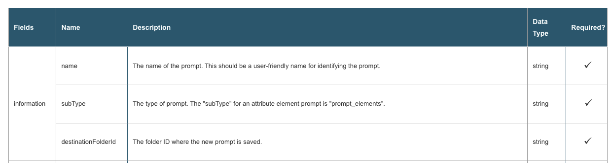
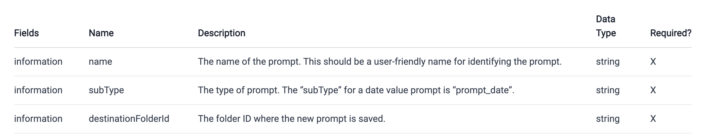
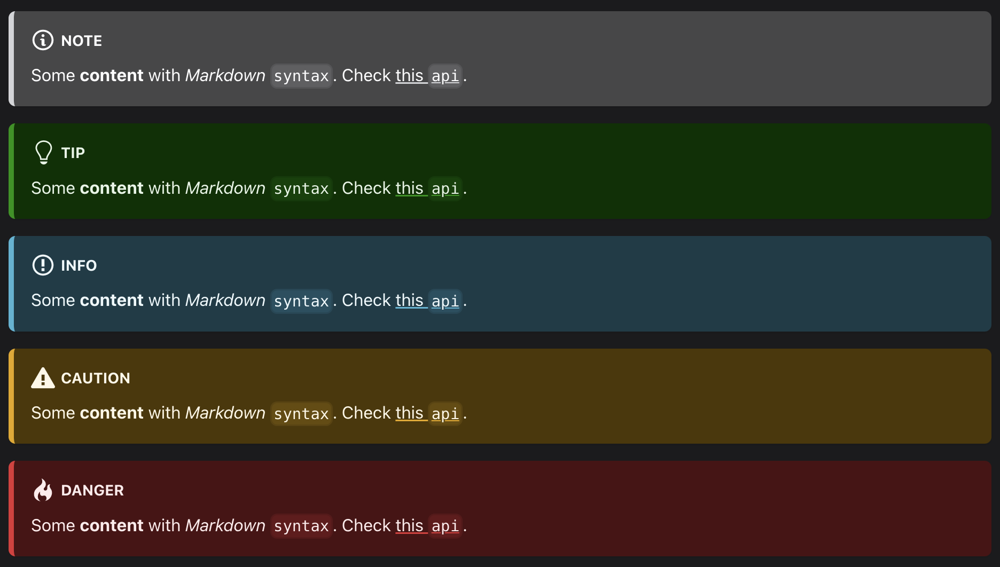

<!-- markdownlint-disable-file MD041 -->

# Content styling guidelines

We try to keep our styling consistent throughout the documentation. Please follow the guidelines to help us provide better documentation.

## Markdownlint

Some rules are enforced by the [`markdownlint`](../.markdownlint.yml).

You can download the [markdownlint linter](https://marketplace.visualstudio.com/items?itemName=DavidAnson.vscode-markdownlint) from the VSCode marketplace, and it will warn you in the markdown files.

To automatically fix these violations when saving a Markdown document, configure Visual Studio Code's [`editor.codeActionsOnSave` setting](https://code.visualstudio.com/docs/getstarted/settings) like so:

```text
"editor.codeActionsOnSave": {
    "source.fixAll.markdownlint": true
}
```

More information about `markdownlint` could be found [here](https://github.com/DavidAnson/markdownlint#rules--aliases).

## Front matter

- (Required) `title` is the `h1` heading that shows on the HTML page.
- (Optional) `sidebar_label` is the title you want to show in the sidebar navigation. It is only needed if you want to display something different from the `title`.
- (Required) `description` is the summary for this page. It provides better text snippet in the search result. This is only for SEO purpose.

Note: Do not use backticks in front matter since they won't be rendered the same as markdown content.

## Headers

Use two hashes (##) for the headers to begin, and continue moving down the line (###, ####, etc.) for subsections.

For headers that need an ordered list, e.g., "1. Do something in this step", it is recommended to write it like ### 1. Do something here instead of 1. ### Do something here because this would cause the Table of Contents plugin to show the wrong order.

## Code blocks

- Code blocks (not inline code) should be surrounded by three backticks on either side. The language should also be specified after the first three backticks, like so:

  ````text
  ```bash
  code used in the terminal such as curl
  ```

  ```json
  JSON code

  Note: If the json is from the response, please simplify it by only keeping two objects in the list.
  ```

  ```js
  JavaScript code
  ```

  ```xml
  XML code
  ```

  ```java
  Java code
  ```

  ```html
  HTML code
  ```

  ```text
  any other code that is not language-specific
  ```
  ````

Supported languages are listed [here](https://prismjs.com/#languages-list).

- Inline code blocks only need one backtick in front and behind, like so:

  ```text
  `INLINE CODE BLOCK`
  ```

- Inline code that is also a link should not have a backtick so that it still appears blue. Like the following:

  ```text
  [POST /api/auth/login](https://demo.microstrategy.com/MicroStrategyLibrary/api-docs/#!/Authentication/postLogin)
  ```

## Ordered list

It is enforced to use `1.` only for all ordered lists for ease of maintenance.

## Emojis

Our docs site supports all [Github-supported emojis](https://github.com/ikatyang/emoji-cheat-sheet/blob/master/README.md). Please use it as needed.

The list below shows the usage of emojis in our Docs site:

- `:heavy_check_mark:` for the checkmark in the table.

## Links and images

- Make sure you check that all links and images are still functional after adding them into Markdown. Some of the REST API links have spaces in them, which don’t work in Markdown and should be replaced by a `%20` or the appropriate generated characters (you can use inspect on the page to identify the id/anchor link).

- Images in the `/images` folder are linked relatively. The pathway back can be found by looking at the permalink for the page and backing out until the root folder is reached. For example, if you want to access the images from `whats-new.md`, you need to access the images like this: ``, and if you want to access the images from `common-workflows/authentication.md`, you need to access the images like this: ``.

- Endpoints for REST API should have links if possible.

- For internal links:

  - If the description of the link is related to the title of some page, use sentence case. For example:

    ```md
    - [Retrieve, create, and update runtime objects.](./common-workflows/manage-runtime-objects/manage-runtimes.md)
    ```

  - If the description of the link is in the middle of the sentence and it is a brief explanation of what the link is, use proper cases as needed. For example:

    ```md
    You can use the following REST APIs to [filter the data that is returned when you create or update an instance of a dossier](./filter-dossier-instances/filter-dossier-instances.md), including clearing the filter selections.
    ```

## Naming conventions

- Folders and files

  - All folder and file names should have **dashes** (`-`) between **lowercase** letters. There should be no spaces in folder or file names.
  - Permalinks for nested files or folders should recognize the nesting; that is, the permalink should be an relative path from the current folder. For instance, to access `common-workflows/authentication.md` from `common-workflows/common-workflows.md` you would use the link `./authentication.md`.
  - Markdown links should have a `.md` ending to them like `./add-functionality/add-functionality.md`.

- Titles, sidebar labels, and headers

  - These should use **sentence case**. For example, prefer "This is the title from MicroStrategy" over "This Is The Title From MicroStrategy".
  - `sidebar_label` should only be used if you want a different title in the sidebar than the `title` in front matter. (Note: For folders, `label` in sidebars.js takes priority over `sidebar_label`)

## Tables

- The recommended converter could convert the basic HTML table to a Markdown table. However, Markdown doesn’t support merged cells (1 cell in 1 row covers multiple smaller rows). You need to add duplicated entries for the wider row manually).

  For example:

  For the HTML table below,

  

You need to add "information" cell multiple times manually because the converter cannot handle this correctly. It will omit the "information" cell for the following rows to make the table not correct.



- Use `:heavy_check_mark:` instead of `X` to display a checkmark.

## Admonitions

We use `:::tip` to to provide some tips, `:::info` to provide some extra information, and `:::danger` to let readers to pay more attention in this section.

Examples:

```text

:::note

Some **content** with _Markdown_ `syntax`. Check [this `api`](#).

:::

:::tip

Some **content** with _Markdown_ `syntax`. Check [this `api`](#).

:::

:::info

Some **content** with _Markdown_ `syntax`. Check [this `api`](#).

:::

:::caution

Some **content** with _Markdown_ `syntax`. Check [this `api`](#).

:::

:::danger

Some **content** with _Markdown_ `syntax`. Check [this `api`](#).

:::

```

should be rendered as



## Links to REST API Playground

If you are adding a new common workflow page, please include the tip admonition on the top of your page.

For the root of a collection of workflows, please use the template below:

```text
:::tip

You can try out these workflows at [REST API Playground]().

Learn more about MicroStrategy REST API Playground [here](/docs/getting-started/playground.md).

:::
```

For the workflow page, please use the template below:

```text
:::tip

You can try out this workflow at [REST API Playground]().

Learn more about MicroStrategy REST API Playground [here](/docs/getting-started/playground.md).

:::
```

## Duplicated content

Try to reduce repeating the same content or description for a workflow or api unless it offers new information or provides clarity. Choose rather to reference the content if it exist already. For instance, workflows, involving changesets, should not describe changesets on the page, but rather reference it like:

```text
:::tip

Changesets are used in this workflow. For information on how to create and use changesets see [Changesets](/docs/common-workflows/changesets.md).

:::
```
