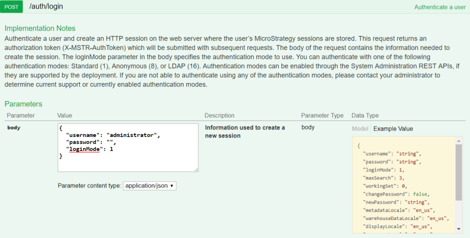
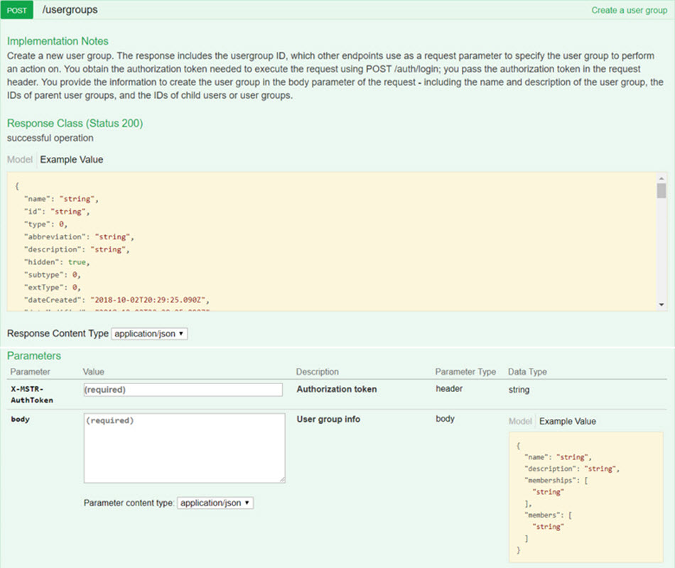
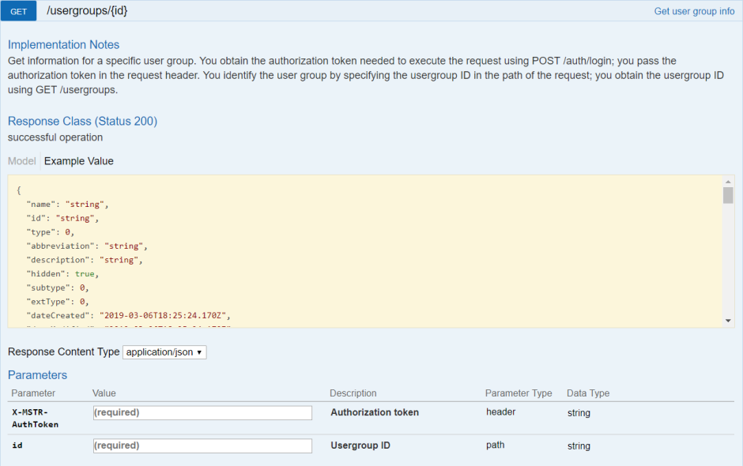
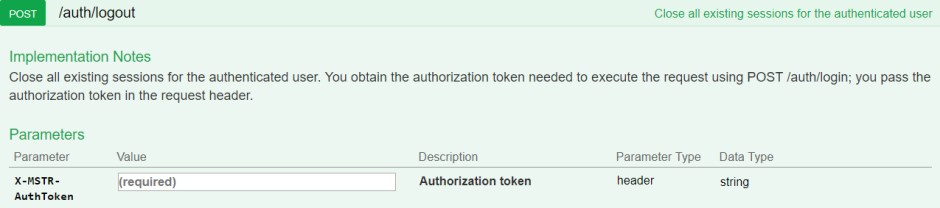

:::tip

You can try out this workflow at [REST API Playground](https://www.postman.com/microstrategysdk/workspace/microstrategy-rest-api/folder/16131298-19b75da6-a5cf-47a0-a202-a4248e893d7c?ctx=documentation).

Learn more about MicroStrategy REST API Playground [here](/docs/getting-started/playground.md).

:::

A workflow sample for managing user groups in the metadata is provided below. The following sequence of REST API requests allows an administrative user to create and update a user group, and optionally get information about the user group to confirm the creation and updates.

1. [Log in](#log-in) Admin user calls `POST /api/auth/login` to authenticate into the environment.
1. [Create a user group](#create-a-user-group) Admin user calls `POST /api/usergroups` to create a new user group.
1. [Update a user group](#update-a-user-group) Admin user calls `PATCH /api/usergroups/{id}` to update information for the new user group.
1. [Optionally, get information about a user group](#get-information-about-a-user-group) Admin user calls `GET /api/usergroups/{id}` to view information about a user group, including changes made to the user group.
1. [Log out](#log-out) Admin user calls `POST /api/logout` to close the session.

To make it easy for you to test this workflow in your environment, [download the zipped Postman script](https://www2.microstrategy.com/producthelp/2021/downloads/RESTSDK/PostmanScripts/ManagingUserGroups_postman_collection.zip) provided for you, extract the JSON file, and configure it to point to your Web server.

A detailed explanation of each step is provided below:

## Log in

End Point: `POST /api/auth/login`

This endpoint allows the caller to authenticate with the MicroStrategy REST Server. You provide the information used to create the session in the body of the request. In this example, you use standard authentication so you need to provide `username`, `password`, and `loginMode` (which specifies the authentication mode to use). If you omit an optional field, the REST Server uses the default value. If the call is successful, the resulting HTTP response returns a status code 204 and a response header containing `X-MSTR-AuthToken`, the authorization token that will be used by subsequent requests.

In this example, you will use Standard authentication and log in as "administrator" with no password.



REST API Explorer: [https://demo.microstrategy.com/MicroStrategyLibrary/api-docs/index.html#/Authentication/postLogin](https://demo.microstrategy.com/MicroStrategyLibrary/api-docs/index.html#/Authentication/postLogin)

Sample Request

- Request Headers

```http
"Content-Type: application/json"
"Accept: application/json"
```

- Request Body

  When loginMode is set to "1", Standard authentication is used.

  ```json
  {
    "loginMode": 1,
    "username": "administrator",
    "password": ""
  }
  ```

- Curl

  ```bash
  curl -X POST -i -c --header 'Content-Type: application/json' --header 'Accept: application/json' -d '{ \
    "loginMode":1, \
    "username": "administrator", \
    "password": "" \
  }' https://demo.microstrategy.com/MicroStrategyLibrary/api/auth/login'
  ```

Sample Response

- Response Headers

  The authorization token `"x-mstr-authtoken"` is returned in the response header. It is used by other endpoints to authenticate the user.

  ```json
  {
    "pragma": "no-cache",
    "x-mstr-authtoken": "nllmm5lpmkjdsj4d4etgdikc6c",
    "cache-control": "no-cache, no-store, max-age=0, must-revalidate",
    "date": "Wed, 22 Aug 2018 01:42:31 GMT",
    "expires": "0",
    "content-type": null
  }
  ```

- Response Body: Empty

- Response Code: 204 (Success: No Content)

## Create a user group

End Point: `POST /api/usergroups`

This endpoint allows a caller with administrative rights to create a new user group. You obtain the authorization token needed to execute the request using `POST /api/auth/login`; you pass the authorization token in the request header. You provide the information to create the user group in the body parameter of the request.

In this example, you create a new user group called "Developers". You make it a member of a parent user group called "Technology", and you add a child user group called "Testers". You need to provide the IDs of the parent and child user groups as part of the user group creation information in the request body. To get these IDs, you first get a list of user groups using `GET /api/usergroups`. The response to this endpoint includes the names and IDs of all available user groups. You then find the names and IDs of the user groups that you want to use when you create the user group.



REST API Explorer: [https://demo.microstrategy.com/MicroStrategyLibrary/api-docs/index.html#/User%20Management/createUserGroup](https://demo.microstrategy.com/MicroStrategyLibrary/api-docs/index.html#/User%20Management/createUserGroup)

Sample Request

- Request Parameters

  - **X-MSTR-AuthToken** Authorization token generated by `POST /api/auth/login`, required to authenticate caller
  - **body** Information used to create the user group, including the name and description of the user group, and the IDs of the parent user group (memberships) and child users/user groups (members).

- Request Headers `'Accept: application/json' 'X-MSTR-AuthToken: nllmm5lpmkjdsj4d4etgdikc6c'`
- Request Body

  ```json
  {
    "name": "Developers",
    "description": "Software Engineers (SEs)",
    "memberships": ["3A22AF3611E8A63CFA170080EF35139A"],
    "members": ["5F90C74FB2944D70930B9BDDA6D2FBF1"]
  }
  ```

- Curl

  ```bash
  curl -X POST --header 'Content-Type: application/json' --header 'Accept: application/json' --header 'X-MSTR-AuthToken: nllmm5lpmkjdsj4d4etgdikc6c' -d '{
    "name": "Developers",
    "description": "Software Developers",
    "memberships": [
      "3A22AF3611E8A63CFA170080EF35139A",
    ]
    "members": [
      "5F90C74FB2944D70930B9BDDA6D2FBF1"
    ]
  } 'https://demo.microstrategy.com/MicroStrategyLibrary/api/usergroups'
  ```

Sample Response

- Response Body

  The response body contains information about the user group that was created, including the user group ID that will be used by later endpoints to identify the user group.

  ```json
  {
    "name": "Developers",
    "id": "F9A9F96011E8A644E5FF0080EF25F39A",
    "type": "34",
    "abbreviation": "SEs",
    "description": "Software Developers",
    "subtype": 8705,
    "extType": 0,
    "dateCreated": "2018-08-22T19:53:01.000+0000",
    "dateModified": "2018-08-22T19:53:02.000+0000",

    "membership": [
      {
        "id": "3A22AF3611E8A63CFA170080EF35139A"
      }
    ],
    "members": [
      {
        "id": "5F90C74FB2944D70930B9BDDA6D2FBF1"
      }
    ]
  }
  ```

## Update a user group

End Point: `PATCH /usergroups/{id}`

This endpoint allows a caller with administrative rights to update specific information for a specific user group, including the name, description, parent user group, and child users or user groups. You obtain the authorization token needed to execute the request using `POST /auth/login`; you pass the authorization token in the request header. You identify the user group by specifying the usergroup ID in the path of the request, as the value of `{id}`; you obtain the usergroup ID using `GET /usergroups`. You specify the type of update operation (add, replace or remove), provide the value to be used in the update operation, and specify the path to the target where the update operation will be performed, in the body parameter of the request.

In this example, you update the new user group called "Developers". You change the description from "Software Developers" to "Software Engineers", remove the child user group called "Testers", and add a new child user group called "SDK Developers". You need to provide the ID of the new child user group as part of the user group update information in the request body. To get this ID, you first get a list of user groups using `GET /usergroups`. The response to this endpoint includes the names and IDs of all available user groups. You then find the name and ID of the user group that you want to use when you update the user group.


REST API Explorer: [https://demo.microstrategy.com/MicroStrategyLibrary/api-docs/index.html#/User%20Management/updatePartialUser](https://demo.microstrategy.com/MicroStrategyLibrary/api-docs/index.html#/User%20Management/updateUserGroup)

Sample Request

- Request Parameters

  - **X-MSTR-AuthToken** Authorization token generated by `POST /auth/login`.
  - **id** ID of the user group to be updated. You generated this ID when you created the new user group in the previous step using `POST /usergroups`.
  - **body** Information used to perform the update, the update operation to be performed ("add", "replace", or "remove"), the property to be updated, and the value to be used in the update operation. You can perform one or more update operations.

- Request Headers

  ```http
  "Content-Type": "application/json",
  "Accept": "application/json",
  "X-MSTR-AuthToken": "nllmm5lpmkjdsj4d4etgdikc6c"
  ```

- Request Parameters

  ```http
  "X-MSTR-AuthToken": "nllmm5lpmkjdsj4d4etgdikc6c",
  "id": "F9A9F96011E8A644E5FF0080EF25F39A"
  ```

- Request Body:

  ```json
  {
    "operationList": [
      {
        "op": "replace",
        "path": "/description",
        "value": "Software Engineers"
      },
      {
        "op": "remove",
        "path": "/members",
        "value": "5F90C74FB2944D70930B9BDDA6D2FBF1"
      },
      {
        "op": "add",
        "path": "/members",
        "value": ["C82C6B1011D2894CC0009D9F29718E4F"]
      }
    ]
  }
  ```

- Curl

  ```bash
  curl -X PATCH --header 'Content-Type: application/json' --header 'Accept: application/json' --header 'X-MSTR-AuthToken: nllmm5lpmkjdsj4d4etgdikc6c' -d '{
    "operationList": [
      {
        "op": "replace",
        "path": "/description",
        "value": [
              "Software Engineers"
        ]
      },
      {
        "op": "remove",
        "path": "/members",
        "value": [
              "5F90C74FB2944D70930B9BDDA6D2FBF1"
        ]
      },
      {
        "op": "add",
        "path": "/members",
        "value": [
              "C82C6B1011D2894CC0009D9F29718E4F"
        ]
      }
    ]
  } 'https://demo.microstrategy.com/MicroStrategyLibrary/api/usergroups/F9A9
  ```

Sample Response

- Response Body

  The REST server returns a JSON object containing the updated information for the user group.

  ```json
  {
    "name": "Developers",
    "id": "F9A9F96011E8A644E5FF0080EF25F39A",
    "type": "34",
    "abbreviation": "SEs",
    "description": "Software Engineers",
    "membership": [
      {
        "id": "3A22AF3611E8A63CFA170080EF35139A"
      }
    ],
    "members": [
      {
        "id": "5F90C74FB2944D70930B9BDDA6D2FBF1"
      }
    ]
  }
  ```

- Response Code: 200 (Success: OK)

## Get information about a user group

End Point: `GET /api/usergroups/{id}`

This endpoint allows a caller with administrative rights to get information for a specific user group. You obtain the authorization token needed to execute the request using `POST /api/auth/login`; you pass the authorization token in the request header. You identify the user group by specifying the usergroup ID in the path of the request, as the value of `{id}`; you obtain the usergroup ID using `GET /api/usergroups`.

In this example, you get information for the user group you created and updated, called "Developers". You confirm that the description is now "Software Engineers" and that there is only one child user group called "SDK Developers". The child user group is defined by its ID instead of its name, so you need to confirm that the value for id under members is the ID for "SDK Developers". This is the ID you provided when you performed the update. You got the ID for that request by first getting a list of user groups using `GET /api/usergroups` and then looking at the response which includes the names and IDs of all available user groups.



REST API Explorer: [https://demo.microstrategy.com/MicroStrategyLibrary/api-docs/index.html#/User%20Management/getUserGroups](https://demo.microstrategy.com/MicroStrategyLibrary/api-docs/index.html#/User%20Management/getUserGroups)

Sample Request

- Request Parameters

  - **X-MSTR-AuthToken** Authorization token generated by `POST /api/auth/login`.
  - **id** ID of the user group to be updated. You generated this ID when you created the new user group in a previous step using `POST /api/usergroups`.

- Request Headers

  ```http
  {
    "Accept": "application/json",
    "X-MSTR-AuthToken": "nllmm5lpmkjdsj4d4etgdikc6c"
  }
  ```

- Request Body: Empty

- Curl

  ```bash
  curl -X GET --header 'Accept: application/json' --header 'X-MSTR-AuthToken: nllmm5lpmkjdsj4d4etgdikc6c' 'https://demo.microstrategy.com/MicroStrategyLibrary/api/usergroups/F9A9F96011E8A644E5FF0080EF25F
  ```

Sample Response

- Response Body

  The REST server returns a JSON object containing all of the information for the specified user group—in this example, "Developers"; this includes the name, ID, description, and many other pieces of information. You can find the detailed parameter definitions in the Response Body on the Swagger page under **Response Class** > **Model**.

  ```json
  {
    "name": "Developers",
    "id": "F9A9F96011E8A644E5FF0080EF25F39A",
    "type": "34",
    "abbreviation": "SEs",
    "description": "Software Engineers",
    "subtype": 8705,
    "extType": 0,
    "dateCreated": "2018-08-22T19:53:01.000+0000",
    "dateModified": "2018-08-22T19:53:02.000+0000",
    "membership": [
      {
        "id": "3A22AF3611E8A63CFA170080EF35139A"
      }
    ],
    "members": [
      {
        "id": "C82C6B1011D2894CC0009D9F29718E4F"
      }
    ]
  }
  ```

- Response Code: 200 (OK)

## Log out

End Point: `POST /api/auth/logout`

This endpoint allows the caller to log out for the authenticated user with the MicroStrategy REST Server. In this example, you close the active user session by providing the authorization token, `X-MSTR-AuthToken`, generated by `POST /api/auth/login`. If the call is successful, the resulting HTTP response returns an HTTP status code 204.



REST API Explorer: [https://demo.microstrategy.com/MicroStrategyLibrary/api-docs/index.html#/Authentication/postLogout](https://demo.microstrategy.com/MicroStrategyLibrary/api-docs/index.html#/Authentication/postLogout)

Sample Request

- Request Header

  ```http
  "Accept": "application/json"
  "X-MSTR-AuthToken": "nllmm5lpmkjdsj4d4etgdikc6c"
  ```

- Request Body: Empty

- Curl

  ```bash
  curl -X POST -i -c ~/cookie-jar.txt --header 'Content-Type: application/json' --header 'Accept: application/json' --header 'X-MSTR-AuthToken: nllmm5lpmkjdsj4d4etgdikc6c'
  'https://demo.microstrategy.com/MicroStrategyLibrary/api/auth/logout'
  ```

Sample Response

- Response code: 204
