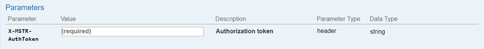
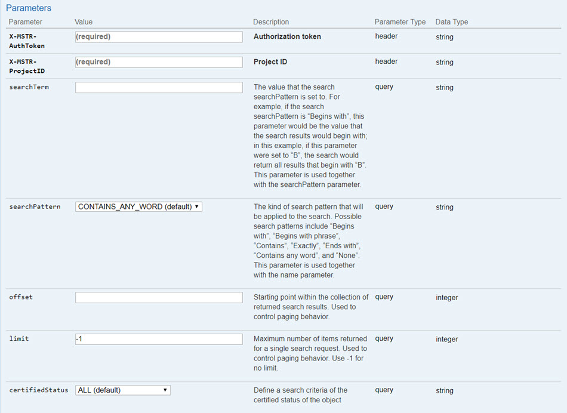
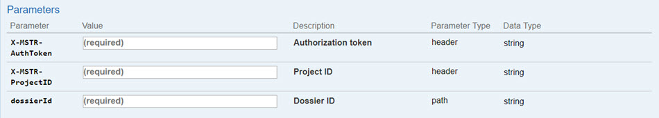
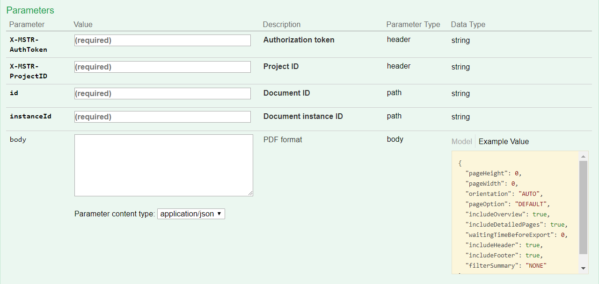

:::tip

You can try out this workflow at [REST API Playground](https://www.postman.com/microstrategysdk/workspace/microstrategy-rest-api/folder/16131298-d6462995-9003-4187-b121-47a5fb31436a?ctx=documentation).

Learn more about MicroStrategy REST API Playground [here](/docs/getting-started/playground.md).

:::

Use the following sequence of REST API requests to see the results when you change the values for the filter selections applied to a dossier instance. In this workflow, you create an instance of a dossier using the filter selections originally defined for the dossier. You then change the values for the filter selections and re-execute the dossier instance with the new values. As a way to see the results of each filter, you export the dossier instance to PDF.

:::tip

In the workflow below, there are both dossier and document endpoints. A dossier and a document have the same base object so dossier actions can be executed with document endpoints. A dossier is simply a different view of a document.

:::

A detailed explanation of each step is provided below:

## Log in

Call `POST /api/auth/login` to authenticate into the environment with standard authentication.

End Point: `POST /api/auth/login`

This endpoint allows the caller to authenticate with the MicroStrategy REST Server. You provide the information used to create the session in the body of the request. In this example, you use standard authentication so you need to provide username, password, and loginMode (which specifies the authentication mode to use). If you omit an optional field, the REST Server uses the default value. If the call is successful, the resulting HTTP response returns an HTTP status code 204 and a response header containing `X-MSTR-AuthToken`, the authorization token that will be used in subsequent requests.

REST API Explorer: [https://demo.microstrategy.com/MicroStrategyLibrary/api-docs/index.html#/Authentication/postLogin](https://demo.microstrategy.com/MicroStrategyLibrary/api-docs/index.html#/Authentication/postLogin)

Sample Request

- Request Headers

  ```http
  'Content-Type: application/json'
  'Accept: application/json'
  ```

- Request Body

  ```json
  {
    "loginMode": 1,
    "username": "administrator",
    "password": ""
  }
  ```

- Curl

  ```bash
  curl -X POST -i -c --header 'Content-Type: application/json' --header 'Accept: application/json' -d '{ \\
  "loginMode":1, \\
  "username": "administrator", \\
  "password": "" \\
  }' https://demo.microstrategy.com/MicroStrategyLibrary/api/auth/login'
  ```

Sample Response

- Response Headers

  ```json
  {
    "pragma": "no-cache",
    "x-mstr-authtoken": "nllmm5lpmkjdsj4d4etgdikc6c",
    "cache-control": "no-cache, no-store, max-age=0, must-revalidate",
    "date": "Wed, 22 Aug 2018 17:58:29 GMT",
    "expires": "0",
    "content-type": null
  }
  ```

  The authorization token x-mstr-authtoken is returned in the response header. It is used by the other endpoints in the workflow to authenticate the user.

- Response Body: no content

- Response Code: 204 (Success: No Content)

## Get project list

Call `GET /api/projects` to obtain the list of available projects.

End Point: `GET /api/projects`

This endpoint allows the caller to get the list of projects that the user session has access to. You use the authorization token returned during login as the value for **X-MSTR-AuthToken**. If the call is successful, the resulting HTTP response returns an HTTP status code 200 and a response body containing a list of the active projects that the user session has access to. The information returned for each project includes the project ID, which will be used by a later endpoint. In this example, you get the list of projects in the MicroStrategy Tutorial metadata.

To execute this API, you need to provide the value for the following parameter in the request header:

- **X-MSTR-AuthToken** Authorization token generated by `POST /api/auth/login`

REST API Explorer: [https://demo.microstrategy.com/MicroStrategyLibrary/api-docs/index.html#/Projects/getProjects](https://demo.microstrategy.com/MicroStrategyLibrary/api-docs/index.html#/Projects/getProjects_1)

Sample Request

- Request Headers

  ```http
  'Accept: application/json'
  'X-MSTR-AuthToken: nllmm5lpmkjdsj4d4etgdikc6c'
  ```

- Request Parameters

  

- Request Body: Empty

- Curl

  ```bash
  curl -X GET -b --header 'Accept: application/json' --header 'X-MSTR-AuthToken: nllmm5lpmkjdsj4d4etgdikc6c'  https://demo.microstrategy.com/MicroStrategyLibrary/api/projects'
  ```

Sample Response

- Response Body

  ```json
  [
    {
      "id": "B19DEDCC11D4E0EFC000EB9495D0F44F",
      "name": "MicroStrategy Tutorial",
      "alias": "",
      "description": "MicroStrategy Tutorial project and application set designed to illustrate the platform's rich functionality. The theme is an Electronics, Books, Movies and Music store. Employees, Inventory, Finance, Product Sales and Suppliers are analyzed.",
      "status": 0
    },
    {
      "id": "AF09B3E3458F78B4FBE4DEB68528BF7B",
      "name": "Human Resources Analysis Module",
      "alias": "",
      "description": "The Human Resources Analysis Module analyses workforce headcount, trends and profiles, employee attrition and recruitment, compensation and benefit costs and employee qualifications, performance and satisfaction.",
      "status": 0
    }
  ]
  ```

  The response body contains information for each project that is returned, including the project ID that is used by other endpoints.

- Response code: 200 (OK)

## Get a list of dossiers

Call `GET /api/dossiers` to obtain a list of dossiers that meet specific search criteria.

End Point: `GET /api/dossiers`

This endpoint allows the caller to get a list of dossiers in a specific project that meet specific search criteria. You use the authorization token returned during login as the value for **X-MSTR-AuthToken**. You use a project ID returned by GET /projects as the value for **X-MSTR-ProjectID**. You specify the search criteria using query parameters in the request; criteria can include the root folder ID, a search searchPattern such as Begins With or Exactly, and the certified status of the dossier.

To execute this API, you need to provide values for the following parameters in the request header:

- **X-MSTR-AuthToken** Authorization token generated by `POST /api/auth/login`
- **X-MSTR-ProjectID** Project ID generated by `GET /api/projects`

REST API Explorer: [https://demo.microstrategy.com/MicroStrategyLibrary/api-docs/index.html#/Dossiers/getDossiers](https://demo.microstrategy.com/MicroStrategyLibrary/api-docs/index.html#/Projects/getProjects_1)

Sample Request

- Request Headers

  ```http
  'Accept: application/json'
  'X-MSTR-AuthToken: nllmm5lpmkjdsj4d4etgdikc6c'
  'X-MSTR-ProjectID: B19DEDCC11D4E0EFC000EB9495D0F44F'
  ```

- Request Parameters

  

- Request Body: Empty

- Curl

  ```bash
  curl -X GET -b --header 'Accept: application/json' --header 'X-MSTR-AuthToken: nllmm5lpmkjdsj4d4etgdikc6c'  https://demo.microstrategy.com/MicroStrategyLibrary/api/projects'
  ```

Sample Response

- Response Body

  ```json
  [
    {
      "id": "Dossier ID",
      "name": "Dossier name",
      "type": "Dossier type"
    },
    {
      "id": "Dossier ID",
      "name": "Dossier name",
      "type": "Dossier type"
    }
  ]
  ```

  The response body contains information for each dossier that is returned, including the dossier ID that is used by later endpoints.

- Response code: 200 (OK)

## Get definition of a dossier, including the filter applied

Call `GET /api/dossiers/{dossierId}/definition` to obtain the definition of the filter applied to a specific dossier, including the key and name of the filter.

End Point: `GET /api/dossiers/{dossierId}/definition`

This endpoint allows the caller to get the definition of the filter applied to a specific dossier in a specific project. You use the authorization token returned during login as the value for **X-MSTR-AuthToken**. You use a project ID returned by `GET /api/projects` as the value for **X-MSTR-ProjectID**. You use the dossier ID returned by `GET /api/dossiers` in the path of the request URL. The response contains the hierarchy of the dossier, which includes the key, name, and summary of the filter applied to the dossier. This is the filter that is applied to the dossier when it is executed. It is also the filter that you will update in a later step.

To execute this API, you need to provide values for the following parameters in the request header:

- **X-MSTR-AuthToken** Authorization token generated by `POST /api/auth/login`
- **X-MSTR-ProjectID** Project ID generated by `GET /api/projects`

REST API Explorer: [https://demo.microstrategy.com/MicroStrategyLibrary/api-docs/index.html#/Dossiers/getDossiers](https://demo.microstrategy.com/MicroStrategyLibrary/api-docs/index.html#/Projects/getProjects_1)

Sample Request

- Request Headers

  ```http
  'Accept: application/json'
  'X-MSTR-AuthToken: nllmm5lpmkjdsj4d4etgdikc6c'
  'X-MSTR-ProjectID: B19DEDCC11D4E0EFC000EB9495D0F44F'
  ```

- Request Parameters

  

- Request Body: Empty

Sample response

- Response Body

  ```json
  {
    "id": "string",
    "name": "string",
    "chapters": [
      {
        "key": "string",
        "name": "string",
        "pages": [
          {
            "key": "string",
            "name": "string",
            "visualizations": [
              {
                "key": "string",
                "name": "string",
                "units": {
                  "attributes": [
                    {
                      "id": "string",
                      "type": 0,
                      "name": "string"
                    }
                  ],
                  "metrics": [
                    {
                      "id": "string",
                      "type": 0,
                      "name": "string"
                    }
                  ]
                }
              }
            ]
          }
        ],
        "filters": [
          {
            "key": "string",
            "name": "string",
            "summary": "string",
            "source": {
              "id": "string",
              "type": 0
            }
          }
        ],
        "filtersPanelStack": {
          "key": "string"
        }
      }
    ]
  }
  ```

  The response body contains information about the specified dossier, including the filter ID, name, and definition that is used to update the filter in a later endpoint.

- Response code: 200 (OK)

## Create a dossier instance with the existing filter applied

Call `POST /api/dossiers/{dossierId}/instances` to create an instance of a specific dossier with the existing filter applied.

End Point: `POST /api/dossiers/{dossierId}/instances`

This endpoint allows the caller to execute a specific dossier in a specific project and create an instance of that dossier. The existing filter for the dossier will be applied when the dossier instance is created; this is the filter that was returned in the previous step. To execute this API, you need to provide values for the following request parameters:

- **X-MSTR-AuthToken** Authorization token generated by `POST /api/auth/login`
- **X-MSTR-ProjectID** Project ID generated by `GET /api/projects`
- **id** Dossier ID generated by `GET /api/dossiers dossiers/{dossierId}/definition` or other endpoints
- **body** Filter definition for the filter key/name generated by `GET /api/dossiers dossiers/{dossierId}/definition`

In this example, you execute a dossier called "Filters" (located in MicroStrategy Tutorial>Shared Reports. You use the authorization token returned by `POST /api/auth/login` as the value for X-MSTR-AuthToken, a project ID returned by `GET /api/projects`, a dossier ID returned by `GET /api/dossiers`, and a filter definition. The request body contains the definition of the existing filter that was created for the dossier; it is applied when the dossier is executed. The resulting HTTP response returns an HTTP status 201, indicating that the dossier instance has been created, and a JSON object containing the instance ID ("mid") of the dossier.

REST API Explorer: [https://demo.microstrategy.com/MicroStrategyLibrary/api-docs/index.html#/Dossiers%20and%20Documents/createDocumentInstance](https://demo.microstrategy.com/MicroStrategyLibrary/api-docs/index.html#/Dossiers%20and%20Documents/createDocumentInstance)

Sample Request

- Request Headers

  ```http
  'Accept: application/json'
  'X-MSTR-AuthToken: nllmm5lpmkjdsj4d4etgdikc6c'
  'X-MSTR-ProjectID: B19DEDCC11D4E0EFC000EB9495D0F44F'
  ```

- Request Parameters

  

- Request Body: Empty

- Curl

  ```bash
  curl -X POST -i -c --header 'Content-Type: application/json' --header 'Accept: application/json' --header 'X-MSTR-AuthToken: nllmm5lpmkjdsj4d4etgdikc6c' --header 'X-MSTR-ProjectID: B19DEDCC11D4E0EFC000EB9495D0F44F' -d '{}' 'http://demo.microstrategy.com/MicroStrategyLibrary/335FFA9640B5F1C1E0C0F3A469E627A8/instances'
  ```

Sample Response

- Response Body

  The REST server returns the instance ID of the dossier as the value of `"mid"`. This value will be used by a later endpoint when an updated filter definition is applied to the dossier instance. The HTTP response code 201 indicates that the dossier instance has been created and is ready for additional actions to be performed.

  ```json
  {
    "mid": "0ADDDAF34260EBA5D5FB73BFE5852AC3"
    // ...
  }
  ```

- Response Code: 201 (Success: Created)

## Export the dossier instance to PDF

Call `POST /api/documents/{id}/instances/{instanceId}/pdf` to export the dossier to a PDF file. This allows you to see the results when the existing filter was applied.

End Point: `POST /api/documents/{id}/instances/{instanceId}/pdf`

This endpoint allows the caller to export a dossier instance to a PDF file using the instance ID and object ID of the dossier. In this example, you export the dossier to a PDF file using the dossier ID and the instance ID you created in previous steps. You provide the authorization token generated during login and the project ID in the request header, and the dossier ID and the instance ID in the request path. In the request body, you specify in JSON how to format the PDF file that you are exporting. If the call is successful, the resulting HTTP response returns a response body in either application/json or application/octet-stream format.

:::tip

This endpoint is used only to allow you to view the results when the filter was applied. It is used again after an updated filter definition has been applied so that you can compare the two results and confirm that the results are different when the updated filter is applied.

:::

REST API Explorer: [https://demo.microstrategy.com/MicroStrategyLibrary/api-docs/index.html#/Dossiers%20and%20Documents/exportDashboardToPdf](https://demo.microstrategy.com/MicroStrategyLibrary/api-docs/index.html#/Dossiers%20and%20Documents/exportDashboardToPdf)

Sample Request

- Request Headers

  ```http
  'Accept: application/json'
  'X-MSTR-AuthToken: nllmm5lpmkjdsj4d4etgdikc6c'
  'X-MSTR-ProjectID: B19DEDCC11D4E0EFC000EB9495D0F44F'
  ```

- Request Parameters

  

- Request Body:

  ```json
  {
    "pageHeight": 11.69,
    "pageWidth": 8.27,
    "orientation": "AUTO",
    "pageOption": "ALL",
    "includeOverview": true,
    "includeDetailedPages": true,
    "waitingTimeBeforeExport": 0,
    "includeHeader": true,
    "includeFooter": true,
    "filterSummary": "ALL"
  }
  ```

  In the request body above, you specify the formatting options. You can change the formatting as desired.

- Curl

  ```bash
  curl -X POST -i -c --header 'Content-Type: application/json' --header 'Accept: application/json' --header 'X-MSTR-AuthToken: nllmm5lpmkjdsj4d4etgdikc6c' --header 'X-MSTR-ProjectID: B19DEDCC11D4E0EFC000EB9495D0F44F' -d '{}' 'https://demo.microstrategy.com/MicroStrategyLibrary/api/documents/335FFA9640B5F1C1E0C0F3A469E627A8/instances/0ADDDAF34260EBA5D5FB73BFE5852AC3/pdf'
  ```

Sample Response

- Response Body

  The REST server returns a JSON object containing the "data" property which includes the PDF data in Base64-encoded binary. To see a sample Base64-encoded binary data file or PDF file for the document, refer to the [Export to PDF](../../export-to-pdf.md) topic.

  ```json
  {
    "data": "JVBERi0xL..."
  }
  ```

- Response Code: 200 (Success: OK)

## Update the dossier instance, with a revised filter definition applied

### Update the filter definition

Call `PUT /api/dossiers/{dossierId}/instances/{instanceId}/filters` to execute the dossier instance with a revised definition for the existing filter applied.

End Point: `PUT /api/dossiers/{dossierId}/instances/{instanceId}/filters`

This endpoint allows the caller to execute a specific dossier instance with an updated filter definition. It updates the instance of the dossier with the new filter definition applied. To execute this API, you need to provide the following as values for the request parameters:

- Authorization token generated by `POST /api/auth/login`
- Project ID generated by `GET /api/projects`
- Dossier ID generated by `GET /api/dossiers dossiers/{dossierId}/definition` or other endpoints
- Dossier instance ID generated by `POST /api/dossiers/{dossierId}/instances`
- Filter definition in the body request parameter

:::tip

This has to be the same filter that was originally applied, but with different values.

:::

In this example, you execute a dossier called "Filters" (located in MicroStrategy Tutorial>Shared Reports. You use the authorization token returned during login as the value for `X-MSTR-AuthToken` and provide the project ID, dossier ID, dossier instance ID, and filter definition. In the request body, you modify the values for the filter to be applied to the dossier when it is executed. The resulting HTTP response returns an HTTP status 204.

Sample Request

- Request Parameters

  

- Request Headers

  ```http
  'Accept: application/json'
  'X-MSTR-AuthToken: nllmm5lpmkjdsj4d4etgdikc6c'
  'X-MSTR-ProjectID: B19DEDCC11D4E0EFC000EB9495D0F44F'
  ```

- Request Body

  ```json
  [
    {
      "key": "WF31A639ECE9E4193AC374F45892DFDB4",
      "name": "cost",
      "qualifier": "Between",
      "constants": ["15000", "20000"],
      "dataType": "Real"
    }
  ]
  ```

- Curl

  ```bash
  curl -X PUT --header 'Content-Type: application/json' --header 'Accept: application/json' --header 'X-MSTR-AuthToken: 70ui9meikiiqgh9u617tnflfcq' --header 'X-MSTR-ProjectID: B19DEDCC11D4E0EFC000EB9495D0F44F' -d '[
   {
    "key": "WF31A639ECE9E4193AC374F45892DFDB4",
    "name": "cost",
    "qualifier": "Between",
    "constants": ["15000", "20000"],
    "dataType": "Real"
   }
  ]' 'http://localhost:8282/consume-dev/api/dossiers/D04C958044B392149FCA7C8ECCFB0330/instances/A48B947B40E97E8A5298499CDE6A774A/filters'
  /335FFA9640B5F1C1E0C0F3A469E627A8/instances'
  ```

### Clear all selections for a filter

Call `POST /api/dossiers/{dossierId}/instances` or `PUT /api/dossiers/{dossierId}/instances/{instanceId}/filters` to clear all of the current filter selections for an individual filter.

To clear all of the current filter selections for an individual filter, you call one of the following APIs and provide nothing but the filter name or ID:

End Point: `POST /api/dossiers/{dossierId}/instances`

Sample code for clearing filter selections using the filter ID:

```json
{
  "filters": [
    {
      "key": "WC8587FF21995453CBE5F0B66702BF56F"
    }
  ]
}
```

Sample code for clearing filter selections using the filter name:

```json
{
  "filters": [
    {
      "name": "Brand"
    }
  ]
}
```

End Point: `PUT /api/dossiers/{dossierId}/instances/{instanceId}/filters`

Sample code for clearing filter selections using the filter ID:

```json
[
  {
    "key": "WC8587FF21995453CBE5F0B66702BF56F"
  }
]
```

Sample code for clearing filter selections using the filter name:

```json
[
  {
    "name": "Brand"
  }
]
```

## Export the dossier instance to PDF again

Call `POST /api/documents/{id}/instances/{instanceId}/pdf` again to export the dossier to a PDF file. This allows you to see the results with a revised definition for the existing filter applied.

End Point: `POST /api/documents/{id}/instances/{instanceId}/pdf`

Just like step 6, this endpoint allows the caller to export the dossier instance to a PDF file using the instance ID and object ID of the dossier. However, the results are now different, based on the new filter definition that was applied when the dossier instance was executed in the previous step.

## Log out

Call `POST /api/logout` to close the session.

End Point: `POST /api/auth/logout`

This endpoint allows the caller to log out for the authenticated user with the MicroStrategy REST Server. In this example, you close the active user session by providing the authorization token, `X-MSTR-AuthToken`, generated during login. If the call is successful, the resulting HTTP response returns an HTTP status code 204.

REST API Explorer: [https://demo.microstrategy.com/MicroStrategyLibrary/api-docs/index.html#/Authentication/postLogout](https://demo.microstrategy.com/MicroStrategyLibrary/api-docs/index.html#/Authentication/postLogout)

Sample Request

- Request Headers

  ```http
  'Accept: application/json'
  'X-MSTR-AuthToken: nllmm5lpmkjdsj4d4etgdikc6c'
  ```

- Request Body: Empty

- Curl

  ```bash
  curl -X POST -i -c --header 'Content-Type: application/json' --header 'Accept: application/json' --header 'X-MSTR-AuthToken: nllmm5lpmkjdsj4d4etgdikc6c'  https://demo.microstrategy.com/MicroStrategyLibrary/api/auth/logout'
  ```

Sample Response

- Response code: 204 (Success: No Content)
