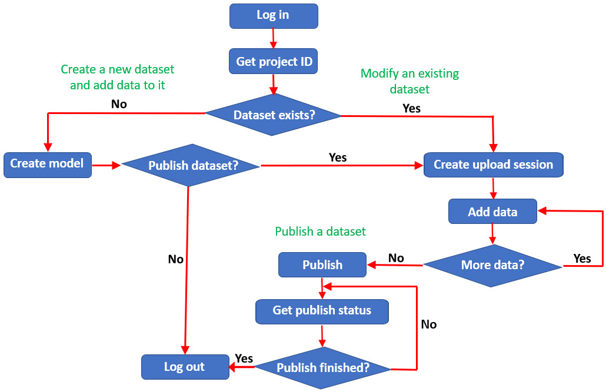

The diagram below illustrates the basic workflow to create a new dataset and add data to it, modify an existing dataset, and publish a new or existing dataset. Separating the action of defining the dataset from the actual creation of the dataset allows you to add data in an incremental fashion. Making publishing the dataset another separate step allows you to schedule publication at any time after all the data has been added. This incremental approach has a beneficial impact on performance and is very important when you are working with very large datasets.

This workflow allows you to upload large amounts of data to the Intelligence Server incrementally to manage the impact on performance. You can vary the amount of data and the timing to fit the needs of your environment. As illustrated in the diagram, you first create the model for the dataset and then create an upload session on the Intelligence Server. After the upload session has been created, you can make multiple requests to add data to the session. Once all of the data has been uploaded, you are ready to publish the dataset. You can get the publishing status of the dataset at any time. If the dataset has already been published, it is available for use. If the dataset has not been published, it is not yet ready for use; if you want to cancel the publish action, you can delete the upload session at any point before publication is complete.
