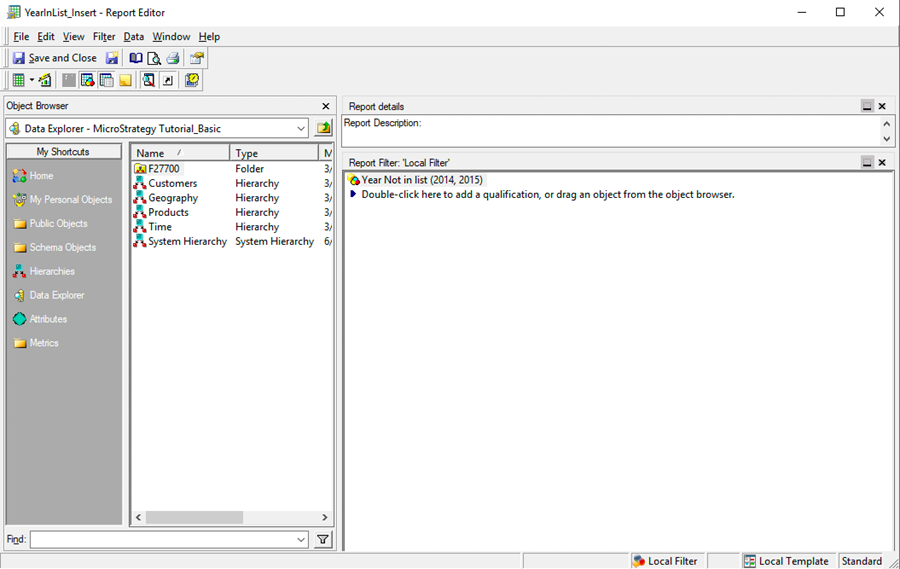

<Available since="2021 Update 6" />

This topic covers several workflows to retrieve an Incremental Refresh Report definition.

You want to get the definition of the `YearInList_Insert` Incremental Refresh Report object as shown in the below screenshot. The object ID of the Incremental Refresh Report is  `B5905F5C4565159A5AEAF78E71DC8BF6` in the MicroStrategy Tutorial project. The project ID is `B7CA92F04B9FAE8D941C3E9B7E0CD754`.



:::info

An authorization token allows the API layer to hide internal session-related implementations such as managing different project-specific sessions. Once the REST API layer has validated the user's credentials using the specified authentication mode, it initiates a session with the Intelligence server and creates a unique authorization token for the client.

Get the authorization token needed to execute the request with [POST /api/auth/login](https://demo.microstrategy.com/MicroStrategyLibrary/api-docs/index.html#/Authentication/postLogin).

Get the project ID from [GET /api/projects](https://demo.microstrategy.com/MicroStrategyLibrary/api-docs/index.html#/Projects/getProjects_1).

:::

The response can change based on the request parameters provided by the caller. Use the following parameters:

- Header: `X-MSTR-authToken` - The authorization token
- Header: `X-MSTR-ProjectID` - The ID of the project
- Parameter: `showFilterTokens`
  - Specify whether the Incremental Refresh Report `filter` is returned in `tokens` format, along with `text` and `tree` formats.
  - If omitted or `false`, only `text` and `tree` formats are returned.
  - If `true`, all `text`, `tree`, and `tokens` formats are returned.

## Retrieve an incremental refresh report definition

Retrieve the Incremental Refresh Report definition using [GET /api/model/incrementalRefresh/\{incrementalRefreshReportId}](https://demo.microstrategy.com/MicroStrategyLibrary/api-docs/index.html#/Cubes/ms-getIncrementalRefreshReport).

Sample Curl:

```bash
curl -X GET "http://10.23.33.151:8080/MicroStrategyLibrary/api/model/incrementalRefresh/B5905F5C4565159A5AEAF78E71DC8BF6" \
-H "accept: application/json" \
-H "X-MSTR-AuthToken: 1etbm9r9i7ngvcbudaarg13m93" \
-H "X-MSTR-ProjectID: B7CA92F04B9FAE8D941C3E9B7E0CD754"
```

Sample Response Body:

You can view the Incremental Refresh Report definition in the body of the response. Below is an example of the filter in `text` and `tree` formats.

```json
{
  "information": {
    "dateCreated": "2022-04-13T09:42:20.000Z",
    "dateModified": "2022-04-13T09:45:58.000Z",
    "versionId": "41241D044FD62C905E9AA69D9149B863",
    "primaryLocale": "en-US",
    "objectId": "B5905F5C4565159A5AEAF78E71DC8BF6",
    "subType": "report_increment_refresh",
    "name": "YearInList_Insert"
  },
  "targetCube": {
    "objectId": "F71F4C0E4B8F73B143B0DD83EEB47F43",
    "subType": "report_cube",
    "name": "Year_Country_Category_3Metrics"
  },
  "incrementType": "filter",
  "refreshType": "insert",
  "filter": {
    "text": "Year <> 2014, 2015",
    "tree": {
      "type": "predicate_element_list",
      "predicateId": "3CFB65D310F44BF0ADDB37E5F5005CF9",
      "predicateTree": {
        "attribute": {
          "objectId": "8D679D5111D3E4981000E787EC6DE8A4",
          "subType": "attribute",
          "name": "Year"
        },
        "elements": [
          {
            "display": "2014",
            "elementId": "h2014"
          },
          {
            "display": "2015",
            "elementId": "h2015"
          }
        ],
        "function": "not_in"
      }
    }
  }
}
```

Response Code: 200 (Incremental Refresh Report's definition is returned successfully.)

## Retrieve an incremental refresh report definition with filter using tokens

Retrieve the Incremental Refresh Report definition using [GET /api/model/incrementalRefresh/\{incrementalRefreshReportId}](https://demo.microstrategy.com/MicroStrategyLibrary/api-docs/index.html#/Cubes/ms-getIncrementalRefreshReport).

Sample Curl:

```bash
curl -X GET "http://10.23.33.151:8080/MicroStrategyLibrary/api/model/incrementalRefresh/B5905F5C4565159A5AEAF78E71DC8BF6?showFilterTokens=true" \
-H "accept: application/json" \
-H "X-MSTR-AuthToken: onlh5h70iu6evblgafkpb5ve3e" \
-H "X-MSTR-ProjectID: B7CA92F04B9FAE8D941C3E9B7E0CD754"
```

Sample Response Body:

You can view the Incremental Refresh Report definition in the body of the response in `text`, `tree`, and `tokens` formats.

```json
{
  "information": {
    "dateCreated": "2022-04-13T09:42:20.000Z",
    "dateModified": "2022-04-13T09:45:58.000Z",
    "versionId": "41241D044FD62C905E9AA69D9149B863",
    "primaryLocale": "en-US",
    "objectId": "B5905F5C4565159A5AEAF78E71DC8BF6",
    "subType": "report_increment_refresh",
    "name": "IYearInList_Insert"
  },
  "targetCube": {
    "objectId": "F71F4C0E4B8F73B143B0DD83EEB47F43",
    "subType": "report_cube",
    "name": "IC01_Year+Country+Category+3Metrics"
  },
  "incrementType": "filter",
  "refreshType": "insert",
  "filter": {
    "text": "Year <> 2014, 2015",
    "tree": {
      "type": "predicate_element_list",
      "predicateId": "15841CA2D9754625A49B45CC5E6A57FD",
      "predicateTree": {
        "attribute": {
          "objectId": "8D679D5111D3E4981000E787EC6DE8A4",
          "subType": "attribute",
          "name": "Year"
        },
        "elements": [
          {
            "display": "2014",
            "elementId": "h2014"
          },
          {
            "display": "2015",
            "elementId": "h2015"
          }
        ],
        "function": "not_in"
      }
    },
    "tokens": [
      {
        "level": "resolved",
        "state": "initial",
        "value": "%",
        "type": "character"
      },
      {
        "level": "resolved",
        "state": "initial",
        "value": "Year",
        "type": "object_reference",
        "target": {
          "dateCreated": "2001-01-02T20:48:10.000Z",
          "dateModified": "2022-05-09T09:37:11.000Z",
          "versionId": "05BB3D284698B0542866C6A5DBA355BC",
          "primaryLocale": "en-US",
          "objectId": "8D679D5111D3E4981000E787EC6DE8A4",
          "subType": "attribute",
          "name": "Year"
        }
      }
    ]
  }
}
```

Response Code: 200 (Incremental Refresh Report's definition is returned successfully.)

## Retrieve a FFSQL incremental refresh report definition

Retrieve the FFSQL Incremental Refresh Report definition using [GET /api/model/incrementalRefresh/\{incrementalRefreshReportId}](https://demo.microstrategy.com/MicroStrategyLibrary/api-docs/index.html#/Cubes/ms-getIncrementalRefreshReport).

Sample Curl:

```bash
curl -X GET "https://demo.microstrategy.com/MicroStrategyLibrary/api/model/incrementalRefresh/B5905F5C4565159A5AEAF78E71DC8BF6" \
-H "accept: application/json" \
-H "X-MSTR-AuthToken: 1etbm9r9i7ngvcbudaarg13m93" \
-H "X-MSTR-ProjectID: B7CA92F04B9FAE8D941C3E9B7E0CD754"
```

Sample Response Body:

You can view the Incremental Refresh Report definition in the body of the response.

```json
{
  "information": {
    "dateCreated": "2024-01-24T07:54:29.220Z",
    "dateModified": "2024-01-24T07:54:29.220Z",
    "versionId": "B2952C4248A99A4346B8CBBC4B2D4A71",
    "acg": 255,
    "primaryLocale": "en-US",
    "objectId": "B5905F5C4565159A5AEAF78E71DC8BF6",
    "subType": "report_increment_refresh",
    "name": "ffsql_irr_06"
  },
  "targetCube": {
    "objectId": "1B1CD04E4494F4FD9711FC8E162FE574",
    "subType": "report_cube",
    "name": "ffsql_cube"
  },
  "incrementType": "report",
  "refreshType": "update",
  "template": {
    "rows": [
      {
        "id": "15FDC75E15FC48CFA0EE53D5E4F36742",
        "name": "my_cust_city",
        "type": "attribute",
        "forms": [
          {
            "id": "45C11FA478E745FEA08D781CEA190FE5",
            "name": "ID"
          }
        ]
      },
      {
        "id": "0D7A725ACF3B41F8B6ACF0FFB5D29376",
        "name": "my_call_ctr",
        "type": "attribute",
        "forms": [
          {
            "id": "45C11FA478E745FEA08D781CEA190FE5",
            "name": "ID"
          }
        ]
      }
    ],
    "columns": [
      {
        "type": "metrics",
        "elements": [
          {
            "id": "59E6325B33BB4A5FAD057A8EB99A7CDB",
            "name": "my_tot_cost",
            "subType": "metric"
          }
        ]
      }
    ],
    "pageBy": []
  },
  "table": {
    "physicalTable": {
      "columns": [
        {
          "id": "A30930BF8DB541F49384E3F9E40ACEC0",
          "name": "aaa",
          "dataType": {
            "type": "integer",
            "precision": 4,
            "scale": 0
          }
        },
        {
          "id": "C85295213D7D43B5A6067BA4B14E3BE2",
          "name": "bbb",
          "dataType": {
            "type": "integer",
            "precision": 4,
            "scale": 0
          }
        },
        {
          "id": "635EFD0ED49A4260880FB357812A24DB",
          "name": "ccc",
          "dataType": {
            "type": "double",
            "precision": 18,
            "scale": 0
          }
        }
      ],
      "sqlExpression": {
        "tree": {
          "function": "concat_no_blank",
          "children": [
            {
              "type": "constant",
              "variant": {
                "type": "string",
                "value": "SELECT cust_city_id, call_ctr_id, tot_cost FROM tutorial.city_ctr_sls WHERE gross_dollar_sales > 0;"
              }
            }
          ],
          "type": "operator"
        }
      }
    },
    "attributes": [
      {
        "id": "15FDC75E15FC48CFA0EE53D5E4F36742",
        "name": "my_cust_city",
        "forms": [
          {
            "id": "45C11FA478E745FEA08D781CEA190FE5",
            "name": "ID",
            "category": "ID",
            "type": "system",
            "displayFormat": "number",
            "expression": {
              "tree": {
                "type": "column_reference",
                "objectId": "635EFD0ED49A4260880FB357812A24DB",
                "name": "ccc"
              }
            }
          }
        ]
      },
      {
        "id": "0D7A725ACF3B41F8B6ACF0FFB5D29376",
        "name": "my_call_ctr",
        "forms": [
          {
            "id": "45C11FA478E745FEA08D781CEA190FE5",
            "name": "ID",
            "category": "ID",
            "type": "system",
            "displayFormat": "number",
            "expression": {
              "tree": {
                "type": "column_reference",
                "objectId": "C85295213D7D43B5A6067BA4B14E3BE2",
                "name": "bbb"
              }
            }
          }
        ]
      }
    ],
    "metrics": [
      {
        "id": "59E6325B33BB4A5FAD057A8EB99A7CDB",
        "name": "my_tot_cost",
        "dataType": {
          "type": "numeric",
          "precision": 0,
          "scale": 0
        },
        "expression": {
          "tree": {
            "type": "column_reference",
            "objectId": "A30930BF8DB541F49384E3F9E40ACEC0",
            "name": "aaa"
          }
        }
      }
    ],
    "dataSource": {
      "objectId": "A528E3A1436D9C08318735BC915FCF13",
      "subType": "db_role_import",
      "name": "tutorial_wh"
    }
  }
}
```

Response Code: 200 (Incremental Refresh Report's definition is returned successfully.)
