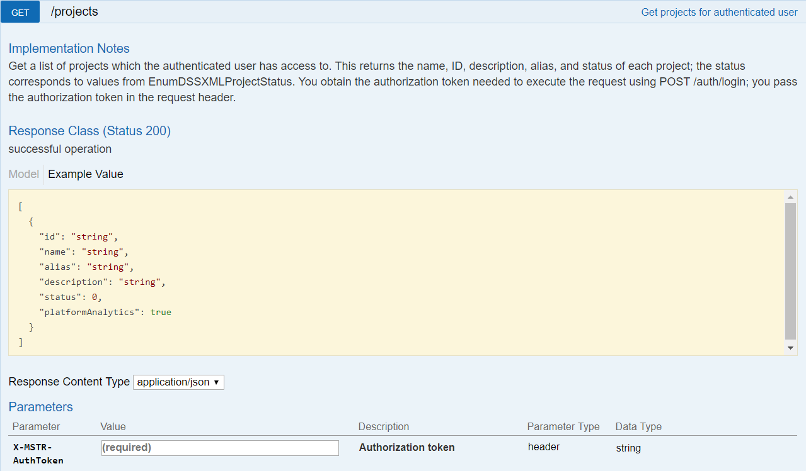
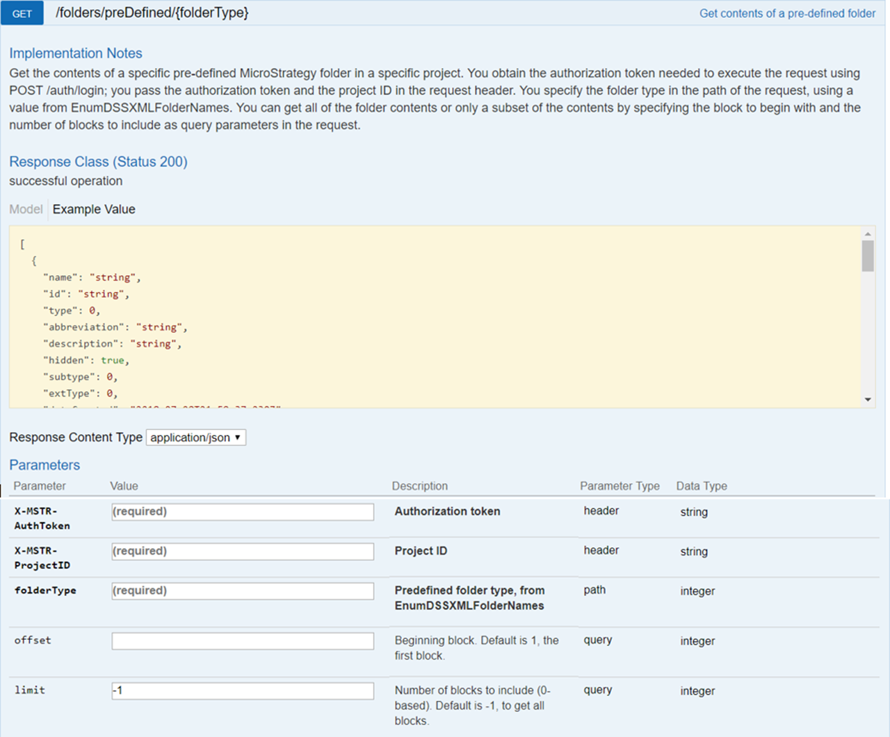

:::tip

You can try out this workflow at [REST API Playground](https://www.postman.com/microstrategysdk/workspace/microstrategy-rest-api/folder/16131298-01bcf62f-9d6f-4ddf-9f63-064d875ddae2?ctx=documentation).

Learn more about MicroStrategy REST API Playground [here](/docs/getting-started/playground.md).

:::

The workflow for browsing folders in the metadata includes the following sequence of REST API requests.

1. [Log in](#log-in) Authenticate into the environment with `POST /api/auth/login` and standard authentication.
1. [Get project list](#get-project-list) Obtain the project list from `GET /api/projects`.
1. [Browse to the Shared Reports folder](#browse-to-the-shared-reports-folder) Call `GET /api/folders/preDefined` to perform folder browsing to the Shared Reports folder (may be multiple requests).
   1. [Get the Shared Reports and My Reports folder objects (optional)](#get-the-shared-reports-and-my-reports-folder-objects-optional) <Available since="2021 Update 10" inline />
1. [Browse to a folder by ID](#browse-to-a-folder-by-id) Call `GET /api/folders/{id}` to perform folder browsing to a child folder under Shared Reports.
1. [Log out](#log-out) Call `POST /api/logout` to close the session.

A detailed explanation of each step is provided below:

## Log in

Endpoint: [POST /api/auth/login](https://demo.microstrategy.com/MicroStrategyLibrary/api-docs/index.html#/Authentication/postLogin)

This endpoint allows the caller to authenticate with the MicroStrategy REST server. You provide the information used to create the session in the body of the request. In this example, you use standard authentication so you need to provide username, password, and loginMode (which specifies the authentication mode to use). If you omit an optional field, the REST server uses the default value. If the call is successful, the resulting HTTP response returns an HTTP status code 204 and a response header containing `X-MSTR-AuthToken`, the authorization token that will be used in subsequent requests.


REST API Explorer: [https://demo.microstrategy.com/MicroStrategyLibrary/api-docs/index.html#/Authentication/postLogin](https://demo.microstrategy.com/MicroStrategyLibrary/api-docs/index.html#/Authentication/postLogin)

Sample Request

- Request Headers

  ```http
  'Content-Type: application/json'
  'Accept: application/json'
  ```

- Request Body

  ```json
  {
    "loginMode": 1,
    "username": "administrator",
    "password": ""
  }
  ```

- Curl

  ```bash
  curl -X POST "https://demo.microstrategy.com/MicroStrategyLibrary/api/auth/login" --header 'Content-Type: application/json' --header 'Accept: application/json' -d '{ \
    "loginMode":1, \
    "username": "administrator", \
    "password": "" \
    }'
  ```

Sample Response

- Response Headers

  ```json
  {
    "pragma": "no-cache",
    "x-mstr-authtoken": "nllmm5lpmkjdsj4d4etgdikc6c",
    "cache-control": "no-cache, no-store, max-age=0, must-revalidate",
    "date": "Thur, 5 July 2018 01:42:31 GMT",
    "expires": "0",
    "content-type": null
  }
  ```

  The authorization token "x-mstr-authtoken" is returned in the response header. It is used in other endpoints to authenticate the user.

- Response Body: Empty
- Response Code: 204 (Success: No Content)

## Get project list

Endpoint: [GET /api/projects](https://demo.microstrategy.com/MicroStrategyLibrary/api-docs/index.html#/Projects/getProjects_1)

This endpoint allows the caller to get the list of projects with the MicroStrategy REST server. In this example, you get the list of projects in the MicroStrategy Tutorial metadata. You use the authorization token returned during login as the value for the header parameter, `X-MSTR-AuthToken`. If the call is successful, the resulting HTTP response returns an HTTP status code 200 and a response body containing a list of the active projects that the user session has access to.



REST API Explorer: [https://demo.microstrategy.com/MicroStrategyLibrary/api-docs/index.html#/Projects/getProjects](https://demo.microstrategy.com/MicroStrategyLibrary/api-docs/index.html#/Projects/getProjects_1)

Sample Request

- Request Headers

  ```http
  'Accept: application/json'
  'X-MSTR-AuthToken: nllmm5lpmkjdsj4d4etgdikc6c'
  ```

- Request Body: Empty

- Curl

  ```bash
  curl -X GET "https://demo.microstrategy.com/MicroStrategyLibrary/api/projects" --header 'Accept: application/json' --header 'X-MSTR-AuthToken: nllmm5lpmkjdsj4d4etgdikc6c'
  ```

Sample Response

- Response Body

  ```http
  [
    {
      "id": "B19DEDCC11D4E0EFC000EB9495D0F44F",
      "name": "MicroStrategy Tutorial",
      "alias": "",
      "description": "MicroStrategy Tutorial project and application set designed to illustrate the platform's rich functionality. The theme is an Electronics, Books, Movies and Music store. Employees, Inventory, Finance, Product Sales and Suppliers are analyzed.",
      "status": 0
    },
    {
      "id": "AF09B3E3458F78B4FBE4DEB68528BF7B",
      "name": "Human Resources Analysis Module",
      "alias": "",
      "description": "The Human Resources Analysis Module analyses workforce headcount, trends and profiles, employee attrition and recruitment, compensation and benefit costs and employee qualifications, performance and satisfaction.",
      "status": 0
    }
  ]
  ```

The response body contains information for each project that is returned, including the project ID that you use in later endpoints.

- Response Code: 204 (Success: OK)

## Browse to the Shared Reports folder

Endpoint: [GET /api/folders/preDefined/{folderType}](https://demo.microstrategy.com/MicroStrategyLibrary/api-docs/index.html#/Browsing/getPreDefinedFolder)

This endpoint allows the caller to get the objects under a predefined folder with the MicroStrategy REST server. In this example, you get the objects under "Shared Reports" in the "MicroStrategy Tutorial" project. You use the authorization token returned by `POST /api/auth/login` as the value for `X-MSTR-AuthToken` and a project ID returned by `GET /api/projects` as the value for `X-MSTR-ProjectID`. You provide a value for `folderType` from the [EnumDSSXMLFolderNames](https://www2.microstrategy.com/producthelp/2021/WebAPIReference/com/microstrategy/webapi/EnumDSSXMLFolderNames.html) enumeration. In this example, you use the value "7" , which specifies the predefined "Shared Reports" folder under the "Public Objects" folder. If the call is successful, the resulting HTTP response returns an HTTP status 200 and a list of metadata objects under the "Shared Reports" folder.



REST API Explorer: [https://demo.microstrategy.com/MicroStrategyLibrary/api-docs/index.html#/Browsing/getPreDefinedFolder](https://demo.microstrategy.com/MicroStrategyLibrary/api-docs/index.html#/Browsing/getPreDefinedFolder)

Sample Request

- Request Parameters

  

- Request Headers

  ```http
  'Accept: application/json'
  'X-MSTR-AuthToken: nllmm5lpmkjdsj4d4etgdikc6c'
  'X-MSTR-ProjectID: B19DEDCC11D4E0EFC000EB9495D0F44F'
  ```

- Curl

  ```bash
  curl -X GET "https://demo.microstrategy.com/MicroStrategyLibrary/api/folders/preDefined/7?limit=-1" --header 'Accept: application/json' --header 'X-MSTR-AuthToken: nllmm5lpmkjdsj4d4etgdikc6c' --header 'X-MSTR-ProjectID: B19DEDCC11D4E0EFC000EB9495D0F44F'
  ```

Sample Response

- Response Body

  You can find detail definitions of each parameter in the Response body for this endpoint on the MicroStrategy REST API Explorer page, under Response Class -> Model.

  ```json
    {
      "name": "Business Roles",
      "id": "032A5E114A59D28267BDD8B6D9E58B22",
      "type": 8,
      "description": "These folders contain reports that are appropriate for individuals in different organizational roles.",
      "subtype": 2048,
      "dateCreated": "2005-05-06T17:48:43.000-0400",
      "dateModified": "2007-03-04T11:42:01.000-0500",
      "version": "3940C5CB4136F3B1DB4F5ABD9541F4B8",
      "acg": 255,
      "owner": {
        "name": "Administrator",
        "id": "54F3D26011D2896560009A8E67019608"
      }
    },
    {
      "name": "Documents and Scorecards",
      "id": "F025A94B4C03B6DCEE0F5D9DA825DA67",
      "type": 8,
      "description": "This folder contains several examples of dashboards.",
      "subtype": 2048,
      "dateCreated": "2007-01-13T17:39:22.000-0500",
      "dateModified": "2015-05-04T17:50:35.000-0400",
      "version": "123CF8A84FCD6FA5B2496E96E5915CAA",
      "acg": 255,
      "owner": {
        "name": "Administrator",
        "id": "54F3D26011D2896560009A8E67019608"
      }
    },
    {
      "name": "Enterprise Reporting Documents",
      "id": "92ADD0F84D07AC532AD03BA0F92A836B",
      "type": 8,
      "description": "This folder contains various types of documents such as scorecards and dashboards, managed metrics reports, production and operational reports, invoices and statements, and business reports.",
      "subtype": 2048,
      "dateCreated": "2003-09-08T16:35:27.000-0400",
      "dateModified": "2012-03-29T10:49:01.000-0400",
      "version": "51FF405E46B8C3400027D6896CC8AA4F",
      "acg": 255,
      "owner": {
        "name": "Administrator",
        "id": "54F3D26011D2896560009A8E67019608"
      }
    },
    {
      "name": "MicroStrategy Platform Capabilities",
      "id": "D64C532E4E7FBA74D29A7CA3576F39CF",
      "type": 8,
      "description": "This folder contains examples of many of the sophisticated capabilities within the MicroStrategy platform.",
      "subtype": 2048,
      "dateCreated": "2006-05-23T04:55:20.000-0400",
      "dateModified": "2012-05-17T05:00:38.000-0400",
      "version": "9E78732646B926BB161F32B5E96581D3",
      "acg": 255,
      "owner": {
        "name": "Administrator",
        "id": "54F3D26011D2896560009A8E67019608"
      }
    },
    {
      "name": "Sample Dashboards",
      "id": "C6C5ECF0B571448A9C31C653AB1D5E51",
      "type": 8,
      "hidden": true,
      "subtype": 2048,
      "dateCreated": "2014-10-20T14:13:39.000-0400",
      "dateModified": "2017-02-16T03:46:16.000-0500",
      "version": "25798DEE4C5CFC61B54BE8A6E60AF208",
      "acg": 255,
      "owner": {
        "name": "Administrator",
        "id": "54F3D26011D2896560009A8E67019608"
      }
    },
    {
      "name": "Subject Areas",
      "id": "5B68C5AE433C728679340A91DC8F809C",
      "type": 8,
      "description": "This folder contains reports that are categorized by topic. Topics include Customer Analysis, Enterprise Performance Management, Human Resource Analysis, Inventory and Supply Chain Analysis, Sales and Profitability Analysis, and Supplier Analysis.",
      "subtype": 2048,
      "dateCreated": "2006-05-22T11:42:06.000-0400",
      "dateModified": "2010-04-08T07:13:16.000-0400",
      "version": "D07DA02D455910C463F928ACBDE6AC9D",
      "acg": 255,
      "owner": {
        "name": "Administrator",
        "id": "54F3D26011D2896560009A8E67019608"
      }
    }
  ```

  The REST server returns all the object information under "Shared Reports".

### Get the Shared Reports and My Reports folder objects (optional)

 <Available since="2021 Update 10" />

Endpoint: [GET /api/folders/preDefined?folderType={folderType}](https://demo.microstrategy.com/MicroStrategyLibrary/api-docs/index.html#/Browsing/getPreDefinedFolders)

This endpoint allows the caller to get the folder object of one or more predefined folders with the MicroStrategy REST server. In this example, you get the "Shared Reports" and "My Reports" folder objects in the "MicroStrategy Tutorial" project. You use the authorization token returned by `POST /api/auth/login` as the value for `X-MSTR-AuthToken` and a project ID returned by `GET /api/projects` as the value for `X-MSTR-ProjectID`. You provide a value for `folderType` from the [EnumDSSXMLFolderNames](https://www2.microstrategy.com/producthelp/2021/WebAPIReference/com/microstrategy/webapi/EnumDSSXMLFolderNames.html) enumeration. You may specify multiple folder types as a comma separated list. In this example, you use the value "7,20", where "7" specifies the predefined "Shared Reports" folder under the "Public Objects" folder, and "20" specifies the "My Reports" folder under the profile folder of the active user. If the call is successful, the resulting HTTP response returns an HTTP status code 200 and a list of the folder objects requested.

Sample Request

- Request Parameters

  - `X-MSTR-AuthToken`

    The authorization token generated by `POST /api/auth/login`.

  - `X-MSTR-ProjectID`

    The ID of the project that the folders being requested belong to.

  - `folderType`

    The pre-defined folder type, from [EnumDSSXMLFolderNames](https://www2.microstrategy.com/producthelp/2021/WebAPIReference/com/microstrategy/webapi/EnumDSSXMLFolderNames.html). You may specify multiple folder types as a comma separated list.

- Request Headers

  ```http
  'Accept: application/json'
  'X-MSTR-AuthToken: nllmm5lpmkjdsj4d4etgdikc6c'
  'X-MSTR-ProjectID: B19DEDCC11D4E0EFC000EB9495D0F44F'
  ```

- Curl

  ```bash
  curl -X GET "https://demo.microstrategy.com/MicroStrategyLibrary/api/folders/preDefined?folderType=7,20" --header 'Accept: application/json' --header 'X-MSTR-AuthToken: nllmm5lpmkjdsj4d4etgdikc6c' --header 'X-MSTR-ProjectID: B19DEDCC11D4E0EFC000EB9495D0F44F'
  ```

Sample Response

- Response Body

  The REST server returns a list containing the object information of the requested folders. Note that the folder with the name "Reports" is the Shared Reports folder.

  ```json
  {
    "preDefined": [
      {
        "name": "Reports",
        "id": "D3C7D461F69C4610AA6BAA5EF51F4125",
        "type": 8,
        "subtype": 2048,
        "dateCreated": "2010-06-11T18:38:55.000+0000",
        "dateModified": "2023-02-10T18:07:21.000+0000",
        "version": "C4849006E34EA7DA6D811F8CBD319C50",
        "acg": 255,
        "owner": {
          "name": "Administrator",
          "id": "54F3D26011D2896560009A8E67019608"
        },
        "extType": 0,
        "folderType": 7
      },
      {
        "name": "My Reports",
        "id": "E287FE0E11E5B55F03C70080EF555BA1",
        "type": 8,
        "subtype": 2048,
        "dateCreated": "2016-01-07T16:58:33.000+0000",
        "dateModified": "2023-03-08T21:32:18.000+0000",
        "version": "784CAF8370496D2510CF91A7AD72941B",
        "acg": 255,
        "owner": {
          "name": "Administrator",
          "id": "54F3D26011D2896560009A8E67019608"
        },
        "extType": 0,
        "folderType": 20
      }
    ]
  }
  ```

## Browse to a folder by ID

Endpoint: [GET /api/folders/{id}](https://demo.microstrategy.com/MicroStrategyLibrary/api-docs/index.html#/Browsing/getFolder)

This endpoint allows the caller to get the objects under a folder with the MicroStrategy REST server using the folder ID. You use the authorization token returned by `POST /api/auth/login` as the value for `X-MSTR-AuthToken` and a project ID returned by `GET /api/projects` as the value for `X-MSTR-ProjectID`. You provide a value for the `id` path parameter with the ID of the folder you want to browse to. In this example, the value "032A5E114A59D28267BDD8B6D9E58B22" is used, which is the ID of the "Business Roles" folder under "Shared Reports" that was returned by [GET /api/folders/preDefined/7](#browse-to-the-shared-reports-folder). If the call is successful, the resulting HTTP response returns an HTTP status code 200 and a list of metadata objects under the folder.

Sample Request

- Request Parameters

  - `X-MSTR-AuthToken`

    The authorization token generated by `POST /api/auth/login`.

  - `X-MSTR-ProjectID`

    The ID of the project that the folder being requested belongs to.

  - `id`

    The folder ID.

- Request Headers

  ```http
  'Accept: application/json'
  'X-MSTR-AuthToken: nllmm5lpmkjdsj4d4etgdikc6c'
  'X-MSTR-ProjectID: B19DEDCC11D4E0EFC000EB9495D0F44F'
  ```

- Curl

  ```bash
  curl -X GET "https://demo.microstrategy.com/MicroStrategyLibrary/api/folders/032A5E114A59D28267BDD8B6D9E58B22" --header 'Accept: application/json' --header 'X-MSTR-AuthToken: nllmm5lpmkjdsj4d4etgdikc6c' --header 'X-MSTR-ProjectID: B19DEDCC11D4E0EFC000EB9495D0F44F'
  ```

Sample Response

- Response Body

  The REST server returns all the object information under the "Business Roles" folder.

  ```json
  [
    {
      "name": "Billing Managers",
      "id": "7A83FC5245C894A2FD0B0BA20801E3F8",
      "type": 8,
      "description": "This folder contains reports that are appropriate for Billing Managers, including a customer invoice and a customer transaction report.",
      "subtype": 2048,
      "dateCreated": "2005-05-06T21:49:08.000+0000",
      "dateModified": "2016-08-12T19:32:56.000+0000",
      "version": "ECEBEF8448F5E57B189AD6A19C839133",
      "acg": 255,
      "owner": {
        "name": "Administrator",
        "id": "54F3D26011D2896560009A8E67019608"
      },
      "extType": 0
    },
    {
      "name": "Brand Managers",
      "id": "8B1A934F46393111029F40A9CB4FE0C6",
      "type": 8,
      "description": "This folder contains brand sales and profitability analyses.",
      "subtype": 2048,
      "dateCreated": "2005-05-06T21:49:14.000+0000",
      "dateModified": "2016-08-12T19:32:56.000+0000",
      "version": "ECEBEF8448F5E57B189AD6A19C839133",
      "acg": 255,
      "owner": {
        "name": "Administrator",
        "id": "54F3D26011D2896560009A8E67019608"
      },
      "extType": 0
    },
    {
      "name": "Category Managers",
      "id": "9B6F439640C1BEDB30EF74939A43F286",
      "type": 8,
      "description": "This folder contains category sales and profitability analyses.",
      "subtype": 2048,
      "dateCreated": "2005-05-06T21:49:24.000+0000",
      "dateModified": "2016-08-12T19:32:56.000+0000",
      "version": "ECEBEF8448F5E57B189AD6A19C839133",
      "acg": 255,
      "owner": {
        "name": "Administrator",
        "id": "54F3D26011D2896560009A8E67019608"
      },
      "extType": 0
    },
    {
      "name": "Company Executives",
      "id": "0065ED414DC05BC9E4E7E6AC2C6AA81F",
      "type": 8,
      "description": "This folder contains executive dashboards that summarize corporate and regional performance.",
      "subtype": 2048,
      "dateCreated": "2006-05-23T08:56:12.000+0000",
      "dateModified": "2016-08-12T19:32:56.000+0000",
      "version": "ECEBEF8448F5E57B189AD6A19C839133",
      "acg": 255,
      "owner": {
        "name": "Administrator",
        "id": "54F3D26011D2896560009A8E67019608"
      },
      "extType": 0
    },
    {
      "name": "District Sales Managers",
      "id": "5105902A4446ACC07467C79BF19FC47C",
      "type": 8,
      "description": "This folder contains analyzes of store-level performance.",
      "subtype": 2048,
      "dateCreated": "2005-05-06T21:49:36.000+0000",
      "dateModified": "2016-08-12T19:32:56.000+0000",
      "version": "ECEBEF8448F5E57B189AD6A19C839133",
      "acg": 255,
      "owner": {
        "name": "Administrator",
        "id": "54F3D26011D2896560009A8E67019608"
      },
      "extType": 0
    },
    {
      "name": "Operations Managers",
      "id": "A81BEFB44F7EE6F522AC85814B3BDCC6",
      "type": 8,
      "description": "This folder contains documents analyzing sales transactions at the city and state levels, as well as an analysis of the timeliness of outbound shipments.",
      "subtype": 2048,
      "dateCreated": "2006-07-20T13:20:01.000+0000",
      "dateModified": "2016-08-12T19:32:56.000+0000",
      "version": "ECEBEF8448F5E57B189AD6A19C839133",
      "acg": 255,
      "owner": {
        "name": "Administrator",
        "id": "54F3D26011D2896560009A8E67019608"
      },
      "extType": 0
    },
    {
      "name": "Regional Sales Managers",
      "id": "E62347FB419BF6C847A712AB40148E6A",
      "type": 8,
      "description": "This folder contains analyses of customer income, sales by employee, and revenue trends.",
      "subtype": 2048,
      "dateCreated": "2005-05-06T21:49:46.000+0000",
      "dateModified": "2016-08-12T19:32:56.000+0000",
      "version": "ECEBEF8448F5E57B189AD6A19C839133",
      "acg": 255,
      "owner": {
        "name": "Administrator",
        "id": "54F3D26011D2896560009A8E67019608"
      },
      "extType": 0
    },
    {
      "name": "Suppliers",
      "id": "AD0985064D8912292E0D07AE1F86866F",
      "type": 8,
      "description": "This folder contains a report analyzing sales by supplier by customer region, item, and month.",
      "subtype": 2048,
      "dateCreated": "2006-05-23T08:56:48.000+0000",
      "dateModified": "2016-08-12T19:32:56.000+0000",
      "version": "ECEBEF8448F5E57B189AD6A19C839133",
      "acg": 255,
      "owner": {
        "name": "Administrator",
        "id": "54F3D26011D2896560009A8E67019608"
      },
      "extType": 0
    }
  ]
  ```

### Filter the folder contents

<Available since="2021 Update 10" />

When calling `GET /api/folders/{id}`, you can use the optional query parameters `type` and `hidden` to filter the objects that are included in the response.

- `type`: Filter the folder contents based on the `type` property of objects. If this query parameter is passed, then only objects of the type(s) specified are included in the response. If not passed, no filtering is applied. You may specify multiple values as a comma separated list. Possible values are defined in [EnumDSSXMLObjectTypes](https://www2.microstrategy.com/producthelp/2021/WebAPIReference/com/microstrategy/webapi/EnumDSSXMLObjectTypes.html). For example, `type=3,8,55` only includes objects in the folder that have a type of `3` (reports), `8` (folders), or `55` (dossiers and documents).
- `hidden`: Filter the result based on the `hidden` property of objects. If this query parameter is not passed, then no filtering is applied (both hidden and unhidden objects are returned). If you pass `hidden=false` then only objects that are _not_ hidden are returned. If you pass `hidden=true` then only objects that are hidden are returned.

## Log out

Endpoint: [POST /api/auth/logout](https://demo.microstrategy.com/MicroStrategyLibrary/api-docs/index.html#/Authentication/postLogout)

This endpoint allows the caller to log out for the authenticated user with the MicroStrategy REST server. In this example, you close the active user session by providing the `X-MSTR-AuthToken` authorization token generated during login. If the call is successful, the resulting HTTP response returns an HTTP status code 204.


REST API Explorer: [https://demo.microstrategy.com/MicroStrategyLibrary/api-docs/index.html#/Authentication/postLogout](https://demo.microstrategy.com/MicroStrategyLibrary/api-docs/index.html#/Authentication/postLogout)

Sample Request

- Request Headers

  ```http
  'Accept: application/json'
  'X-MSTR-AuthToken: nllmm5lpmkjdsj4d4etgdikc6c'
  ```

- Request Body: Empty

- Curl

  ```bash
  curl -X POST -i -c ~/cookie-jar.txt --header 'Content-Type: application/json' --header 'Accept: application/json' --header 'X-MSTR-AuthToken: nllmm5lpmkjdsj4d4etgdikc6c'  https://demo.microstrategy.com/MicroStrategyLibrary/api/auth/logout'
  ```

Sample Response

- Response code: 204
