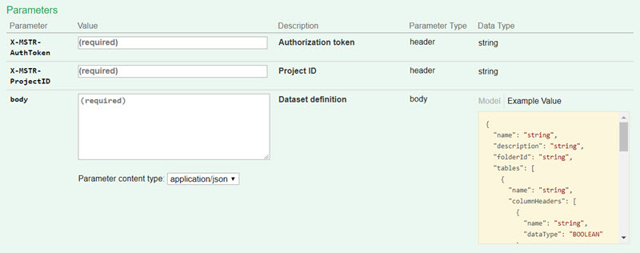
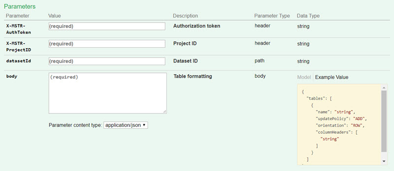
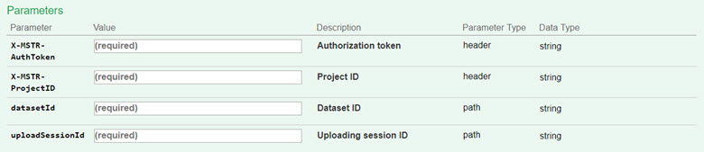
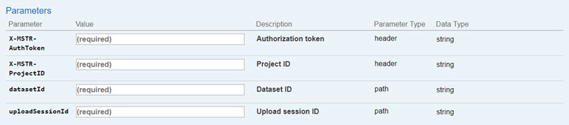

:::tip

You can try out this workflow at [REST API Playground](https://www.postman.com/microstrategysdk/workspace/microstrategy-rest-api/folder/16131298-2f45d89b-a009-455b-b181-f5e529be9121?ctx=documentation).

Learn more about MicroStrategy REST API Playground [here](/docs/getting-started/playground.md).

:::

## Workflow

The steps below illustrate the workflow for defining a dataset with one or more tables and then incrementally uploading data to the Intelligence Server with multiple requests, before publishing the final dataset. This same workflow is used to update a dataset created with the Push Data API—either a [dataset created using one REST API request](../create-a-dataset-with-one-request/workflow-create-and-modify-a-dataset-with-one-request.md) or a [dataset created with multiple API requests](../create-a-dataset-incrementally-with-multiple-requests/create-a-dataset-incrementally-with-multiple-requests.md).

1. [Log in](#log-in). Call `POST /api/auth/login` to authenticate the user and create a session.
1. [Create the definition of the dataset](#create-the-definition-of-the-dataset). Call `POST /api/datasets/models` to create the definition of the dataset.
1. [Create an upload session on the IServer](#create-an-upload-session-on-the-iserver). Call `POST /api/datasets/{datasetId}/uploadSessions` to define the format of the data to upload.
1. [Add data to the upload session (with multiple calls)](#add-data-to-the-upload-session-with-multiple-calls). Call `PUT /api/datasets/{datasetId}/uploadSessions/{uploadSessionsId}` multiple times to upload external data to the IServer in separate calls.
1. [Publish the dataset](#publish-the-dataset). Call `POST /api/datasets/{datasetId}/uploadSessions/{uploadSessionsId}/publish` to publish the dataset.
1. [Check to see if the dataset has been published](#check-to-see-if-the-dataset-has-been-published). Call `POST /api/datasets/{datasetId}/uploadSessions/{uploadSessionsId}/publishStatus` to check the publication status of the dataset (whether the publish action is complete).
1. [Delete the upload session](#delete-the-upload-session). Call `DELETE /api/datasets/{datasetId}/uploadSessions/{uploadSessionsId}` to end the upload session—either because the dataset has been published or to cancel the publish action before it has finished.
1. [Log out](#log-out). Call `POST /api/logout` to close the authenticated user's session.

A detailed explanation of each step, with code samples, is provided below:

## Log in

End Point: [POST /api/auth/login](https://demo.microstrategy.com/MicroStrategyLibrary/api-docs/index.html#/Authentication/postLogin)

This endpoint allows the caller to authenticate with the MicroStrategy REST server. You provide the information used to create the session in the body of the request; in this example, you use standard authentication so you need to provide username, password, and loginMode (which specifies the authentication mode to use). If you omit an optional field, the REST Server uses the default value. If the call is successful, the resulting HTTP response returns an HTTP status code 204 and a response header containing the authorization token that will be used in subsequent requests.

Sample Request Header:

```http
'Content-Type: application/json'
'Accept: application/json'
```

Sample Request Body:

```json
{
  "loginMode": 1,
  "username": "administrator",
  "password": ""
}
```

Sample Curl:

```bash
curl -X --header 'Content-Type: application/json' --header 'Accept: application/json' -d '{
  "username": "administrator",
  "password": "",
  "loginMode":1
}' 'https://demo.microstrategy.com/MicroStrategyLibrary/api/auth/login'
```

Sample Response Header:

The authorization token `"x-mstr-authtoken"` is returned in the response header. you use it in the header of other endpoints to authenticate the user.

```json
{
  "pragma": "no-cache",
  "x-mstr-authtoken": "r8t814um1kjnjocse1kgm7rijm",
  "cache-control": "no-cache, no-store, max-age=0, must-revalidate",
  "date": "Mon, 15 Jan 2018 06:13:41 GMT",
  "expires": "0",
  "content-type": null
}
```

Response Body: Empty

Response Code: 204

## Create the definition of the dataset

End Point: [POST /api/datasets/models](https://demo.microstrategy.com/MicroStrategyLibrary/api-docs/index.html#/Datasets/createTable)

This endpoint allows the caller to create the definition of a dataset containing one or more tables. The definition includes the name and description of the dataset and the name and description of each table, attribute, and metric within the dataset.

You pass the authorization token created in step 1 for `X-MSTR-AuthToken` header and a project ID for `X-MSTR-ProjectID` header.

You provide the information used to create the dataset definition in the body of the request. The data format is the same as it is used in [POST /api/datasets](https://demo.microstrategy.com/MicroStrategyLibrary/api-docs/index.html#/Datasets/createDICube) request. You can see [this page](../create-a-dataset-with-one-request/workflow-create-and-modify-a-dataset-with-one-request.md) for the explanation of the fields.

Request

- Request Parameters

  

- Request Headers

  ```http
  'Content-Type: application/json''Accept: application/json''X-MSTR-AuthToken: r8t814um1kjnjocse1kgm7rijm’'X-MSTR-ProjectID: B19DEDCC11D4E0EFC000EB9495D0F44F'
  ```

- Request Body

  ```json
  {
    "name": "testModel",
    "description": "This is a dataset definition created by the Push Data API",
    "tables": [
      {
        "name": "table1",
        "columnHeaders": [
          {
            "name": "ID",
            "dataType": "Integer"
          },
          {
            "name": "Date",
            "dataType": "Date"
          },
          {
            "name": "Time",
            "dataType": "Time"
          },
          {
            "name": "Category",
            "dataType": "String"
          },
          {
            "name": "Cost",
            "dataType": "Double"
          }
        ]
      },
      {
        "name": "table2",
        "columnHeaders": [
          {
            "name": "Year",
            "dataType": "Integer"
          },
          {
            "name": "DateTime",
            "dataType": "DateTime"
          },
          {
            "name": "Profit",
            "dataType": "Double"
          }
        ]
      }
    ],
    "metrics": [
      {
        "name": "Cost",
        "expressions": [
          {
            "tableName": "table1",
            "columnName": "Cost"
          }
        ]
      },
      {
        "name": "Profit",
        "expressions": [
          {
            "tableName": "table2",
            "columnName": "Profit"
          }
        ]
      }
    ],
    "attributes": [
      {
        "name": "ID",
        "attributeForms": [
          {
            "category": "ID",
            "expressions": [
              {
                "tableName": "table1",
                "columnName": "ID"
              }
            ]
          }
        ]
      },
      {
        "name": "Date",
        "attributeForms": [
          {
            "category": "ID",
            "expressions": [
              {
                "tableName": "table1",
                "columnName": "Date"
              }
            ]
          }
        ]
      },
      {
        "name": "Time",
        "attributeForms": [
          {
            "category": "ID",
            "expressions": [
              {
                "tableName": "table1",
                "columnName": "Time"
              }
            ]
          }
        ]
      },
      {
        "name": "Category",
        "attributeForms": [
          {
            "category": "ID",
            "expressions": [
              {
                "tableName": "table1",
                "columnName": "Category"
              }
            ]
          }
        ]
      },
      {
        "name": "Year",
        "attributeForms": [
          {
            "category": "ID",
            "expressions": [
              {
                "tableName": "table2",
                "columnName": "Year"
              }
            ]
          }
        ]
      },
      {
        "name": "DateTime",
        "attributeForms": [
          {
            "category": "ID",
            "expressions": [
              {
                "tableName": "table2",
                "columnName": "DateTime"
              }
            ]
          }
        ]
      }
    ]
  }
  ```

- Curl

  ```json
  {
    "name": "testModel",
    "description": "This is a dataset definition created by the Push Data API",
    "tables": [
      {
        "name": "table1",
        "columnHeaders": [
          {
            "name": "ID",
            "dataType": "Integer"
          },
          {
            "name": "Date",
            "dataType": "Date"
          },
          {
            "name": "Time",
            "dataType": "Time"
          },
          {
            "name": "Category",
            "dataType": "String"
          },
          {
            "name": "Cost",
            "dataType": "Double"
          }
        ]
      },
      {
        "name": "table2",
        "columnHeaders": [
          {
            "name": "Year",
            "dataType": "Integer"
          },
          {
            "name": "DateTime",
            "dataType": "DateTime"
          },
          {
            "name": "Profit",
            "dataType": "Double"
          }
        ]
      }
    ],
    "metrics": [
      {
        "name": "Cost",
        "expressions": [
          {
            "tableName": "table1",
            "columnName": "Cost"
          }
        ]
      },
      {
        "name": "Profit",
        "expressions": [
          {
            "tableName": "table2",
            "columnName": "Profit"
          }
        ]
      }
    ],
    "attributes": [
      {
        "name": "ID",
        "attributeForms": [
          {
            "category": "ID",
            "expressions": [
              {
                "tableName": "table1",
                "columnName": "ID"
              }
            ]
          }
        ]
      },
      {
        "name": "Date",
        "attributeForms": [
          {
            "category": "ID",
            "expressions": [
              {
                "tableName": "table1",
                "columnName": "Date"
              }
            ]
          }
        ]
      },
      {
        "name": "Time",
        "attributeForms": [
          {
            "category": "ID",
            "expressions": [
              {
                "tableName": "table1",
                "columnName": "Time"
              }
            ]
          }
        ]
      },
      {
        "name": "Category",
        "attributeForms": [
          {
            "category": "ID",
            "expressions": [
              {
                "tableName": "table1",
                "columnName": "Category"
              }
            ]
          }
        ]
      },
      {
        "name": "Year",
        "attributeForms": [
          {
            "category": "ID",
            "expressions": [
              {
                "tableName": "table2",
                "columnName": "Year"
              }
            ]
          }
        ]
      },
      {
        "name": "DateTime",
        "attributeForms": [
          {
            "category": "ID",
            "expressions": [
              {
                "tableName": "table2",
                "columnName": "DateTime"
              }
            ]
          }
        ]
      }
    ]
  }
  ```

Response

- Response Body

  ```json
  {
    "id": "D13539E5433CDB837363F086C6DA6B5C",
    "name": "testModel"
  }
  ```

  The response body includes the name and ID of the dataset. The dataset ID is used in subsequent requests.

- Response Code: 200

## Create an upload session on the IServer

Endpoint: [POST /api/datasets/{datasetId}/uploadSessions](https://demo.microstrategy.com/MicroStrategyLibrary/api-docs/index.html#/Datasets/pushApiV2CreateUploadSession)

This endpoint allows the caller to create a multi-table dataset upload session and provide formatting information for data that is to be uploaded to the Intelligence Server. Formatting information is used by the Intelligence Server to parse data from a subsequent `PUT /api/datasets/{datasetId}/uploadSessions/{uploadSessionId}` request. You pass the authorization token and the project ID in the request header. You specify the dataset ID in the path of the request. You obtain the dataset ID from `POST /api/datasets/models`.

In the body of the request, you must provide the name and update policy for each table in the dataset. The update policy refers to how updates are applied to existing data in the dataset; valid values are 'add', 'update', 'upsert', and 'replace'. Optionally, you can also provide the orientation and column headers for each table in the body of the request; these parameters define how data is arranged in subsequent `PUT /api/datasets/{datasetId}/uploadSessions/{uploadSessionId}` requests and processed by the Intelligence Server. The [orientation parameter](#orientation) specifies whether the array of data provided is arranged by rows or columns. Valid orientations are 'ROW' and 'COLUMN'; if the orientation parameter is not provided, 'ROW' is used. The columnHeaders parameter accepts an optional list of column names; data provided in subsequent update requests should have the same order as the column names in columnHeaders. If the columnHeaders parameter is not provided, the order of column names in the response of `GET /api/datasets/{datasetId}?fields=columns` is used. If the call is successful, the resulting HTTP response returns an HTTP status code 200 and the ID of the upload session.

- Request Parameters

  

- Request Headers

  ```http
  'Content-Type: application/json'
  'Accept: application/json'
  'X-MSTR-AuthToken: r8t814um1kjnjocse1kgm7rijm’
  'X-MSTR-ProjectID: B19DEDCC11D4E0EFC000EB9495D0F44F'
  ```

- Request Body

  ```json
  {
    "tables": [
      {
        "columnHeaders": ["ID", "Date", "Time", "Category", "Cost"],
        "name": "table1",
        "orientation": "row",
        "updatePolicy": "replace"
      },
      {
        "columnHeaders": ["Year", "DateTime", "Profit"],
        "name": "table2",
        "orientation": "row",
        "updatePolicy": "add"
      }
    ]
  }
  ```

- Curl

  ```json
  {
    "tables": [
      {
        "columnHeaders": ["ID", "Date", "Time", "Category", "Cost"],
        "name": "table1",
        "orientation": "row",
        "updatePolicy": "replace"
      },
      {
        "columnHeaders": ["Year", "DateTime", "Profit"],
        "name": "table2",
        "orientation": "row",
        "updatePolicy": "add"
      }
    ]
  }
  ```

Response

- Response Body

  ```json
  {
    "uploadSessionId": "9A4EE1C04C4EA20C8A976A8172034DD0"
  }
  ```

  The response body includes the ID of the upload session. The upload session ID is used in subsequent requests.

- Response Code: 200

## Add data to the upload session (with multiple calls)

Endpoint: [PUT /api/datasets/{datasetId}/uploadSessions/{uploadSessionId}](https://demo.microstrategy.com/MicroStrategyLibrary/api-docs/index.html#/Datasets/pushApiV2AddData)

This endpoint allows the caller to iteratively upload data to the Intelligence Server that matches formatting information provided by the previous (required) `POST /api/datasets/{datasetId}/uploadSessions` request. For large data volumes, the data should first be split into smaller chunks. This request should then be called until all chunks have been uploaded. Once all the data has been uploaded, call `POST /api/datasets/{datasetId}/uploadSessions/{uploadSessionId}/publish` to update the dataset with the newly uploaded data according to the previously specified update policy. You pass the authorization token and the project ID in the request header. You specify the dataset ID and the upload session ID in the path of the request; you obtain the dataset ID from `POST /api/datasets/models`, and the upload session ID from `POST /api/datasets/{datasetId}/uploadSessions`.

You provide information about each table in the body parameter, including the table name, the index of each chunk of data, and the base64 encoded chunk of data. If the data contains values of Date, DateTime, or Time type, only ISO8601 date formats are supported. If the call is successful, the resulting HTTP response returns an HTTP status code 200.

:::tip

To improve performance, follow the recommendations below for chunking data:

- If the data size <= 50MB, the recommended practice is to put data into one chunk.
- If the data size > 50MB, the recommended practice is to put data into separate chunks. The chunk size should range from 50-200MB, with an ideal chunk size of 100MB.

:::

### Orientation

The data is before base64 encoding is formatted in different ways depending on the orientation parameter:

- In ‘ROW’ orientation, each sub-array corresponds to data in a row.

  Format:

  ```text
  [
    [data_col1_row1, data_col2_row1],
    [data_col1_row2, data_col2_row2]
  ]
  ```

  Example:

  ```json
  [
    // This is the data with row orientation when "columnHeaders": ["ID", "Date", "Time", "Category", "Cost"]
    [2, "2017-12-5", "11:00:00", "Books", 200],
    [3, "2017-12-5", "12:00:00", "Electronics", 400]
  ]
  ```

- In ‘COLUMN’ orientation, each sub-array corresponds to data in a column.

  Format:

  ```text
  [
    [data_col1_row1, data_col1_row2],
    [data_col2_row1, data_col2_row2]
  ]
  ```

  Example:

  ```json
  [
    // This is the data with column orientation when "columnHeaders": ["ID", "Date", "Time", "Category", "Cost"].
    [2, 3],
    ["2017-12-5", "2017-12-5"],
    ["11:00:00", "12:00:00"],
    ["Books", "Electronics"],
    [200, 400]
  ]
  ```

### Request

- Request Parameters

  

- Request Headers

  ```http
  'Content-Type: application/json'
  'Accept: application/json'
  'X-MSTR-AuthToken: r8t814um1kjnjocse1kgm7rijm’
  'X-MSTR-ProjectID: B19DEDCC11D4E0EFC000EB9495D0F44F'
  ```

- Request Body

  ```json
  {
    "data": "Ww0KCSAgIFsNCgkJICAxLA0KCQkgICIyMDE3LTEyLTQiLA0KCQkgICIxMTowMDowMCIsDQoJCSAgIkJvb2tzIiwNCgkJICAxMDAuNTINCgkgICBdDQoJXQ==",
    "index": "1",
    "tableName": "table1"
  }
  ```

- Curl

  ```bash
  curl -X POST --header 'Content-Type: application/json' --header 'Accept: application/json' --header 'X-MSTR-AuthToken: r8t814um1kjnjocse1kgm7rijm' --header 'X-MSTR-ProjectID: B19DEDCC11D4E0EFC000EB9495D0F44F' -d '{
    "data":"Ww0KCSAgIFsNCgkJICAxLA0KCQkgICIyMDE3LTEyLTQiLA0KCQkgICIxMTowMDowMCIsDQoJCSAgIkJvb2tzIiwNCgkJICAxMDAuNTINCgkgICBdDQoJXQ==",
    "index":"1",
    "tableName":"table1"
  }' 'https://demo.microstrategy.com/MicroStrategyLibrary/api/datasets/D13539E5433CDB837363F086C6DA6B5C/instances/9A4EE1C04C4EA20C8A976A8172034DD0/initializeUpload'
  ```

### Response

- Response Body: Empty

- Response Code: 200

## Publish the dataset

Endpoint: [POST /api/datasets/{datasetId}/uploadSessions/{uploadSessionId}/publish](https://demo.microstrategy.com/MicroStrategyLibrary/api-docs/index.html#/Datasets/pushApiV2Publish)

This endpoint allows the caller to publish a specific multi-table dataset using data uploaded to the Intelligence Server. This request should be used after calling `PUT /api/datasets/{datasetId}/uploadSessions/{uploadSessionId}` as many times as needed to upload all the data. You pass the authorization token and the project ID in the request header. You specify the dataset ID and the upload session ID in the path of the request; you obtain the dataset ID from `POST /api/datasets/models`, and the upload session ID from `POST /api/datasets/{datasetId}/uploadSessions`. If the call is successful, the resulting HTTP response returns an HTTP status code 200.

### Request

- Request Parameters

  

- Request Headers

  ```http
  'Content-Type: application/json'
  'Accept: application/json'
  'X-MSTR-AuthToken: r8t814um1kjnjocse1kgm7rijm’
  'X-MSTR-ProjectID: B19DEDCC11D4E0EFC000EB9495D0F44F'
  ```

- Curl

  ```bash
  curl -X POST --header 'Content-Type: application/json' --header 'Accept: application/json' --header 'X-MSTR-AuthToken: r8t814um1kjnjocse1kgm7rijm' --header 'X-MSTR-ProjectID: B19DEDCC11D4E0EFC000EB9495D0F44F' '
  https://demo.microstrategy.com/MicroStrategyLibrary/api/datasets/D13539E5433CDB837363F086C6DA6B5C/instances/9A4EE1C04C4EA20C8A976A8172034DD0/addData'
  ```

### Response

- Response Body: Empty

- Response Code: 200

## Check to see if the dataset has been published

Endpoint: [GET /api/datasets/{datasetId}/uploadSessions/{uploadSessionId}/publishStatus](https://demo.microstrategy.com/MicroStrategyLibrary/api-docs/index.html#/Datasets/pushApiV2GetPublishStatus)

This endpoint allows the caller to get the status of a multi-table dataset update operation after new data was uploaded to the dataset and published. This request should be called after `POST /api/datasets/{datasetId}/uploadSessions/{uploadSessionId}/publish`. You pass the authorization token and the project ID in the request header. You specify the dataset ID and the upload session ID in the path of the request; you obtain the dataset ID from `POST /api/datasets/models`, and the upload session ID from `POST /api/datasets/{datasetId}/uploadSessions`. If the call is successful, the resulting HTTP response returns an HTTP status code 200 and a status value; when the value is '1', the update action has finished.

### Request

- Request Parameters

  

- Request Headers

  ```http
  'Content-Type: application/json'
  'Accept: application/json'
  'X-MSTR-AuthToken: r8t814um1kjnjocse1kgm7rijm’
  'X-MSTR-ProjectID: B19DEDCC11D4E0EFC000EB9495D0F44F'
  ```

- Curl

  ```bash
  curl -X POST --header 'Content-Type: application/json' --header 'Accept: application/json' --header 'X-MSTR-AuthToken: p3c32i09rc92ml2u11nkats857' --header 'X-MSTR-ProjectID: 1DB3FCB845A6809E9DFFCA9D29C0CCE3' '
  https://demo.microstrategy.com/MicroStrategyLibrary/datasets/5138232E11E8D37B08A20080EF253616/uploadSessions/DB78D99811E8D37B16360080EF25B558/publish'
  ```

### Response

- Response Body

  The response body includes the ID of the upload session and the publish status (integer value and associated message).

  - Publishing finished (status value is "1")

    ```json
    {
      "uploadSessionId": "D13539E5433CDB837363F086C6DA6B5C",
      "status": "1",
      "message": "result ready"
    }
    ```

  - In processing (status value is not "1")

    ```json
    {
      "uploadSessionId": "D13539E5433CDB837363F086C6DA6B5C",
      "status": "6",
      "message": "sql execution"
    }
    ```

- Response Code: 200

## Delete the upload session

Endpoint: [DELETE /api/datasets/{datasetId}/uploadSessions/{uploadSessionId}](https://demo.microstrategy.com/MicroStrategyLibrary/api-docs/index.html#/Datasets/pushApiV2Cancel)

This endpoint allows the caller to delete the upload session after the dataset is published or cancel the publishing process. The request includes the authorization token generated when the user was authenticated, a project ID that was generated when the list of projects was returned, the ID of the dataset, and the ID of the upload session. If the call is successful, the resulting HTTP response returns an HTTP status code 200.

### Request

- Request Parameters

  

- Request Headers

  ```http
  'Content-Type: application/json'
  'Accept: application/json'
  'X-MSTR-AuthToken: r8t814um1kjnjocse1kgm7rijm’
  'X-MSTR-ProjectID: B19DEDCC11D4E0EFC000EB9495D0F44F'
  ```

- Curl

  ```bash
  curl -X DELETE --header 'Accept: application/json' --header 'X-MSTR-AuthToken: p3c32i09rc92ml2u11nkats857' --header 'X-MSTR-ProjectID: 1DB3FCB845A6809E9DFFCA9D29C0CCE3' '
  https://demo.microstrategy.com/MicroStrategyLibrary /api/datasets/5138232E11E8D37B08A20080EF253616/uploadSessions/DB78D99811E8D37B16360080EF25B558'
  ```

### Response

- Response Headers

  ```json
  {
    "content-security-policy": "frame-ancestors 'self'",
    "x-content-type-options": "nosniff",
    "date": "Fri, 19 Oct 2018 09:08:21 GMT",
    "transfer-encoding": "chunked",
    "access-control-allow-methods": "GET, POST, DELETE, PUT, PATCH, HEAD, OPTIONS",
    "cache-control": "no-store",
    "access-control-allow-headers": "Content-Type",
    "x-xss-protection": "1; mode=block",
    "content-type": null
  }
  ```

- Response Body: Empty

- Response Code: 200

## Log out

End Point: [POST /api/auth/logout](https://demo.microstrategy.com/MicroStrategyLibrary/api-docs/index.html#/Authentication/postLogout)

This endpoint allows the caller to log out for the authenticated user, using the MicroStrategy REST server. You close the active user session by providing the authorization token generated during login. If the call is successful, the resulting HTTP response returns an HTTP status code 204.

### Request

- Request Headers

  ```http
  'Accept: application/json'
  'X-MSTR-AuthToken: r8t814um1kjnjocse1kgm7rijm'
  ```

- Request Body: Empty

- Curl

  ```bash
  curl -X POST --header 'Content-Type: application/json' --header 'Accept: application/json' --header 'X-MSTR-AuthToken: r8t814um1kjnjocse1kgm7rijm' 'https://demo.microstrategy.com/MicroStrategyLibrary/api/auth/logout'
  ```

### Response

- Response code: 204
