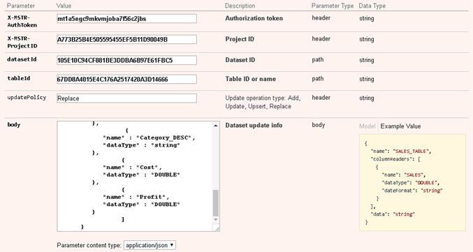

:::tip

You can try out this workflow at [REST API Playground](https://www.postman.com/microstrategysdk/workspace/microstrategy-rest-api/folder/16131298-eccc2471-3af4-44c0-b4aa-9c98a1443823?ctx=documentation).

Learn more about MicroStrategy REST API Playground [here](/docs/getting-started/playground.md).

:::

## Workflow

You can use a single REST API to create a dataset using external data you upload directly to the Intelligence Server. If you have a small amount of data and need only one table in your dataset, this request workflow is the easiest to use. You simply define a single-table dataset and upload data to it using one Push Data API request.

:::tip

If you have a large amount of data, the recommendation is to use the [incremental approach to uploading data to the Intelligence Server](../create-a-dataset-incrementally-with-multiple-requests/create-a-dataset-incrementally-with-multiple-requests.md).

Datasets created using `POST /api/datasets/models` cannot be modified with `PATCH /api/datasets/{datasetId}/tables/{tableId}`. They are updated using the same [upload session workflow](../create-a-dataset-incrementally-with-multiple-requests/logic-for-creating-a-dataset-incrementally.md) used to create the dataset; datasets created using `POST /api/datasets` can also be updated using the upload session workflow.

:::

The steps below illustrate the workflow for creating and modifying a dataset, using external data uploaded directly to the Intelligence Server. In this workflow, you create the dataset with one REST API request and you modify it with another single request.

1. [Log in](#log-in). User authenticates into the environment with `POST /api/auth/login`
1. [Create a dataset](#create-a-dataset). User calls `POST /api/datasets` to create a dataset
1. [Update a dataset](#update-a-dataset). User calls `PATCH /api/datasets/{datasetId}/tables/{tableId}` to update the dataset
1. [Log out](#log-out). User calls `POST /api/logout` to close the session.

A detailed explanation of each step is provided below.

## Log in

End Point: [POST /api/auth/login](https://demo.microstrategy.com/MicroStrategyLibrary/api-docs/index.html#/Authentication/postLogin)

This endpoint allows the caller to authenticate with the MicroStrategy REST server. You provide the information used to create the session in the body of the request. In this example, you use standard authentication so you need to provide username, password, and loginMode (which specifies the authentication mode to use). If you omit an optional field, the REST Server uses the default value. If the call is successful, the resulting HTTP response returns an HTTP status code 204 and a response header containing X-MSTR-AuthToken, the authorization token that will be used in subsequent requests.

Sample Request Header:

```http
'Content-Type: application/json'
'Accept: application/json'
```

Sample Request Body:

```json
{
  "loginMode": 1,
  "username": "administrator",
  "password": ""
}
```

Sample Curl:

```bash
curl -X POST -i -c ~/cookie-jar.txt --header 'Content-Type: application/json'\
--header 'Accept: application/json' -d '{ \
"loginMode":1, \
"username": "administrator", \
"password": "" \
}' https://demo.microstrategy.com/MicroStrategyLibrary/api/auth/login'
```

Sample Response Header:

```json
{
  "pragma": "no-cache",
  "x-mstr-authtoken": "rllckqkm598s8vm9h3mgvfqhus",
  "cache-control": "no-cache, no-store, max-age=0, must-revalidate",
  "date": "Wed, 16 Aug 2017 01:42:31 GMT",
  "expires": "0",
  "content-type": null
}
```

The authorization token `“x-mstr-authtoken”` is returned in the response header. It is used in other endpoints to authenticate the user.


Response Body: Empty

## Create a dataset

End Point: [POST /api/datasets](https://demo.microstrategy.com/MicroStrategyLibrary/api-docs/index.html#/Datasets/createDICube)

This endpoint allows the caller to create a dataset with the MicroStrategy REST server. You use the authorization token returned in step 1 as the value for `X-MSTR-AuthToken` and a project ID for `X-MSTR-ProjectID`.

The dataset is created from the data in the `body` parameter of the request. The `body` parameter defines the data you want to upload to the Intelligence Server.

The model for this parameter has the following fields:

- `name` : Name of the dataset to be created from the external data
- `tables` : Tables to be created in the dataset
- `attributes`: Attributes to be included in the dataset
- `metrics`: Metrics to be included in the dataset

The details of each field is explained below, with the JSON examples at the end.

### Tables

The `tables` field is an array of tables. Here are the fields for each table.

| Field           | Data Type | Description                                               |
| --------------- | --------- | --------------------------------------------------------- |
| `name`          | string    | Name of the table                                         |
| `columnHeaders` | array     | An array of column headers for the table                  |
| `data`          | string    | Data in the table. It is a Base64 encoded string of JSON. |

For each column header:

| Field        | Data Type         | Description                                                                                                                                                    |
| ------------ | ----------------- | -------------------------------------------------------------------------------------------------------------------------------------------------------------- |
| `name`       | string            | Name of the column header                                                                                                                                      |
| `dataType`   | string            | Data type for the values in the column, with possible values 'STRING', 'INTEGER', 'BIGINTEGER', 'BOOL', 'DOUBLE', 'BIGDECIMAL', 'DATE', 'TIME', and 'DATETIME' |
| `dateFormat` | string (optional) | Date format for DATETME values in the column, with default format of YYYY-MM-DD[(T)hh:mm:[ss]]                                                                 |

### Attributes

The `attributes` field is an array of attributes in the table. Here are the fields for each attribute.

| Field            | Data Type | Description                 |
| ---------------- | --------- | --------------------------- |
| `name`           | string    | Name of the attribute       |
| `attributeForms` | array     | An array of attribute forms |

For each attribute form:

| Field         | Data Type | Description                                                                                                                                                    |
| ------------- | --------- | -------------------------------------------------------------------------------------------------------------------------------------------------------------- |
| `category`    | string    | Category of the attribute form, with values such as ID or DESC                                                                                                 |
| `expressions` | array     | An array of expressions that link the attribute form to a column header in the table                                                                           |
| `dataType`    | string    | Data type for the values in the column, with possible values 'STRING', 'INTEGER', 'BIGINTEGER', 'BOOL', 'DOUBLE', 'BIGDECIMAL', 'DATE', 'TIME', and 'DATETIME' |

For each expression:

| Field     | Data Type | Description                                                                                                                           |
| --------- | --------- | ------------------------------------------------------------------------------------------------------------------------------------- |
| `formula` | string    | Expression that links a metric or attribute form in the dataset to a column header in the table, in the format table_name.column_name |

### Metrics

| Field         | Data Type | Description                                                                                                                                                    |
| ------------- | --------- | -------------------------------------------------------------------------------------------------------------------------------------------------------------- |
| `name`        | string    | Name of the metric                                                                                                                                             |
| `dataType`    | string    | Data type for the values in the column, with possible values 'STRING', 'INTEGER', 'BIGINTEGER', 'BOOL', 'DOUBLE', 'BIGDECIMAL', 'DATE', 'TIME', and 'DATETIME' |
| `expressions` | array     | An array of expressions that link the metric to a column header in the table                                                                                   |

### Request

Request Parameters:


Sample Request Headers:

```http
'Accept: application/json'
'X-MSTR-AuthToken: mt1a5egc9mkvmjoba7f56c2jbs'
```

Sample Request Body:

```json
{
  "name": "SALES_TABLE",
  "tables": [
    {
      "data": "WyAgICAgICAgIA0KICAgICAgICAgICAgICAgew0KICAgICAgICAgICAgICAgICAgICAiWWVhciI6IDIwMTUsDQoJCQkJCSJDYXRlZ29yeV9JRCI6MSwNCgkJCQkJIkNhdGVnb3J5X0RFU0MiOiJCb29rcyIsDQoJCQkJCSJDb3N0IjoxMDAwLjAwLA0KCQkJCQkiUHJvZml0IjoyMDAwLjAwDQogICAgICAgICAgICAgICAgfSwNCgkJCQl7DQogICAgICAgICAgICAgICAgICAgICJZZWFyIjogMjAxNiwNCgkJCQkJIkNhdGVnb3J5X0lEIjoyLA0KCQkJCQkiQ2F0ZWdvcnlfREVTQyI6Ik1vdmllcyIsDQoJCQkJCSJDb3N0IjoyMDAwLjAwLA0KCQkJCQkiUHJvZml0IjozMDAwLjAwDQogICAgICAgICAgICAgICAgfSwNCgkJCQl7DQogICAgICAgICAgICAgICAgICAgICJZZWFyIjogMjAxNywNCgkJCQkJIkNhdGVnb3J5X0lEIjozLA0KCQkJCQkiQ2F0ZWdvcnlfREVTQyI6Ik11c2ljcyIsDQoJCQkJCSJDb3N0IjozMDAwLjAwLA0KCQkJCQkiUHJvZml0Ijo0MDAwLjAwDQogICAgICAgICAgICAgICAgfSwNCgkJCQl7DQogICAgICAgICAgICAgICAgICAgICJZZWFyIjogMjAxOCwNCgkJCQkJIkNhdGVnb3J5X0lEIjo0LA0KCQkJCQkiQ2F0ZWdvcnlfREVTQyI6IkVsZWN0cm9uaWNzIiwNCgkJCQkJIkNvc3QiOjQwMDAuMDAsDQoJCQkJCSJQcm9maXQiOjUwMDAuMDANCiAgICAgICAgICAgICAgICB9DQogICAgICAgICBd",
      "name": "SALES_TABLE",
      "columnHeaders": [
        {
          "name": "Year",
          "dataType": "INTEGER"
        },
        {
          "name": "Category_ID",
          "dataType": "INTEGER"
        },
        {
          "name": "Category_DESC",
          "dataType": "string"
        },
        {
          "name": "Cost",
          "dataType": "DOUBLE"
        },
        {
          "name": "Profit",
          "dataType": "DOUBLE"
        }
      ]
    }
  ],
  "metrics": [
    {
      "name": "Cost",
      "dataType": "DOUBLE",
      "expressions": [
        {
          "formula": "SALES_TABLE.Cost"
        }
      ]
    },
    {
      "name": "Profit",
      "dataType": "DOUBLE",
      "expressions": [
        {
          "formula": "SALES_TABLE.Profit"
        }
      ]
    }
  ],
  "attributes": [
    {
      "name": "Year",
      "attributeForms": [
        {
          "category": "ID",
          "expressions": [{ "formula": "SALES_TABLE.Year" }],
          "dataType": "INTEGER"
        }
      ]
    },
    {
      "name": "category",
      "attributeForms": [
        {
          "category": "ID",
          "expressions": [{ "formula": "SALES_TABLE.Category_ID" }],
          "dataType": "INTEGER"
        },
        {
          "category": "DESC",
          "expressions": [{ "formula": "SALES_TABLE.Category_DESC" }],
          "dataType": "string"
        }
      ]
    }
  ]
}
```

Sample Curl:

```bash
curl -X POST -i -c ~/cookie-jar.txt --header 'Content-Type: application/json'\
--header 'Accept: application/json' --header 'X-MSTR-AuthToken: mt1a5egc9mkvmjoba7f56c2jbs'\
--header 'X-MSTR-ProjectID: A773B25B4E505595455EF5B11D90049B' -d '{
  "name": "SALES_TABLE",
  "tables":[
    {
      "data": "WyAgICAgICAgIA0KICAgICAgICAgICAgICAgew0KICAgICAgICAgICAgICAgICAgICAiWWVhciI6IDIwMTUsDQoJCQkJCSJDYXRlZ29yeV9JRCI6MSwNCgkJCQkJIkNhdGVnb3J5X0RFU0MiOiJCb29rcyIsDQoJCQkJCSJDb3N0IjoxMDAwLjAwLA0KCQkJCQkiUHJvZml0IjoyMDAwLjAwDQogICAgICAgICAgICAgICAgfSwNCgkJCQl7DQogICAgICAgICAgICAgICAgICAgICJZZWFyIjogMjAxNiwNCgkJCQkJIkNhdGVnb3J5X0lEIjoyLA0KCQkJCQkiQ2F0ZWdvcnlfREVTQyI6Ik1vdmllcyIsDQoJCQkJCSJDb3N0IjoyMDAwLjAwLA0KCQkJCQkiUHJvZml0IjozMDAwLjAwDQogICAgICAgICAgICAgICAgfSwNCgkJCQl7DQogICAgICAgICAgICAgICAgICAgICJZZWFyIjogMjAxNywNCgkJCQkJIkNhdGVnb3J5X0lEIjozLA0KCQkJCQkiQ2F0ZWdvcnlfREVTQyI6Ik11c2ljcyIsDQoJCQkJCSJDb3N0IjozMDAwLjAwLA0KCQkJCQkiUHJvZml0Ijo0MDAwLjAwDQogICAgICAgICAgICAgICAgfSwNCgkJCQl7DQogICAgICAgICAgICAgICAgICAgICJZZWFyIjogMjAxOCwNCgkJCQkJIkNhdGVnb3J5X0lEIjo0LA0KCQkJCQkiQ2F0ZWdvcnlfREVTQyI6IkVsZWN0cm9uaWNzIiwNCgkJCQkJIkNvc3QiOjQwMDAuMDAsDQoJCQkJCSJQcm9maXQiOjUwMDAuMDANCiAgICAgICAgICAgICAgICB9DQogICAgICAgICBd",
      "name":"SALES_TABLE",
          "columnHeaders": [
            {
              "name" : "Year",
              "dataType" : "INTEGER"
            },
            {
              "name" : "Category_ID",
              "dataType" : "INTEGER"
            },
            {
              "name" : "Category_DESC",
              "dataType" : "string"
            },
            {
              "name" : "Cost",
              "dataType" : "DOUBLE"
            },
            {
              "name" : "Profit",
              "dataType" : "DOUBLE"
            }
          ]
    }
  ],
  "metrics" : [
    {
      "name": "Cost",
      "dataType": "DOUBLE",
      "expressions": [
        {
          "formula": "SALES_TABLE.Cost"
        }
      ]
    },
    {
      "name": "Profit",
      "dataType": "DOUBLE",
      "expressions": [
        {
          "formula": "SALES_TABLE.Profit"
        }
      ]
    }
  ],
  "attributes" : [
    {
      "name":"Year",
      "attributeForms":[
        {
          "category" : "ID",
          "expressions" : [{"formula" : "SALES_TABLE.Year"}],
          "dataType": "INTEGER"
        }
      ]
    },
    {
      "name":"category",
      "attributeForms":[
        {
          "category" : "ID",
          "expressions" : [{"formula" : "SALES_TABLE.Category_ID"}],
          "dataType": "INTEGER"
        },
        {
          "category" : "DESC",
          "expressions" : [{"formula" : "SALES_TABLE.Category_DESC"}],
          "dataType": "string"
        }
      ]
    }
  ]
}
```

### Response

The resulting HTTP response returns an HTTP status 200 and a response body containing the name and ID of the dataset and the ID of the table containing the data.

Sample Response Body:

```json
{
  "datasetId": "105E10C94CF881BE3DDBA6B97E61FBC5",
  "name": "SALES_TABLE",
  "tables": [
    {
      "id": "67DD8A4015E4C176A2517420A3D14666",
      "name": "SALES_TABLE"
    }
  ]
}
```

A dataset named SALES_TABLE is created under the My Reports folder. The dataset ID and the table ID, returned in the response body, are used in other endpoints, such as `PATCH /api/datasets/{datasetId}/tables/{tableId}`.

## Update a dataset

End Point: [PATCH /api/datasets/{datasetId}/tables/{tableId}](https://demo.microstrategy.com/MicroStrategyLibrary/api-docs/index.html#/Datasets/updateDICube)

This endpoint allows the caller to update and republish a dataset that was created by the MicroStrategy REST server (using `POST /api/datasets`). To update and republish a specific dataset, you provide the authorization token, `X-MSTR-AuthToken`, generated in step 1, the dataset ID and table ID to identify the dataset to be updated, the type of update action that should be performed, and the data to be applied. If successful, the resulting HTTP response returns an HTTP status 200.

Request Parameters



Sample Request Header:

```http
'Accept: application/json'
'X-MSTR-AuthToken: mt1a5egc9mkvmjoba7f56c2jbs'
```

Sample Request Body:

```json
{
  "data": "WyAgICAgICAgIA0KICAgICAgICAgICAgICAgew0KICAgICAgICAgICAgICAgICAgICAiWWVhciI6IDIwMTUsDQoJCQkJCSJDYXRlZ29yeV9JRCI6MSwNCgkJCQkJIkNhdGVnb3J5X0RFU0MiOiJCb29rcyIsDQoJCQkJCSJDb3N0IjoxMDAwLjAwLA0KCQkJCQkiUHJvZml0IjoyMDAwLjAwDQogICAgICAgICAgICAgICAgfSwNCgkJCQl7DQogICAgICAgICAgICAgICAgICAgICJZZWFyIjogMjAxNiwNCgkJCQkJIkNhdGVnb3J5X0lEIjo1LA0KCQkJCQkiQ2F0ZWdvcnlfREVTQyI6Ik1vdmllcyIsDQoJCQkJCSJDb3N0IjoyMDAwLjAwLA0KCQkJCQkiUHJvZml0IjozMDAwLjAwDQogICAgICAgICAgICAgICAgfSwNCgkJCQl7DQogICAgICAgICAgICAgICAgICAgICJZZWFyIjogMjAxNywNCgkJCQkJIkNhdGVnb3J5X0lEIjozLA0KCQkJCQkiQ2F0ZWdvcnlfREVTQyI6Ik11c2ljcyIsDQoJCQkJCSJDb3N0Ijo2MDAwLjAwLA0KCQkJCQkiUHJvZml0Ijo0MDAwLjAwDQogICAgICAgICAgICAgICAgfSwNCgkJCQl7DQogICAgICAgICAgICAgICAgICAgICJZZWFyIjogMjAxOSwNCgkJCQkJIkNhdGVnb3J5X0lEIjo0LA0KCQkJCQkiQ2F0ZWdvcnlfREVTQyI6IkVsZWN0cm9uaWNzIiwNCgkJCQkJIkNvc3QiOjYwMDAuMDAsDQoJCQkJCSJQcm9maXQiOjYwMDAuMDANCiAgICAgICAgICAgICAgICB9DQogICAgICAgICBd",
  "name": "SALES_TABLE",
  "columnHeaders": [
    {
      "name": "Year",
      "dataType": "INTEGER"
    },
    {
      "name": "Category_ID",
      "dataType": "INTEGER"
    },
    {
      "name": "Category_DESC",
      "dataType": "string"
    },
    {
      "name": "Cost",
      "dataType": "DOUBLE"
    },
    {
      "name": "Profit",
      "dataType": "DOUBLE"
    }
  ]
}
```

Sample Curl:

```bash
curl -X PATCH -b ~/cookie-jar.txt 'https://demo.microstrategy.com/MicroStrategyLibrary/api/datasets/105E10C94CF881BE3DDBA6B97E61FBC5/tables/67DD8A4015E4C176A2517420A3D14666'\
--header 'Content-Type: application/json'\
--header 'Accept: application/json' --header 'X-MSTR-AuthToken: mt1a5egc9mkvmjoba7f56c2jbs'\
--header 'X-MSTR-ProjectID: A773B25B4E505595455EF5B11D90049B'\
--header 'updatePolicy: Replace' -d '       {
  "data": "WyAgICAgICAgIA0KICAgICAgICAgICAgICAgew0KICAgICAgICAgICAgICAgICAgICAiWWVhciI6IDIwMTUsDQoJCQkJCSJDYXRlZ29yeV9JRCI6MSwNCgkJCQkJIkNhdGVnb3J5X0RFU0MiOiJCb29rcyIsDQoJCQkJCSJDb3N0IjoxMDAwLjAwLA0KCQkJCQkiUHJvZml0IjoyMDAwLjAwDQogICAgICAgICAgICAgICAgfSwNCgkJCQl7DQogICAgICAgICAgICAgICAgICAgICJZZWFyIjogMjAxNiwNCgkJCQkJIkNhdGVnb3J5X0lEIjo1LA0KCQkJCQkiQ2F0ZWdvcnlfREVTQyI6Ik1vdmllcyIsDQoJCQkJCSJDb3N0IjoyMDAwLjAwLA0KCQkJCQkiUHJvZml0IjozMDAwLjAwDQogICAgICAgICAgICAgICAgfSwNCgkJCQl7DQogICAgICAgICAgICAgICAgICAgICJZZWFyIjogMjAxNywNCgkJCQkJIkNhdGVnb3J5X0lEIjozLA0KCQkJCQkiQ2F0ZWdvcnlfREVTQyI6Ik11c2ljcyIsDQoJCQkJCSJDb3N0Ijo2MDAwLjAwLA0KCQkJCQkiUHJvZml0Ijo0MDAwLjAwDQogICAgICAgICAgICAgICAgfSwNCgkJCQl7DQogICAgICAgICAgICAgICAgICAgICJZZWFyIjogMjAxOSwNCgkJCQkJIkNhdGVnb3J5X0lEIjo0LA0KCQkJCQkiQ2F0ZWdvcnlfREVTQyI6IkVsZWN0cm9uaWNzIiwNCgkJCQkJIkNvc3QiOjYwMDAuMDAsDQoJCQkJCSJQcm9maXQiOjYwMDAuMDANCiAgICAgICAgICAgICAgICB9DQogICAgICAgICBd",
  "name":"SALES_TABLE",
  "columnHeaders": [
    {
      "name" : "Year",
      "dataType" : "INTEGER"
    },
    {
      "name" : "Category_ID",
      "dataType" : "INTEGER"
    },
    {
      "name" : "Category_DESC",
      "dataType" : "string"
    },
    {
      "name" : "Cost",
      "dataType" : "DOUBLE"
    },
    {
      "name" : "Profit",
      "dataType" : "DOUBLE"
    }
  ]
}'
```

Response Body: Empty

Response Code: 204

The dataset named SALES_TABLE, under the My Reports folder, is updated and republished using the specified type of update action and data. In this example, the update action is to replace the existing data with new data.

## Log out

End Point: [POST /api/auth/logout](https://demo.microstrategy.com/MicroStrategyLibrary/api-docs/index.html#/Authentication/postLogout)

This endpoint allows the caller to log out for the authenticated user with the MicroStrategy REST server. In this example, you close the active user session by providing the authorization token, X-MSTR-AuthToken, generated in step 1. If the call is successful, the resulting HTTP response returns an HTTP status code 204.

Sample Request Header:

```http
'Accept: application/json'
'X-MSTR-AuthToken: mt1a5egc9mkvmjoba7f56c2jbs'
```

Request Body: Empty

Sample Curl:

```bash
curl -X POST --header 'Content-Type: application/json' --header 'Accept: application/json'\
--header 'X-MSTR-AuthToken: mt1a5egc9mkvmjoba7f56c2jbs' 'https://demo.microstrategy.com/MicroStrategyLibrary/api/auth/logout'
```

Response Code: 204
