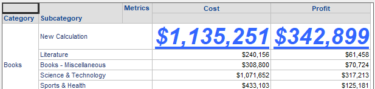
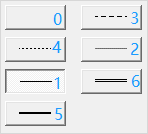
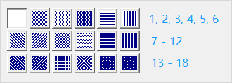
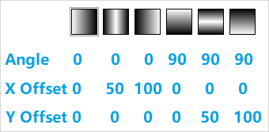

In a derived element, you can set header and values formats for each element in the POST and PUT REST APIs.

Let's say you want to set the following font properties for all values:

- Font size: 28
- Bold
- Italic
- Underline
- Color: light blue

The `"format"` field should appear as shown below.

```json
"format": {
  "header": [],
  "values": [
    {
      "type": "font_bold",
      "value": "true"
    },
    {
      "type": "font_italic",
      "value": "true"
    },
    {
      "type": "font_size",
      "value": "28"
    },
    {
      "type": "font_underline",
      "value": "true"
    },
    {
      "type": "font_color",
      "value": "16737843"
    }
  ]
}
```

If you apply this derived element to a report, the formatting appears as shown below.



In the derived element, you can set the following types of formatting in one API request. Any properties that you do not set remain at the default value.

- [Numbers](#numbers)
- [Alignment](#alignment)
- [Font](#font)
- [Border](#border)
- [Background](#background)

## Numbers

This section describes the properties used to format numbers.

:::tip

Currently, in reports, only format properties controls number formatting. Setting other properties, such as decimal places, does not take effect. Instead, you must use the following request body and construct your own format value according to [custom number formatting symbols](https://www2.microstrategy.com/producthelp/Current/ReportDesigner/WebHelp/Lang_1033/Content/custom_number_formatting_symbols.htm#NumericSymbols).

```json
"format": {
  "header": [],
  "values": [
    {
        "type": "number_category",
        "value": "7"
    },
    {
        "type": "number_format",
        "value": "###0.00;[RED]-###0.00"
    }
  ]
}
```

:::

### Category

This property represents the type of number format.

Sample Body:

```json
{
  "type": "number_category",
  "value": "1"
}
```

`"value"` is an integer of "0" through "9", as shown in the table below. The default value is "9".

| Value | Description |
| ----- | ----------- |
| 0     | Fixed       |
| 1     | Currency    |
| 2     | Date        |
| 3     | Time        |
| 4     | Percent     |
| 5     | Fraction    |
| 6     | Scientific  |
| 7     | Custom      |
| 8     | Special     |
| 9     | General     |

### Decimal Places

This property controls the number of decimal places shown in the report.

Sample Body:

```json
{
  "type": "number_decimal_places",
  "value": "1"
}
```

`"value"` is an integer of `"0"` through `"30"`. The default value is `"0"`.

### Thousands Separator

This property controls the display of a thousands separator.

Sample Body:

```json
{
  "type": "number_thousand_separator",
  "value": "true"
}
```

`"value"` is a case-insensitive Boolean of `"true"` or `"false"`. The default value is `"true"`.

### Currency Symbol

This property controls the display of the currency symbol.

Sample Body:

```json
{
  "type": "number_currency_symbol",
  "value": "$"
}
```

`"value"` is a string no longer than four characters. The default value is `"$"`.

### Currency Position

This property controls the position of the currency symbol.

Sample Body:

```json
{
  "type": "number_currency_position",
  "value": "0"
}
```

`"value"` is an integer of `"0"` through `"3"`. The default value is `"0"`.

| Value | Description                                                                        |
| ----- | ---------------------------------------------------------------------------------- |
| 0     | The currency symbol is at the beginning, such as $10.                              |
| 1     | The currency symbol is at the end, such as 10$.                                    |
| 2     | The currency symbol is at the beginning, followed by an empty space, such as $ 10. |
| 3     | An empty space is added to the end, followed by a currency symbol, such as 10 $.   |

### Format

This property specifies the customer number format.

Sample Body:

```json
{
  "type": "number_format",
  "value": "###0.00;[RED]-###0.00"
}
```

`"value"` is a string no longer than 255 characters. The default value is `"General"`.

### Negative Numbers

This property specifies the format of negative numbers.

Sample Body:

```json
{
  "type": "number_negative_numbers",
  "value": "1"
}
```

`"value"` is an integer of `"1"` through `"5"`. The default value is `"3"`.

| Value | Description                                                   |
| ----- | ------------------------------------------------------------- |
| 1     | Represents a normal negative format, such as -10.             |
| 2     | Uses red coloring to represent negative numbers, such as 10.  |
| 3     | Adds parentheses to represent negative numbers, such as (10). |
| 4     | Adds parentheses, along with red coloring, such as (10).      |
| 5     | Adds a minus symbol, along with red coloring, such as -10.    |

## Alignment

This section describes the properties used to control alignment.

### Horizontal

This property controls the horizontal position of cell data.

Sample Body:

```json
{
  "type": "alignment_horizontal",
  "value": "2"
}
```

`"value"` is an integer of `"1"` through `"5"`. The default value is "1".

| Value | Description |
| ----- | ----------- |
| 1     | General     |
| 2     | Left        |
| 3     | Center      |
| 4     | Right       |
| 5     | Fill        |

### Vertical

This property controls the vertical position of cell data.

Sample Body:

```json
{
  "type": "alignment_vertical",
  "value": "2"
}
```

`"value"` is an integer of `"1"` through `"3"`. The default value is `"1"`.

| Value | Description                                                |
| ----- | ---------------------------------------------------------- |
| 1     | Positions cell data vertically, at the top of the cell.    |
| 2     | Positions cell data vertically, in the center of the cell. |
| 3     | Positions cell data vertically, at the bottom of the cell. |

### Text Wrap

This property controls text wrapping.

Sample Body:

```json
{
  "type": "alignment_text_wrap",
  "value": "true"
}
```

`"value"` is a case-insensitive Boolean of `"true"` or `"false"`. The default value is `"false"`.

### Text Direction

This property controls text direction.

Sample Body:

```json
{
  "type": "alignment_text_direction",
  "value": "-90"
}
```

`"value"` is an integer of `"0"`, `"90"`, or `"-90"` that represents the text direction in degrees. If `"value"` is `"0"`, the text is horizontal. `"90"` places the text at a 90 degree angle. `"-90"` places the text at a -90 degree angle.

### Left Padding

This property controls left padding.

Sample Body:

```json
{
  "type": "padding_left",
  "value": "20.5"
}
```

`"value"` is a double of `"0"` through `"100"`. The default value is `"1.0"`.

### Right Padding

This property controls right padding.

Sample Body:

```json
{
  "type": "padding_right",
  "value": "20.5"
}
```

`"value"` is a double of `"0"` through `"100"`. The default value is `"1.0"`.

### Top Padding

This property controls top padding.

Sample Body:

```json
{
  "type": "padding_top",
  "value": "20.5"
}
```

`"value"` is a double of `"0"` through `"100"`. The default value is `"1.0"`.

### Bottom Padding

This property controls bottom padding.

Sample Body:

```json
{
  "type": "padding_bottom",
  "value": "20.5"
}
```

`"value"` is a double of `"0"` through `"100"`. The default value is `"1.0"`.

## Font

This section describes the properties used to control font format.

### Name

The property specifies the font name.

Sample Body:

```json
{
  "type": "font_name",
  "value": "Arial"
}
```

`"value"` is a string that represents the supported fonts. The default value is `"Arial"`. If you provide an unsupported or non-existent font, the report uses the default font.

### Bold

This property controls whether the text is bold.

Sample Body:

```json
{
  "type": "font_bold",
  "value": "true"
}
```

`"value"` is a case-insensitive Boolean of `"true"` or `"false"`. The default value is `"false"`.

### Italic

This property controls whether the text is italicized.

Sample Body:

```json
{
  "type": "font_italic",
  "value": "true"
}
```

`"value"` is a case-insensitive Boolean of `"true"` or `"false"`. The default value is `"false"`.

### Size

This property controls the font size.

Sample Body:

```json
{
  "type": "font_size",
  "value": "20"
}
```

`"value"` is an integer of `"1"` through `"2147483647"`. For readability, we suggest you provide values of `"8"` through `"72"`.

### Strikeout

This property strikes out text.

Sample Body:

```json
{
  "type": "font_strikeout",
  "value": "true"
}
```

`"value"` is a case-insensitive Boolean of `"true"` or `"false"`. The default is `"false"`.

### Underline

This property underlines text.

Sample Body:

```json
{
  "type": "font_underline",
  "value": "true"
}
```

`"value"` is a case-insensitive Boolean of `"true"` or `"false"`. The default is `"false"`.

### Color

This property controls the font color.

Sample Body:

```json
{
  "type": "font_color",
  "value": "16737843"
}
```

`"value"` is an integer from `"0"` to `"16777215"` that represents the color using the decimal color format. The default value is `"0"`, which is black.

### Script

This property specifics the type of font script.

Sample Body:

```json
{
  "type": "font_script",
  "value": "0"
}
```

`"value"` is an integer from `"0"` to `"2147483647"`. The default value is `"0"`. The value represents the corresponding font script. If the value does not have a corresponding script, the default one is used.

## Border

This section describes the properties used to format cell borders in a report.

### Top Style

This property controls the top border style of cells.

Sample Body:

```json
{
  "type": "border_top_style",
  "value": "0"
}
```

`"value`" is an integer from `"0"` to `"6"` that represents the top style of cell borders. The default value is `"1"`. The different border styles are shown below.



| Value | Border Type |
| ----- | ----------- |
| 0     | none        |
| 1     | thin        |
| 2     | hairline    |
| 3     | dashed      |
| 4     | dotted      |
| 5     | thick       |
| 6     | double      |

### Bottom Style

This property controls the bottom border style of cells.

Sample Body:

```json
{
  "type": "border_bottom_style",
  "value": "0"
}
```

This border style uses the same `"value"` as the [Top Style](#top-style).

### Left Style

This property controls the left cell border style of cells.

Sample Body:

```json
{
  "type": "border_left_style",
  "value": "0"
}
```

This border style uses the same `"value"` as the [Top Style](#top-style).

### Right Style

This property controls the right border style of cells.

Sample Body:

```json
{
  "type": "border_right_style",
  "value": "0"
}
```

This border style uses the same `"value"` as the [Top Style](#top-style).

### Top Color

This property controls the color of top cell borders.

Sample Body:

```json
{
  "type": "border_top_color",
  "value": "16737843"
}
```

`"value"` is an integer from `"0"` to `"16777215"` that represents the color using the decimal color format. The default value is `"0"`, which is black.

### Bottom Color

This property controls the color of bottom cell borders.

Sample Body:

```json
{
  "type": "border_bottom_color",
  "value": "16737843"
}
```

`"value"` is an integer from `"0"` to `"16777215"` that represents the color using the decimal color format. The default value is `"0"`, which is black.

### Left Color

This property controls the color of left cell borders.

Sample Body:

```json
{
  "type": "border_left_color",
  "value": "16737843"
}
```

`"value"` is an integer from `"0"` to `"16777215"` that represents the color using the decimal color format. The default value is `"0"`, which is black.

### Right Color

This property controls the color of right cell borders.

Sample Body:

```json
{
  "type": "border_right_color",
  "value": "16737843"
}
```

`"value"` is an integer from `"0"` to `"16777215"` that represents the color using the decimal color format. The default value is `"0"`, which is black.

## Background

This section describes the properties used to format the background.

### Fill Style

This property controls the fill style of the background.

Sample Body:

```json
{
  "type": "background_fill_style",
  "value": "0"
}
```

`"value"` is an integer of "0" through "3". The default value is `"0"`, which is solid.

| Value | Fill Style                                                                                                                                                                                                                                          |
| ----- | --------------------------------------------------------------------------------------------------------------------------------------------------------------------------------------------------------------------------------------------------- |
| 0     | solid                                                                                                                                                                                                                                               |
| 1     | transparent                                                                                                                                                                                                                                         |
| 2     | gradient<br/>You also select other supporting properties for [fill color](#fill-color), [gradient color](#gradient-color), [gradient angle](#gradient-angle), [gradient X offset](#gradient-x-offset), and [gradient X offset](#gradient-x-offset). |
| 3     | pattern<br/>You can also select other supporting properties for [fill color](#fill-color), [pattern color](#pattern-color), and [pattern style](#pattern-style).                                                                                    |

### Fill Color

This property control the fill color of the background. If the [fill style](#fill-style) is set to `"2"` for a gradient fill, this represents the gradient color.

Sample Body:

```json
{
  "type": "background_fill_color",
  "value": "16737843"
}
```

`"value"` is an integer from `"0"` to `"16777215"` that represents the color using the decimal color format. The default value is `"16777215"`, which is white.

### Pattern Color

This property controls the pattern color of the background.

Sample Body:

```json
{
  "type": "background_pattern_color",
  "value": "16737843"
}
```

`"value"` is an integer from `"0"` to `"16777215"` that represents the color using the decimal color format. The default value is `"8650752"`, which is red.

### Pattern Style

This property controls the pattern style of the background.

Sample Body:

```json
{
  "type": "background_pattern_style",
  "value": "2"
}
```

`"value"` is an integer from `"1"` to `"18"`. Each number represents one of the 18 pattern styles shown below. The default value is `"1"`, which is none.



### Gradient Color

This property controls the gradient color.

Sample Body:

```json
{
  "type": "background_gradient_color",
  "value": "16737843"
}
```

`"value"` is an integer from `"0"` to `"16777215"` that represents the color using the decimal color format. The default value is `"0"`, which is black.

`"value"` is an integer from `"0"` to `"16777215"` that represents the color using the decimal color format. The default value is `"16777215"`, which is white.

### Gradient Angle

This property sets the gradient angle.

Sample Body:

```json
{
  "type": "background_gradient_angle",
  "value": "0"
}
```

`"value"` is an integer of `"0"` or `"90"`. The default value is `"0"`.

See the image [below](#gradient_image) for an example of how a gradient appears with different combinations of angle, X offset, and Y offset.

### Gradient X Offset

This property sets the gradient X axis offset.

Sample Body:

```json
{
  "type": "background_gradient_x_offset",
  "value": "50"
}
```

`"value"` is an integer of `"0"`, `"50"`, or `"100"`. The default value is `"0"`.

See the image [below](#gradient_image) for an example of how a gradient appears with different combinations of angle, X offset, and Y offset.

### Gradient Y Offset

This property sets the gradient Y axis offset.

Sample Body:

```json
{
  "type": "background_gradient_y_offset",
  "value": "100"
}
```

`"value"` is an integer of `"0"`, `"50"`, or `"100"`. The default value is `"0"`.

See the image [below](#gradient_image) for an example of how a gradient appears with different combinations of angle, X offset, and Y offset.

<a name="gradient_image"></a>
