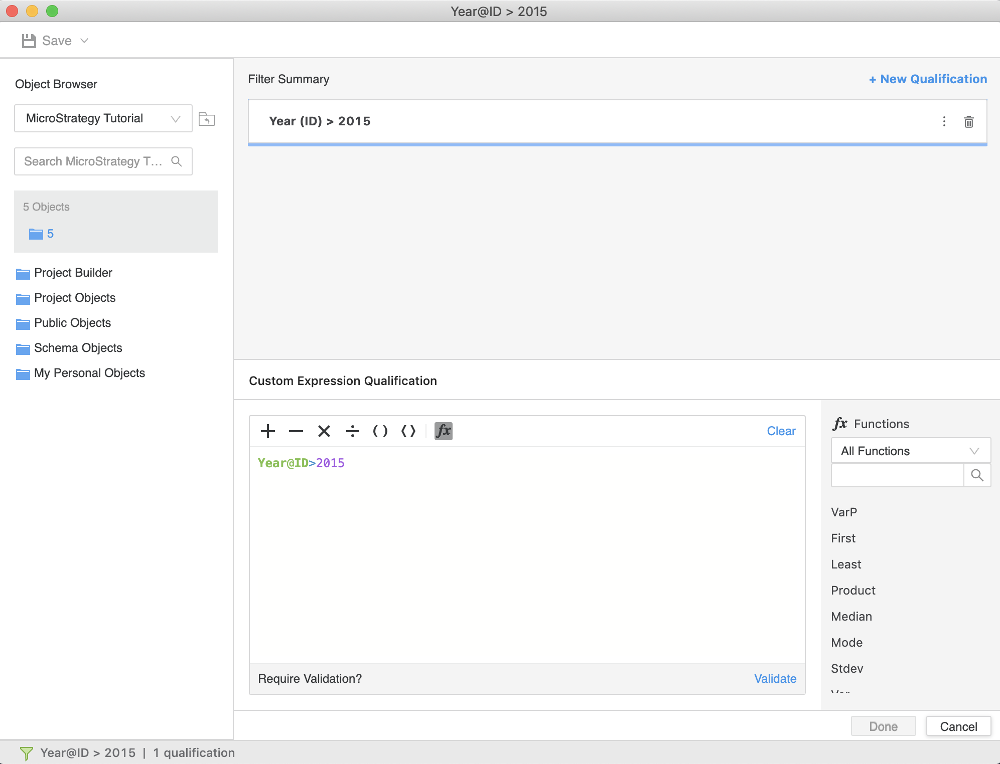

:::tip

You can try out this workflow at [REST API Playground](https://www.postman.com/microstrategysdk/workspace/microstrategy-rest-api/folder/16131298-c532ccd7-317b-4f18-9a37-1388740cbab5?ctx=documentation).

Learn more about MicroStrategy REST API Playground [here](/docs/getting-started/playground.md).

:::

This topic covers several workflows for retrieving a filter's definition:

- [Retrieve a Filter's Definition](#retrieve-a-filters-definition)
- [Retrieve a Filter's Definition in Tokens Format](#retrieve-a-filters-definition-in-tokens-format)
- [Retrieve a Filter's Definition with Custom Expressions in Tree and Tokens Formats](#retrieve-a-filters-definition-with-custom-expressions-in-tree-and-tokens-formats)
- [Retrieve a Filter's Definition That Contains Inline Custom Expressions, with the Expression in Tree and Tokens Formats](#retrieve-a-filters-definition-that-contains-inline-custom-expressions-with-the-expression-in-tree-and-tokens-formats)

## Retrieve a Filter's Definition

This workflow sample demonstrates how to retrieve the definition of a filter through the Modeling service.

You want to get the definition of the "Year > 2015" filter object. The object ID of the filter is `8018C24FEBC4406CB9E36838C01C82D1` in the MicroStrategy Tutorial project. The project ID is `B7CA92F04B9FAE8D941C3E9B7E0CD754`.

:::info

Obtain the authorization token needed to execute the request using [`POST /api/auth/login`](https://demo.microstrategy.com/MicroStrategyLibrary/api-docs/index.html#/Authentication/postLogin).

Obtain the project ID from [`GET /api/projects`](https://demo.microstrategy.com/MicroStrategyLibrary/api-docs/index.html#/Projects/getProjects_1).

:::

Retrieve the filter's definition using [/api/model/filters/{FilterId}](https://demo.microstrategy.com/MicroStrategyLibrary/api-docs/index.html#/Filters/ms-getFilterDetails).

Sample Request Header:

```http
"accept": "application/json"
"X-MSTR-AuthToken": "4bb7n1dhjo860e7tlpchg57hl"
"X-MSTR-ProjectID": "B7CA92F04B9FAE8D941C3E9B7E0CD754"
```

Sample Request Body: Empty

Sample Curl:

```bash
curl -X GET "https://demo.microstrategy.com/MicroStrategyLibrary/api/model/filters/8018C24FEBC4406CB9E36838C01C82D1" -H "accept: application/json" -H "X-MSTR-AuthToken: 4bb7n1dhjo860e7tlpchg57hl" -H "X-MSTR-ProjectID: B7CA92F04B9FAE8D941C3E9B7E0CD754"
```

Sample Response Body:

You can view the filter's definition in the body of the response.

```json
{
  "information": {
    "dateCreated": "2020-11-17T16:42:39.776Z",
    "dateModified": "2020-11-17T16:42:57.268Z",
    "versionId": "F253FD1211EB28F32AE10080EFC56102",
    "primaryLocale": "en-US",
    "objectId": "8018C24FEBC4406CB9E36838C01C82D1",
    "subType": "filter",
    "name": "Year > 2015"
  },
  "qualification": {
    "text": "Year (ID) > 2015",
    "tree": {
      "type": "predicate_form_qualification",
      "predicateId": "62EE53C755F64508BAEE99989E9EACCC",
      "predicateText": "Year (ID) > 2015",
      "predicateTree": {
        "function": "greater",
        "parameters": [
          {
            "parameterType": "constant",
            "constant": {
              "type": "double",
              "value": "2015.0"
            }
          }
        ],
        "attribute": {
          "objectId": "8D679D5111D3E4981000E787EC6DE8A4",
          "subType": "attribute",
          "name": "Year"
        },
        "form": {
          "objectId": "45C11FA478E745FEA08D781CEA190FE5",
          "subType": "attribute_form_system",
          "name": "ID"
        }
      }
    }
  }
}
```

Response Code: 200 (The filter's definition was returned successfully.)

## Retrieve a Filter's Definition in Tokens Format

In this workflow sample, you want to get the definition of the "Year < 2015" filter object. The object ID of the filter is `8018C24FEBC4406CB9E36838C01C82D1`. Unlike the first workflow, we want to enable the showFilterTokens parameter to retrieve the filter's definition in tokens format as well.

:::tip

Tokens are a semi-structured representation of MicroStrategy expression text that includes object references. For example, let’s say a filter expression is "Revenue > Cost". When the filter expression is represented as tokens, the text is broken down into pieces (tokens) with information about what these pieces represent in the metadata: ("Revenue", Revenue_ID), (">", GreaterThan_ID), ("Cost", Cost_ID).

A filter's "qualification" is presented in the following formats:

- "text": A human-readable, but non-parsable text, describing a filter's qualification.
- "tree": A tree data structure fully defining the filter's qualification.
- "tokens": A list of parsed tokens that define a filter's qualification. Be aware that generating tokens requires additional time.

If `showFilterTokens` is omitted or `false`, only "text" and "tree" formats are returned.

If `showFilterTokens` is `true`, all "text", "tree" and "tokens" formats are returned.

:::

This workflow sample is similar to [Workflow Samples: Retrieve a Filter's Definition](./), except with `showFilterTokens=true`.

Sample Curl:

```bash
curl -X GET "https://demo.cloud.microstrategy.com/MicroStrategyLibrary/api/model/filters/5B64A6A6E5B1466497D9D4D35328D91B?showFilterTokens=true" -H "accept: application/json" -H "X-MSTR-AuthToken: mcgi1hfofet0f1nhs3u3kjurah" -H "X-MSTR-ProjectID: B7CA92F04B9FAE8D941C3E9B7E0CD754"
```

Sample Response Body: You can view the filter’s definition in the body of the response. If you compare this to [Workflow Samples: Retrieve a Filter's Definition](#retrieve-a-filters-definition), "qualification" has an extra field of "tokens".

```json
{
  "information": {
    "dateCreated": "2020-11-30T12:56:01.400Z",
    "dateModified": "2020-11-30T12:56:01.400Z",
    "versionId": "6602277211EB330B01430080EF051B59",
    "primaryLocale": "en-US",
    "objectId": "5B64A6A6E5B1466497D9D4D35328D91B",
    "subType": "filter",
    "name": "Year > 2015"
  },
  "qualification": {
    "text": "Year (ID) > 2015",
    "tree": {
      "type": "predicate_form_qualification",
      "predicateId": "A0D326D440304DC4B07F12DA6631447F",
      "predicateText": "Year (ID) > 2015",
      "predicateTree": {
        "function": "greater",
        "parameters": [
          {
            "parameterType": "constant",
            "constant": {
              "type": "double",
              "value": "2015.0"
            }
          }
        ],
        "attribute": {
          "objectId": "8D679D5111D3E4981000E787EC6DE8A4",
          "subType": "attribute",
          "name": "Year"
        },
        "form": {
          "objectId": "45C11FA478E745FEA08D781CEA190FE5",
          "subType": "attribute_form_system",
          "name": "ID"
        }
      }
    },
    "tokens": [
      {
        "level": "resolved",
        "state": "initial",
        "value": "%",
        "type": "character"
      },
      {
        "level": "resolved",
        "state": "initial",
        "value": "Year@ID",
        "type": "object_at_form",
        "target": {
          "dateCreated": "2001-01-02T20:48:10.000Z",
          "dateModified": "2012-01-27T12:00:32.000Z",
          "versionId": "24CEEC7044C6C7008EE0DF96565E9459",
          "primaryLocale": "en-US",
          "objectId": "8D679D5111D3E4981000E787EC6DE8A4",
          "subType": "attribute",
          "name": "Year"
        },
        "attributeForm": {
          "objectId": "45C11FA478E745FEA08D781CEA190FE5"
        }
      },
      {
        "level": "resolved",
        "state": "initial",
        "value": ">",
        "type": "character",
        "target": {
          "dateCreated": "2001-01-02T20:47:41.000Z",
          "dateModified": "2018-01-29T21:13:06.000Z",
          "versionId": "332E00E411E8053925F00080EF7500C5",
          "primaryLocale": "en-US",
          "objectId": "8107C317DD9911D3B98100C04F2233EA",
          "subType": "function",
          "name": ">",
          "description": "Returns TRUE if the first value is greater than the second value."
        }
      },
      {
        "level": "resolved",
        "state": "initial",
        "value": "2015.0",
        "type": "integer"
      },
      {
        "level": "resolved",
        "state": "initial",
        "value": "",
        "type": "end_of_text"
      }
    ]
  }
}
```

## Retrieve a Filter's Definition with Custom Expressions in Tree and Tokens Formats

In this workflow sample, you want to get the definition of a filter that contains the custom expression, "Year@ID > 2015", with the expression returned in tree and tokens formats. The object ID of the filter is `B4B9AE1411EB3309268D0080EFE5DA56`. The following is a screenshot of what the filter looks like in the Filter editor.



If custom expressions are used in a filter, this parameter specifies the format in which they are returned in the response.

Custom expressions are presented in the following formats:

- "text": A human-readable, but non-parsable text, describing the expression. This is the default format that is always returned in the response.
- "tree": A tree data structure fully defining the expression. This format can be used if you want to examine and modify the expression programmatically.
- "tokens": A list of parsed tokens. This format can be used if you want to examine and modify the expression using the parser component. Be aware that generating tokens requires additional time.

Tokens are a semi-structured representation of MicroStrategy expression text that includes object references. For example, let’s say a filter expression is "Revenue > Cost". When the filter expression is represented as tokens, the text is broken down into pieces (tokens) with information about what these pieces represent in the metadata: ("Revenue", Revenue_ID), (">", GreaterThan_ID), ("Cost", Cost_ID).

If omitted, the custom expression is returned in "text" format.

If `tree`, the custom expression is returned in "text" and "tree" format.

If `tokens`, the custom expression is returned in "text" and "tokens" format.

This workflow is similar to [Retrieve a Filter's Definition](#retrieve-a-filters-definition), except with `showExpressionAs=tree` and `showExpressionAs=tokens`.

Sample Curl:

```bash
curl -X GET "https://demo.cloud.microstrategy.com/MicroStrategyLibrary/api/model/filters/B4B9AE1411EB3309268D0080EFE5DA56?showExpressionAs=tokens&showExpressionAs=tree" -H "accept: application/json" -H "X-MSTR-AuthToken: mcgi1hfofet0f1nhs3u3kjurah" -H "X-MSTR-ProjectID: B7CA92F04B9FAE8D941C3E9B7E0CD754"
```

Sample Response Body: You can view the filter’s definition in the body of the response. Notice that, `['qualification']['tree']['PredicateTree']['expression']` contains the fields "tree" and "tokens", representing the customer expression in `tree` and `tokens` format respectively.

```json
{
  "information": {
    "dateCreated": "2020-11-30T12:56:18.228Z",
    "dateModified": "2020-11-30T19:36:32.103Z",
    "versionId": "596C793011EB334357FA0080EF7579B5",
    "primaryLocale": "en-US",
    "objectId": "B4B9AE1411EB3309268D0080EFE5DA56",
    "subType": "filter",
    "name": "Year@ID > 2015"
  },
  "qualification": {
    "text": "Year (ID) > 2015",
    "tree": {
      "type": "predicate_custom",
      "predicateId": "A6CBA8F104FD4194B4727AE74DE8F721",
      "predicateText": "Year (ID) > 2015",
      "predicateTree": {
        "expression": {
          "text": "Year (ID) > 2015",
          "tree": {
            "function": "greater",
            "children": [
              {
                "attribute": {
                  "objectId": "8D679D5111D3E4981000E787EC6DE8A4",
                  "subType": "attribute",
                  "name": "Year"
                },
                "form": {
                  "objectId": "45C11FA478E745FEA08D781CEA190FE5",
                  "subType": "attribute_form_system",
                  "name": "ID"
                },
                "type": "form_shortcut"
              },
              {
                "type": "constant",
                "variant": {
                  "type": "int32",
                  "value": "2015"
                }
              }
            ],
            "levelType": "metric_level",
            "type": "operator"
          },
          "tokens": [
            {
              "level": "resolved",
              "state": "initial",
              "value": "%",
              "type": "character"
            },
            {
              "level": "resolved",
              "state": "initial",
              "value": "Year@ID",
              "type": "object_at_form",
              "target": {
                "dateCreated": "2001-01-02T20:48:10.000Z",
                "dateModified": "2012-01-27T12:00:32.000Z",
                "versionId": "24CEEC7044C6C7008EE0DF96565E9459",
                "primaryLocale": "en-US",
                "objectId": "8D679D5111D3E4981000E787EC6DE8A4",
                "subType": "attribute",
                "name": "Year"
              },
              "attributeForm": {
                "objectId": "45C11FA478E745FEA08D781CEA190FE5"
              }
            },
            {
              "level": "resolved",
              "state": "initial",
              "value": ">",
              "type": "character",
              "target": {
                "dateCreated": "2001-01-02T20:47:41.000Z",
                "dateModified": "2018-01-29T21:13:06.000Z",
                "versionId": "332E00E411E8053925F00080EF7500C5",
                "primaryLocale": "en-US",
                "objectId": "8107C317DD9911D3B98100C04F2233EA",
                "subType": "function",
                "name": ">",
                "description": "Returns TRUE if the first value is greater than the second value."
              }
            },
            {
              "level": "resolved",
              "state": "initial",
              "value": "2015",
              "type": "integer"
            },
            {
              "level": "resolved",
              "state": "initial",
              "value": "",
              "type": "end_of_text"
            }
          ]
        }
      }
    }
  }
}
```

Sample Response Code: 200 (Filter's definition is returned successfully.)

## Retrieve a Filter's Definition That Contains Inline Custom Expressions, with the Expression in Tree and Tokens Formats

In this workflow sample, you want to get the definition of a filter that contains an inline custom expression, with the expression returned in tree and tokens format. The object ID of the filter is `B488A1B711EB330926FF0080EFB57956`. The following is a screenshot of what the filter looks like in the Filter editor.


Get filter’s definition with its inline custom expression in tree and tokens format.

Sample Curl:

```bash
curl -X GET "https://demo.cloud.microstrategy.com/MicroStrategyLibrary/api/model/filters/B488A1B711EB330926FF0080EFB57956?showExpressionAs=tokens&showExpressionAs=tree" -H "accept: application/json" -H "X-MSTR-AuthToken: mcgi1hfofet0f1nhs3u3kjurah" -H "X-MSTR-ProjectID: B7CA92F04B9FAE8D941C3E9B7E0CD754"
```

Sample Response Body: You can view the filter’s definition in the body of the response. Notice that, `['qualification']['tree']['PredicateTree']['expression']` contains the fields "tree" and "tokens", representing the customer expression in `tree` and `tokens` format respectively.

```json
{
  "information": {
    "dateCreated": "2020-11-30T12:56:40.479Z",
    "dateModified": "2020-11-30T19:36:49.829Z",
    "versionId": "63FD317811EB334357BA0080EF5539B5",
    "primaryLocale": "en-US",
    "objectId": "B488A1B711EB330926FF0080EFB57956",
    "subType": "filter",
    "name": "Year > Current Year - 5"
  },
  "qualification": {
    "text": "Year (ID) > (Year(CurrentDate) - 5)",
    "tree": {
      "type": "predicate_form_qualification",
      "predicateId": "C7ACD6179CC44F219A663E95D236583F",
      "predicateText": "Year (ID) > (Year(CurrentDate) - 5)",
      "predicateTree": {
        "function": "greater",
        "parameters": [
          {
            "parameterType": "expression",
            "expression": {
              "text": "(Year(CurrentDate) - 5)",
              "tree": {
                "function": "minus",
                "children": [
                  {
                    "function": "year",
                    "children": [
                      {
                        "function": "current_date",
                        "type": "operator"
                      }
                    ],
                    "type": "operator"
                  },
                  {
                    "type": "constant",
                    "variant": {
                      "type": "int32",
                      "value": "5"
                    }
                  }
                ],
                "type": "operator"
              },
              "tokens": [
                {
                  "level": "resolved",
                  "state": "initial",
                  "value": "(",
                  "type": "character"
                },
                {
                  "level": "resolved",
                  "state": "initial",
                  "value": "Year",
                  "type": "function",
                  "target": {
                    "dateCreated": "2001-11-09T15:47:55.000Z",
                    "dateModified": "2018-01-29T21:13:05.000Z",
                    "versionId": "32737F3011E8053925F00080EF7500C5",
                    "primaryLocale": "en-US",
                    "objectId": "6F7DF5F8449111D5BEA300B0D01A55EF",
                    "subType": "function",
                    "name": "Year",
                    "description": "Returns the year of the input date."
                  }
                },
                {
                  "level": "resolved",
                  "state": "initial",
                  "value": "(",
                  "type": "character"
                },
                {
                  "level": "resolved",
                  "state": "initial",
                  "value": "CurrentDate",
                  "type": "function",
                  "target": {
                    "dateCreated": "2001-11-09T15:47:54.000Z",
                    "dateModified": "2018-01-29T21:13:05.000Z",
                    "versionId": "32363DBE11E8053925F00080EF7500C5",
                    "primaryLocale": "en-US",
                    "objectId": "6F7DF5F1449111D5BEA300B0D01A55EF",
                    "subType": "function",
                    "name": "CurrentDate",
                    "description": "Returns the current date based on the database timer. This function takes no input parameters."
                  }
                },
                {
                  "level": "resolved",
                  "state": "initial",
                  "value": "(",
                  "type": "character"
                },
                {
                  "level": "resolved",
                  "state": "initial",
                  "value": ")",
                  "type": "character"
                },
                {
                  "level": "resolved",
                  "state": "initial",
                  "value": ")",
                  "type": "character"
                },
                {
                  "level": "resolved",
                  "state": "initial",
                  "value": "-",
                  "type": "character",
                  "target": {
                    "dateCreated": "2001-01-02T20:47:41.000Z",
                    "dateModified": "2018-01-29T21:13:06.000Z",
                    "versionId": "330711DC11E8053925F00080EF7500C5",
                    "primaryLocale": "en-US",
                    "objectId": "8107C311DD9911D3B98100C04F2233EA",
                    "subType": "function",
                    "name": "-",
                    "description": "Returns the difference between two values."
                  }
                },
                {
                  "level": "resolved",
                  "state": "initial",
                  "value": "5",
                  "type": "integer"
                },
                {
                  "level": "resolved",
                  "state": "initial",
                  "value": ")",
                  "type": "character"
                }
              ]
            }
          }
        ],
        "attribute": {
          "objectId": "8D679D5111D3E4981000E787EC6DE8A4",
          "subType": "attribute",
          "name": "Year"
        },
        "form": {
          "objectId": "45C11FA478E745FEA08D781CEA190FE5",
          "subType": "attribute_form_system",
          "name": "ID"
        }
      }
    }
  }
}
```
