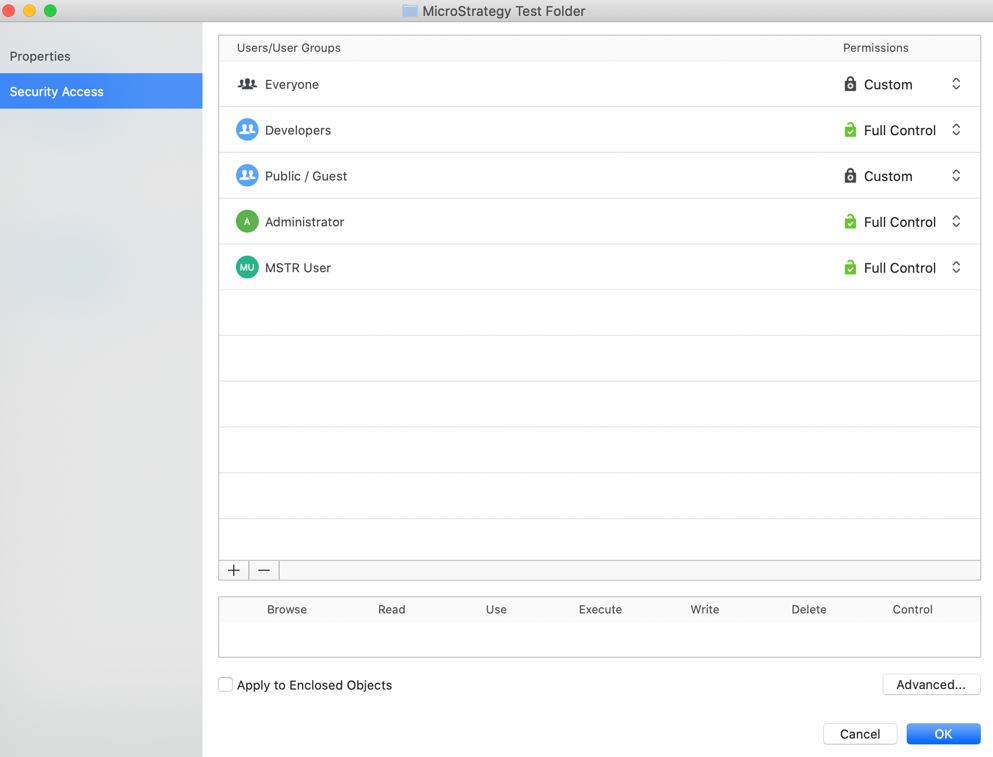
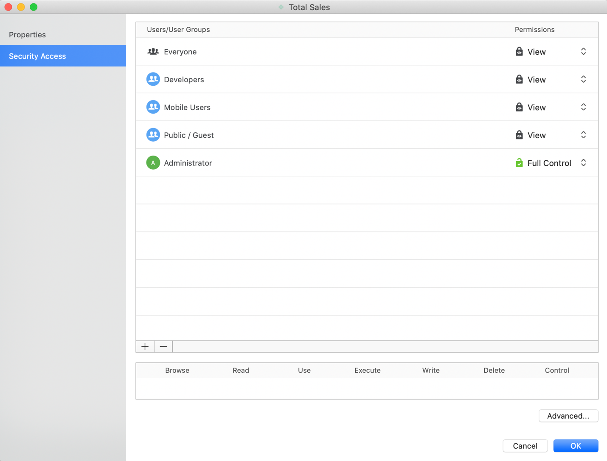

:::tip

You can try out this workflow at [REST API Playground](https://www.postman.com/microstrategysdk/workspace/microstrategy-rest-api/folder/16131298-638a5542-2f37-4df9-be9a-972a11055db5?ctx=documentation).

Learn more about MicroStrategy REST API Playground [here](/docs/getting-started/playground.md).

:::

An Access Control List (ACL) is a set of permissions on objects so that users or user groups have control over individual objects in the system. Those permissions decide whether or not a user can perform a particular class of operations on a particular object. For example, a user may have permissions to view and execute a report , but cannot modify the report definition or delete the report.

ACLs include the following information.

- User: The name of the user or group granted or denied access to the object.
- Permissions: The degree to which the user or group is granted or denied access to the object. The available permissions are:

| Access      | Description                                                                                                        | Value |
| ----------- | ------------------------------------------------------------------------------------------------------------------ | ----- |
| Browse      | Allows the viewing of an object in the Folder List and Object Viewer                                               | 1     |
| Use/Execute | Allows the usage of an object needed for execution. For example, a filter that must be used in a report execution. | 2     |
| Read        | Allows viewing of the object's definition and ACL                                                                  | 4     |
| Write       | Allows modification of the object definition, but not the object's ACL                                             | 8     |
| Delete      | Allows deletion of the object                                                                                      | 16    |
| Control     | Allows modification of the object's ACL and takes ownership of an object                                           | 32    |
| Use         | Allow usage of the object                                                                                          | 64    |
| Execute     | All execution of the object                                                                                        | 128   |
| Full        | Allow full control of the object                                                                                   | 255   |

- Inheritable: Applies only to folders. If set, any objects placed in the folder inherits the folder's entry in the ACL.

The workflow sample below demonstrates how to get and update an object's ACL.

## Get a folder's ACL

Endpoint: `GET /api/objects/{id}`

In this workflow sample, we created a MicroStrategy Test Folder under the Public Objects folder. Use the `GET /api/objects/{id}` endpoint to get complete information about the MicroStrategy Test Folder and view its ACL. The object ID of the folder is 0017E12B4DB60EE4BF7D56946ED60A7E. Based on [EnumDSSXMLObjectTypes](https://www2.microstrategy.com/producthelp/2021/WebAPIReference/com/microstrategy/webapi/EnumDSSXMLObjectTypes.html), the object type is 8.

Pass the authorization token needed to execute the request using `POST /api/auth/login`. Obtain the project ID from `GET /api/projects`. Identify possible values of the object type from [EnumDSSXMLObjectTypes](https://www2.microstrategy.com/producthelp/2021/WebAPIReference/com/microstrategy/webapi/EnumDSSXMLObjectTypes.html).

The MicroStrategy Test Folder has the following ACL for users and user groups:

| Trustee Name  | ACL Rights   | ACL Value |
| ------------- | ------------ | --------- |
| Public/Guest  | Custom       | 5         |
| Everyone      | Custom       | 5         |
| Administrator | Full Control | 255       |
| MSTR User     | Full Control | 255       |
| Developer     | Full Control | 255       |

Parameters:

```http
X-MSTR-AuthToken: ugvg79hltc7bv6sm57vt0jpr9j
X-MSTR-ProjectID: B7CA92F04B9FAE8D941C3E9B7E0CD754
Object Id: 0017E12B4DB60EE4BF7D56946ED60A7E
Object type: 8
```

Curl Request:

```bash
curl -X GET "https://demo.microstrategy.com/MicroStrategyLibrary/api/objects/0017E12B4DB60EE4BF7D56946ED60A7E?type=8" -H "accept: application/json" -H "X-MSTR-AuthToken: lac3dgmq352qt9hjcojia8e7n9" -H "X-MSTR-ProjectID: B7CA92F04B9FAE8D941C3E9B7E0CD754"
```

Request URL:

```url
https://demo.microstrategy.com/MicroStrategyLibrary/api/objects/0017E12B4DB60EE4BF7D56946ED60A7E?type=8
```

Response Code: 200

Response Body:

```json
{
  "name": "MicroStrategy Test Folder",
  "id": "0017E12B4DB60EE4BF7D56946ED60A7E",
  "type": 8,
  "subtype": 2048,
  "dateCreated": "2020-08-04T20:38:43.000+0000",
  "dateModified": "2020-08-05T15:54:16.000+0000",
  "version": "EA48B2AA11EAD73300000080EF158CC0",
  "acg": 255,
  "owner": {
    "name": "MSTR User",
    "id": "7FC05A65473CE2FD845CE6A1D3F13233"
  },
  "acl": [
    {
      "deny": false,
      "type": 1,
      "rights": 199,
      "trusteeId": "294DEDC011D2F1D56000D98E67019608",
      "trusteeName": "Public / Guest",
      "trusteeType": 34,
      "trusteeSubtype": 8705,
      "inheritable": true
    },
    {
      "deny": false,
      "type": 1,
      "rights": 199,
      "trusteeId": "C82C6B1011D2894CC0009D9F29718E4F",
      "trusteeName": "Everyone",
      "trusteeType": 34,
      "trusteeSubtype": 8705,
      "inheritable": true
    },
    {
      "deny": false,
      "type": 1,
      "rights": 255,
      "trusteeId": "54F3D26011D2896560009A8E67019608",
      "trusteeName": "Administrator",
      "trusteeType": 34,
      "trusteeSubtype": 8704,
      "inheritable": true
    },
    {
      "deny": false,
      "type": 1,
      "rights": 255,
      "trusteeId": "C1E1419F11D603A2100086B3A5E8F8A4",
      "trusteeName": "Developers",
      "trusteeType": 34,
      "trusteeSubtype": 8705,
      "inheritable": true
    }
  ],
  "extType": 0,
  "ancestors": [
    {
      "name": "MicroStrategy Tutorial",
      "id": "D43364C684E34A5F9B2F9AD7108F7828",
      "level": 2
    },
    {
      "name": "Public Objects",
      "id": "98FE182C2A10427EACE0CD30B6768258",
      "level": 1
    }
  ]
}
```

In Workstation, you can view the permissions for the MicroStrategy Test Folder.

1\. On the main Workstation window, locate the MicroStrategy Test Folder. 2\. Right-click the folder and choose **Properties** or **Get Info**. 3\. In the left pane, click **Security Access**.



## Get an attribute's ACL

Endpoint: `GET /api/objects/{id}`

Under the MicroStrategy Test Folder, there is a Total Sales attribute. Use the `GET /api/objects/{id}` endpoint to fetch all the attribute’s details, as well as the ACL. This attribute has an object ID of 5C258DC54E035C48145A2DA5C791E1D5 and an object type of 12.

The Total Sales attribute has the following ACL for users and user groups:

| Trustee Name  | ACL Rights   | ACL Value |
| ------------- | ------------ | --------- |
| Public/Guest  | View         | 199       |
| Everyone      | View         | 199       |
| Administrator | Full Control | 255       |
| MSTR User     | Full Control | 255       |
| Developer     | Full Control | 255       |

Parameters:

```http
X-MSTR-AuthToken: ugvg79hltc7bv6sm57vt0jpr9j
X-MSTR-ProjectID: B7CA92F04B9FAE8D941C3E9B7E0CD754
Object Id: 5C258DC54E035C48145A2DA5C791E1D5
Object type: 12
```

Curl:

```bash
curl -X GET "https://demo.microstrategy.com/MicroStrategyLibrary/api/objects/5C258DC54E035C48145A2DA5C791E1D5?type=12" -H "accept: application/json" -H "X-MSTR-AuthToken: oc34eshuafnv5ir2381252gs5q" -H "X-MSTR-ProjectID: B7CA92F04B9FAE8D941C3E9B7E0CD754"
```

Response Body:

```json
{
  "name": "Total Sales",
  "id": "5C258DC54E035C48145A2DA5C791E1D5",
  "type": 12,
  "abbreviation": "Testing",
  "description": "Testing",
  "subtype": 3072,
  "dateCreated": "2020-08-04T21:05:20.000+0000",
  "dateModified": "2020-08-05T17:29:14.000+0000",
  "version": "2E4C112E11EAD741285E0080EF6535D3",
  "acg": 255,
  "owner": {
    "name": "MSTR User",
    "id": "7FC05A65473CE2FD845CE6A1D3F13233"
  },
  "acl": [
    {
      "deny": false,
      "type": 1,
      "rights": 255,
      "trusteeId": "54F3D26011D2896560009A8E67019608",
      "trusteeName": "Administrator",
      "trusteeType": 34,
      "trusteeSubtype": 8704,
      "inheritable": false
    },
    {
      "deny": false,
      "type": 1,
      "rights": 255,
      "trusteeId": "C1E1419F11D603A2100086B3A5E8F8A4",
      "trusteeName": "Developers",
      "trusteeType": 34,
      "trusteeSubtype": 8705,
      "inheritable": false
    },
    {
      "deny": true,
      "type": 0,
      "rights": 199,
      "trusteeId": "C82C6B1011D2894CC0009D9F29718E4F",
      "trusteeName": "Everyone",
      "trusteeType": 34,
      "trusteeSubtype": 8705,
      "inheritable": false
    },
    {
      "deny": false,
      "type": 1,
      "rights": 255,
      "trusteeId": "7FC05A65473CE2FD845CE6A1D3F13233",
      "trusteeName": "MSTR User",
      "trusteeType": 34,
      "trusteeSubtype": 8704,
      "inheritable": false
    },
    {
      "deny": false,
      "type": 1,
      "rights": 199,
      "trusteeId": "C82C6B1011D2894CC0009D9F29718E4F",
      "trusteeName": "Everyone",
      "trusteeType": 34,
      "trusteeSubtype": 8705,
      "inheritable": false
    },
    {
      "deny": false,
      "type": 1,
      "rights": 199,
      "trusteeId": "294DEDC011D2F1D56000D98E67019608",
      "trusteeName": "Public / Guest",
      "trusteeType": 34,
      "trusteeSubtype": 8705,
      "inheritable": false
    }
  ],
  "extType": 0,
  "iconPath": "string",
  "ancestors": [
    {
      "name": "MicroStrategy Tutorial",
      "id": "D43364C684E34A5F9B2F9AD7108F7828",
      "level": 3
    },
    {
      "name": "Public Objects",
      "id": "98FE182C2A10427EACE0CD30B6768258",
      "level": 2
    },
    {
      "name": "MicroStrategy Test Folder",
      "id": "0017E12B4DB60EE4BF7D56946ED60A7E",
      "level": 1
    }
  ]
}
```

In Workstation, you can view the permissions for the Total Sales attribute.

1\. On the main Workstation window, locate the MicroStrategy Test Folder. 2\. Right-click the Total Sales attribute in the folder and choose **Properties** or **Get Info**. 3\. In the left pane, click **Security Access**.



## Update a folder's ACL

Endpoint: `PUT /api/objects/{id}`

Let's use the `PUT` operation to update the ACL value for the MicroStrategy Test Folder, previously mentioned in step 1. Update the ACL value for Developer from Full Control (255) to View (199). Then, add a trustee called Mobile User, with an ID of 0AA72D6042B938FF3FBED3AAC39349F5 and an ACL value of View (199).

The `PUT /api/objects/{id}` endpoint is used to update information for a specific object, in a specific project. Obtain the authorization token needed to execute the request using `POST /api/auth/login`. Obtain the project ID using `GET /api/projects`. Pass the authorization token and the project ID in the request header. Specify the object ID in the path of the request. Specify the object type as a query parameter; possible values for object type are provided in [EnumDSSXMLObjectTypes](https://www2.microstrategy.com/producthelp/2021/WebAPIReference/com/microstrategy/webapi/EnumDSSXMLObjectTypes.html).

Parameters:

```http
X-MSTR-AuthToken: ugvg79hltc7bv6sm57vt0jpr9j
X-MSTR-ProjectID: B7CA92F04B9FAE8D941C3E9B7E0CD754
Object Id: 0017E12B4DB60EE4BF7D56946ED60A7E
Object type: 8
```

Request Body:

```json
{
  "name": "MicroStrategy Test Folder",
  "description": "Test Folder",
  "folderId": "98FE182C2A10427EACE0CD30B6768258",
  "acl": [
    {
      "op": "ADD",
      "trustee": "0AA72D6042B938FF3FBED3AAC39349F5",
      "rights": 199,
      "denied": false,
      "inheritable": true,
      "type": 1
    },
    {
      "op": "REPLACE",
      "trustee": "C1E1419F11D603A2100086B3A5E8F8A4",
      "rights": 199,
      "denied": false,
      "inheritable": true,
      "type": 1
    }
  ],
  "propagateACLToChildren": true
}
```

Curl:

```bash
curl -X PUT "https://demo.microstrategy.com/MicroStrategyLibrary/api/objects/0017E12B4DB60EE4BF7D56946ED60A7E?type=8" -H "accept: application/json" -H "X-MSTR-AuthToken: 3j1jbrrv4ese6qfr05kgl10lv5" -H "X-MSTR-ProjectID: B7CA92F04B9FAE8D941C3E9B7E0CD754" -H "Content-Type: application/json" -d "{\\"name\\":\\"MicroStrategy Test Folder\\",\\"description\\":\\"Test Folder\\",\\"folderId\\":\\"98FE182C2A10427EACE0CD30B6768258\\",\\"acl\\":[{\\"op\\":\\"ADD\\",\\"trustee\\":\\"0AA72D6042B938FF3FBED3AAC39349F5\\",\\"rights\\":199,\\"denied\\":false,\\"inheritable\\":true,\\"type\\":1},{\\"op\\":\\"REPLACE\\",\\"trustee\\":\\"C1E1419F11D603A2100086B3A5E8F8A4\\",\\"rights\\":199,\\"denied\\":false,\\"inheritable\\":true,\\"type\\":1}],\\"propagateACLToChildren\\":true}"
```

Request URL:

```url
https://demo.microstrategy.com/MicroStrategyLibrary/api/objects/0017E12B4DB60EE4BF7D56946ED60A7E?type=8
```

Response Code: 200

Response Body:

```json
{
  "name": "MicroStrategy Test Folder",
  "id": "0017E12B4DB60EE4BF7D56946ED60A7E",
  "type": 8,
  "description": "Test Folder",
  "subtype": 2048,
  "dateCreated": "2020-08-04T20:38:43.000+0000",
  "dateModified": "2020-08-05T18:51:59.000+0000",
  "version": "BDFAEE5211EAD74C00000080EFF54DC2",
  "acg": 255,
  "owner": {
    "name": "MSTR User",
    "id": "7FC05A65473CE2FD845CE6A1D3F13233"
  },
  "acl": [
    {
      "deny": false,
      "type": 1,
      "rights": 199,
      "trusteeId": "294DEDC011D2F1D56000D98E67019608",
      "trusteeName": "Public / Guest",
      "trusteeType": 34,
      "trusteeSubtype": 8705,
      "inheritable": true
    },
    {
      "deny": false,
      "type": 1,
      "rights": 199,
      "trusteeId": "C82C6B1011D2894CC0009D9F29718E4F",
      "trusteeName": "Everyone",
      "trusteeType": 34,
      "trusteeSubtype": 8705,
      "inheritable": true
    },
    {
      "deny": false,
      "type": 1,
      "rights": 255,
      "trusteeId": "54F3D26011D2896560009A8E67019608",
      "trusteeName": "Administrator",
      "trusteeType": 34,
      "trusteeSubtype": 8704,
      "inheritable": true
    },
    {
      "deny": false,
      "type": 1,
      "rights": 199,
      "trusteeId": "C1E1419F11D603A2100086B3A5E8F8A4",
      "trusteeName": "Developers",
      "trusteeType": 34,
      "trusteeSubtype": 8705,
      "inheritable": true
    },
    {
      "deny": false,
      "type": 1,
      "rights": 199,
      "trusteeId": "0AA72D6042B938FF3FBED3AAC39349F5",
      "trusteeName": "Mobile Users",
      "trusteeType": 34,
      "trusteeSubtype": 8705,
      "inheritable": true
    }
  ],
  "extType": 0,
  "ancestors": [
    {
      "name": "MicroStrategy Tutorial",
      "id": "D43364C684E34A5F9B2F9AD7108F7828",
      "level": 2
    },
    {
      "name": "Public Objects",
      "id": "98FE182C2A10427EACE0CD30B6768258",
      "level": 1
    }
  ]
}
```

## Attribute inherits ACL of parent folder

Endpoint: `GET /api/objects/{id}`

In step 3, the Total Sales attribute inherited the same updated ACL as the parent MicroStrategy Test Folder. Any objects placed in this folder inherit the folder's entry in the ACL. The ACL for Developer is updated from Full Control (255) to View (199). A new trustee called Mobile User is added with a View (199) permission.

The Total Sales attribute has the following ACL for users and user groups:

| Trustee Name  | ACL Rights   | ACL Value |
| ------------- | ------------ | --------- |
| Public/Guest  | View         | 199       |
| Everyone      | View         | 199       |
| Administrator | Full Control | 255       |
| Mobile User   | View         | 199       |
| Developer     | View         | 199       |

Parameters:

```http
X-MSTR-AuthToken: ugvg79hltc7bv6sm57vt0jpr9j
X-MSTR-ProjectID: B7CA92F04B9FAE8D941C3E9B7E0CD754
Object Id: 5C258DC54E035C48145A2DA5C791E1D5
Object type: 12
```

Response Body:

```json
{
  "name": "Total Sales",
  "id": "5C258DC54E035C48145A2DA5C791E1D5",
  "type": 12,
  "abbreviation": "Testing",
  "description": "Testing",
  "subtype": 3072,
  "dateCreated": "2020-08-04T21:05:20.000+0000",
  "dateModified": "2020-08-05T18:51:59.000+0000",
  "version": "BE0D1F6E11EAD74CC1CC0080EFB54BF3",
  "acg": 255,
  "owner": {
    "name": "MSTR User",
    "id": "7FC05A65473CE2FD845CE6A1D3F13233"
  },
  "acl": [
    {
      "deny": false,
      "type": 1,
      "rights": 199,
      "trusteeId": "294DEDC011D2F1D56000D98E67019608",
      "trusteeName": "Public / Guest",
      "trusteeType": 34,
      "trusteeSubtype": 8705,
      "inheritable": false
    },
    {
      "deny": false,
      "type": 1,
      "rights": 199,
      "trusteeId": "C82C6B1011D2894CC0009D9F29718E4F",
      "trusteeName": "Everyone",
      "trusteeType": 34,
      "trusteeSubtype": 8705,
      "inheritable": false
    },
    {
      "deny": false,
      "type": 1,
      "rights": 255,
      "trusteeId": "54F3D26011D2896560009A8E67019608",
      "trusteeName": "Administrator",
      "trusteeType": 34,
      "trusteeSubtype": 8704,
      "inheritable": false
    },
    {
      "deny": false,
      "type": 1,
      "rights": 199,
      "trusteeId": "C1E1419F11D603A2100086B3A5E8F8A4",
      "trusteeName": "Developers",
      "trusteeType": 34,
      "trusteeSubtype": 8705,
      "inheritable": false
    },
    {
      "deny": false,
      "type": 1,
      "rights": 199,
      "trusteeId": "0AA72D6042B938FF3FBED3AAC39349F5",
      "trusteeName": "Mobile Users",
      "trusteeType": 34,
      "trusteeSubtype": 8705,
      "inheritable": false
    }
  ],
  "extType": 0,
  "iconPath": "string",
  "ancestors": [
    {
      "name": "MicroStrategy Tutorial",
      "id": "D43364C684E34A5F9B2F9AD7108F7828",
      "level": 3
    },
    {
      "name": "Public Objects",
      "id": "98FE182C2A10427EACE0CD30B6768258",
      "level": 2
    },
    {
      "name": "MicroStrategy Test Folder",
      "id": "0017E12B4DB60EE4BF7D56946ED60A7E",
      "level": 1
    }
  ]
}
```

In Workstation, you can view the updated security access for the Total Sales attribute.

1\. On the main Workstation window, locate the MicroStrategy Test Folder. 2\. Right-click the Total Sales attribute in the folder and choose **Properties** or **Get Info**. 3\. In the left pane, click **Security Access**.


