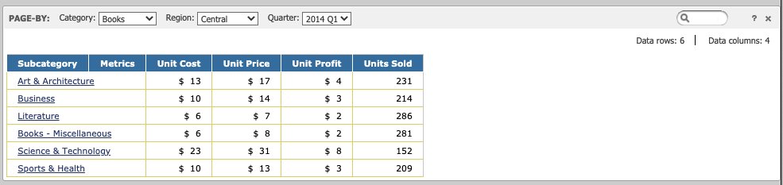

:::tip

You can try out this workflow at [REST API Playground](https://www.postman.com/microstrategysdk/workspace/microstrategy-rest-api/folder/16131298-244d4021-db1d-4e6d-9b3e-04dd192faa2f?ctx=documentation).

Learn more about MicroStrategy REST API Playground [here](/docs/getting-started/playground.md).

:::

You can use REST API requests to manage page-by information for reports.

- [Fetch the Report Definition and Include Page-By Information](#fetch-the-report-definition-and-include-page-by-information)
- [Execute the Report and Fetch Data to Apply to the Page-By Information](#execute-the-report-and-fetch-data-to-apply-to-the-page-by-information)
- [Update a Report Instance to Modify the Current Page of Page-By(s)](#update-a-report-instance-to-modify-the-current-page-of-page-bys)

The workflows on this page use the Unit Sales Paged report located in the MicroStrategy Tutorial project at **Shared Reports** > **MicroStrategy Platform Capabilities** > **MicroStrategy Office** > **Excel - Self-Service Report Book** > **Paged Report**.



## Fetch the report definition and include page-by information

This workflow sample demonstrates how to retrieve the definition of a report that contains a page-by section.

An application may need to know if a Page-By section exists on the page-by axis of a report prior to execution, so that it can set the desired value.

:::info

Obtain the authorization token needed to execute the request using [POST /api/auth/login](https://demo.microstrategy.com/MicroStrategyLibrary/api-docs/index.html#/Authentication/postLogin).

Obtain the project ID from [GET /api/projects](https://demo.microstrategy.com/MicroStrategyLibrary/api-docs/index.html#/Projects/getProjects_1).

:::

Execute [GET /api/v2/reports/{id}](https://demo.microstrategy.com/MicroStrategyLibrary/api-docs/index.html#/Reports/getDefinition_3).

Sample Request Header:

```http
"accept": "application/json"
"X-MSTR-AuthToken": "4bb7n1dhjo860e7tlpchg57hl"
"X-MSTR-ProjectID": "B7CA92F04B9FAE8D941C3E9B7E0CD754"
```

Sample Request Body: Empty

Sample Curl:

```bash
curl -X GET "https://demo.microstrategy.com/MicroStrategyLibrary/api/v2/reports/FA055E5B408A9A7ABA47C6A001E8D72C" -H "accept: application/json" -H "X-MSTR-AuthToken: 4bb7n1dhjo860e7tlpchg57hl" -H "X-MSTR-ProjectID: B7CA92F04B9FAE8D941C3E9B7E0CD754"
```

Sample Response Body:

The report definition is returned in the body of the response. This includes information about the page-by section in `definition.pageBy`.

```json
{
  "name": "Unit Sales Paged",
  "id": "FA055E5B408A9A7ABA47C6A001E8D72C",
  "definition": {
    "grid": {
      "crossTab": false,
      "metricsPosition": {
        "axis": "columns",
        "index": 0
      },
      "rows": [
        {
          "name": "Subcategory",
          "id": "8D679D4F11D3E4981000E787EC6DE8A4",
          "type": "attribute",
          "forms": [
            {
              "id": "CCFBE2A5EADB4F50941FB879CCF1721C",
              "name": "DESC",
              "dataType": "nVarChar",
              "baseFormCategory": "DESC",
              "baseFormType": "text"
            }
          ]
        }
      ],
      "columns": [
        {
          "name": "Metrics",
          "id": "00000000000000000000000000000000",
          "type": "templateMetrics",
          "elements": [
            {
              "name": "Unit Cost",
              "id": "0782483A11D40C95C000C8906B98494F",
              "type": "metric",
              "dataType": "unknown"
            },
            {
              "name": "Unit Price",
              "id": "078248EE11D40C95C000C8906B98494F",
              "type": "metric",
              "dataType": "unknown"
            },
            {
              "name": "Unit Profit",
              "id": "7FD5B6D111D5AC76C000D98A4CC5F24F",
              "type": "metric",
              "dataType": "unknown"
            },
            {
              "name": "Units Sold",
              "id": "4C05190A11D3E877C000B3B2D86C964F",
              "type": "metric",
              "dataType": "unknown"
            }
          ]
        }
      ],
      "pageBy": [
        {
          "name": "Category",
          "id": "8D679D3711D3E4981000E787EC6DE8A4",
          "type": "attribute",
          "forms": [
            {
              "id": "CCFBE2A5EADB4F50941FB879CCF1721C",
              "name": "DESC",
              "dataType": "nVarChar",
              "baseFormCategory": "DESC",
              "baseFormType": "text"
            }
          ]
        },
        {
          "name": "Region",
          "id": "8D679D4B11D3E4981000E787EC6DE8A4",
          "type": "attribute",
          "forms": [
            {
              "id": "CCFBE2A5EADB4F50941FB879CCF1721C",
              "name": "DESC",
              "dataType": "varChar",
              "baseFormCategory": "DESC",
              "baseFormType": "text"
            }
          ]
        },
        {
          "name": "Quarter",
          "id": "8D679D4A11D3E4981000E787EC6DE8A4",
          "type": "attribute",
          "forms": [
            {
              "id": "CCFBE2A5EADB4F50941FB879CCF1721C",
              "name": "DESC",
              "dataType": "varChar",
              "baseFormCategory": "DESC",
              "baseFormType": "text"
            }
          ]
        }
      ],
      "subtotals": {
        "defined": false,
        "visible": true
      },
      "sorting": {
        "rows": [],
        "columns": [],
        "pageBy": []
      },
      "thresholds": []
    },
    "availableObjects": {
      "attributes": [
        {
          "name": "Subcategory",
          "id": "8D679D4F11D3E4981000E787EC6DE8A4",
          "type": "attribute",
          "forms": [
            {
              "id": "CCFBE2A5EADB4F50941FB879CCF1721C",
              "name": "DESC",
              "dataType": "nVarChar",
              "baseFormCategory": "DESC",
              "baseFormType": "text"
            },
            {
              "id": "45C11FA478E745FEA08D781CEA190FE5",
              "name": "ID",
              "dataType": "integer",
              "baseFormCategory": "ID",
              "baseFormType": "number"
            }
          ]
        },
        {
          "name": "Category",
          "id": "8D679D3711D3E4981000E787EC6DE8A4",
          "type": "attribute",
          "forms": [
            {
              "id": "CCFBE2A5EADB4F50941FB879CCF1721C",
              "name": "DESC",
              "dataType": "nVarChar",
              "baseFormCategory": "DESC",
              "baseFormType": "text"
            },
            {
              "id": "45C11FA478E745FEA08D781CEA190FE5",
              "name": "ID",
              "dataType": "integer",
              "baseFormCategory": "ID",
              "baseFormType": "number"
            }
          ]
        },
        {
          "name": "Region",
          "id": "8D679D4B11D3E4981000E787EC6DE8A4",
          "type": "attribute",
          "forms": [
            {
              "id": "CCFBE2A5EADB4F50941FB879CCF1721C",
              "name": "DESC",
              "dataType": "varChar",
              "baseFormCategory": "DESC",
              "baseFormType": "text"
            },
            {
              "id": "45C11FA478E745FEA08D781CEA190FE5",
              "name": "ID",
              "dataType": "integer",
              "baseFormCategory": "ID",
              "baseFormType": "number"
            }
          ]
        },
        {
          "name": "Quarter",
          "id": "8D679D4A11D3E4981000E787EC6DE8A4",
          "type": "attribute",
          "forms": [
            {
              "id": "CCFBE2A5EADB4F50941FB879CCF1721C",
              "name": "DESC",
              "dataType": "varChar",
              "baseFormCategory": "DESC",
              "baseFormType": "text"
            },
            {
              "id": "45C11FA478E745FEA08D781CEA190FE5",
              "name": "ID",
              "dataType": "integer",
              "baseFormCategory": "ID",
              "baseFormType": "number"
            }
          ]
        }
      ],
      "metrics": [
        {
          "name": "Unit Cost",
          "id": "0782483A11D40C95C000C8906B98494F",
          "type": "metric",
          "dataType": "unknown"
        },
        {
          "name": "Unit Price",
          "id": "078248EE11D40C95C000C8906B98494F",
          "type": "metric",
          "dataType": "unknown"
        },
        {
          "name": "Unit Profit",
          "id": "7FD5B6D111D5AC76C000D98A4CC5F24F",
          "type": "metric",
          "dataType": "unknown"
        },
        {
          "name": "Units Sold",
          "id": "4C05190A11D3E877C000B3B2D86C964F",
          "type": "metric",
          "dataType": "unknown"
        }
      ],
      "customGroups": [],
      "consolidations": [],
      "hierarchies": []
    }
  }
}
```

## Execute the report and fetch data to apply to the page-by information

This workflow sample demonstrates how to execute a report by applying the page-by section provided by the API caller during execution. The assumption for this workflow is that the API caller is already aware of the existence of the objects on the page-by axis and their elements.

Initially the page-by elements are: Category = Books, Region = Central, Quarter = 2014 Q1. In this workflow, the page-by elements are changed to: Category = Electronics, Region = Mid-Atlantic, Quarter = 2014 Q2.

:::info

Obtain the authorization token needed to execute the request using [POST /api/auth/login](https://demo.microstrategy.com/MicroStrategyLibrary/api-docs/index.html#/Authentication/postLogin).

Obtain the project ID from [GET /api/projects](https://demo.microstrategy.com/MicroStrategyLibrary/api-docs/index.html#/Projects/getProjects_1).

:::

Execute [POST /api/v2/reports/{id}/instances](https://demo.microstrategy.com/MicroStrategyLibrary/api-docs/index.html#/Reports/createReportInstance_1).

Sample Request Header:

```http
"accept": "application/json"
"X-MSTR-AuthToken": "4bb7n1dhjo860e7tlpchg57hl"
"X-MSTR-ProjectID": "B7CA92F04B9FAE8D941C3E9B7E0CD754"
```

Sample Request Body:

```json
{
  "currentPageBy": [
    {
      "id": "h2;8D679D3711D3E4981000E787EC6DE8A4"
    },
    {
      "id": "h2;8D679D4B11D3E4981000E787EC6DE8A4"
    },
    {
      "id": "h20142;8D679D4A11D3E4981000E787EC6DE8A4"
    }
  ]
}
```

In the request body, you pass `"currentPageBy"`, which is an array of objects with one parameter ID. The position in the array corresponds to the order of the objects on the page-by axis in the report.

Sample Curl:

```bash
curl -X POST "https://demo.microstrategy.com/MicroStrategyLibrary/api/v2/reports/FA055E5B408A9A7ABA47C6A001E8D72C/instances?limit=10" -H "accept: application/json" -H "X-MSTR-AuthToken: 93ur91sedfb9f61bcjama7ekms" -H "X-MSTR-ProjectID: B7CA92F04B9FAE8D941C3E9B7E0CD754" -H "Content-Type: application/json" -d "{\"currentPageBy\":[{\"id\":\"h2;8D679D3711D3E4981000E787EC6DE8A4\"},{\"id\":\"h2;8D679D4B11D3E4981000E787EC6DE8A4\"},{\"id\":\"h20142;8D679D4A11D3E4981000E787EC6DE8A4\"}]}"
```

Sample Response Body:

The report definition is returned along with the data in the body of the response. This includes a definition for the page-by in `definition.pageBy`.

Metric data has been omitted from the following JSON sample for simplicity.

```json
{
  "name": "Unit Sales Paged",
  "id": "FA055E5B408A9A7ABA47C6A001E8D72C",
  "instanceId": "DF70FA6F1F492678E7606BBFCAEA358B",
  "status": 1,
  "definition": {
    "grid": {
      "crossTab": false,
      "metricsPosition": {
        "axis": "columns",
        "index": 0
      },
      "rows": [
        {
          "name": "Subcategory",
          "id": "8D679D4F11D3E4981000E787EC6DE8A4",
          "type": "attribute",
          "forms": [
            {
              "id": "CCFBE2A5EADB4F50941FB879CCF1721C",
              "name": "DESC",
              "dataType": "nVarChar",
              "baseFormCategory": "DESC",
              "baseFormType": "text"
            }
          ],
          "elements": [
            {
              "formValues": ["Audio Equipment"],
              "id": "h21;8D679D4F11D3E4981000E787EC6DE8A4"
            },
            {
              "formValues": ["Cameras"],
              "id": "h22;8D679D4F11D3E4981000E787EC6DE8A4"
            },
            {
              "formValues": ["Computers"],
              "id": "h23;8D679D4F11D3E4981000E787EC6DE8A4"
            },
            {
              "formValues": ["Electronics - Miscellaneous"],
              "id": "h24;8D679D4F11D3E4981000E787EC6DE8A4"
            },
            {
              "formValues": ["TV's"],
              "id": "h25;8D679D4F11D3E4981000E787EC6DE8A4"
            },
            {
              "formValues": ["Video Equipment"],
              "id": "h26;8D679D4F11D3E4981000E787EC6DE8A4"
            }
          ]
        }
      ],
      "columns": [
        {
          "name": "Metrics",
          "id": "00000000000000000000000000000000",
          "type": "templateMetrics",
          "elements": [
            {
              "name": "Unit Cost",
              "id": "0782483A11D40C95C000C8906B98494F",
              "type": "metric",
              "min": 5.5406218487,
              "max": 465.8073230769,
              "dataType": "double",
              "numberFormatting": {
                "category": 1,
                "decimalPlaces": 0,
                "formatString": "\"$ \" #,##0",
                "negativeType": 1
              }
            },
            {
              "name": "Unit Price",
              "id": "078248EE11D40C95C000C8906B98494F",
              "type": "metric",
              "min": 7.1062801932,
              "max": 586.7307692308,
              "dataType": "double",
              "numberFormatting": {
                "category": 1,
                "decimalPlaces": 0,
                "formatString": "\"$ \" #,##0",
                "negativeType": 1
              }
            },
            {
              "name": "Unit Profit",
              "id": "7FD5B6D111D5AC76C000D98A4CC5F24F",
              "type": "metric",
              "min": 0.2646396825,
              "max": 120.9234461538,
              "dataType": "double",
              "numberFormatting": {
                "category": 1,
                "decimalPlaces": 0,
                "formatString": "\"$ \" #,##0",
                "negativeType": 1
              }
            },
            {
              "name": "Units Sold",
              "id": "4C05190A11D3E877C000B3B2D86C964F",
              "type": "metric",
              "min": 25,
              "max": 1586,
              "dataType": "short",
              "numberFormatting": {
                "category": 0,
                "decimalPlaces": 0,
                "formatString": "#,##0",
                "negativeType": 1
              }
            }
          ]
        }
      ],
      "pageBy": [
        {
          "name": "Category",
          "id": "8D679D3711D3E4981000E787EC6DE8A4",
          "type": "attribute",
          "forms": [
            {
              "id": "CCFBE2A5EADB4F50941FB879CCF1721C",
              "name": "DESC",
              "dataType": "nVarChar",
              "baseFormCategory": "DESC",
              "baseFormType": "text"
            }
          ],
          "elements": [
            {
              "formValues": ["Books"],
              "id": "h1;8D679D3711D3E4981000E787EC6DE8A4"
            },
            {
              "formValues": ["Electronics"],
              "id": "h2;8D679D3711D3E4981000E787EC6DE8A4"
            },
            {
              "formValues": ["Movies"],
              "id": "h3;8D679D3711D3E4981000E787EC6DE8A4"
            },
            {
              "formValues": ["Music"],
              "id": "h4;8D679D3711D3E4981000E787EC6DE8A4"
            }
          ]
        },
        {
          "name": "Region",
          "id": "8D679D4B11D3E4981000E787EC6DE8A4",
          "type": "attribute",
          "forms": [
            {
              "id": "CCFBE2A5EADB4F50941FB879CCF1721C",
              "name": "DESC",
              "dataType": "varChar",
              "baseFormCategory": "DESC",
              "baseFormType": "text"
            }
          ],
          "elements": [
            {
              "formValues": ["Central"],
              "id": "h4;8D679D4B11D3E4981000E787EC6DE8A4"
            },
            {
              "formValues": ["Mid-Atlantic"],
              "id": "h2;8D679D4B11D3E4981000E787EC6DE8A4"
            },
            {
              "formValues": ["Northeast"],
              "id": "h1;8D679D4B11D3E4981000E787EC6DE8A4"
            },
            {
              "formValues": ["Northwest"],
              "id": "h6;8D679D4B11D3E4981000E787EC6DE8A4"
            },
            {
              "formValues": ["South"],
              "id": "h5;8D679D4B11D3E4981000E787EC6DE8A4"
            },
            {
              "formValues": ["Southeast"],
              "id": "h3;8D679D4B11D3E4981000E787EC6DE8A4"
            },
            {
              "formValues": ["Southwest"],
              "id": "h7;8D679D4B11D3E4981000E787EC6DE8A4"
            },
            {
              "formValues": ["Web"],
              "id": "h12;8D679D4B11D3E4981000E787EC6DE8A4"
            }
          ]
        },
        {
          "name": "Quarter",
          "id": "8D679D4A11D3E4981000E787EC6DE8A4",
          "type": "attribute",
          "forms": [
            {
              "id": "CCFBE2A5EADB4F50941FB879CCF1721C",
              "name": "DESC",
              "dataType": "varChar",
              "baseFormCategory": "DESC",
              "baseFormType": "text"
            }
          ],
          "elements": [
            {
              "formValues": ["2014 Q1"],
              "id": "h20141;8D679D4A11D3E4981000E787EC6DE8A4"
            },
            {
              "formValues": ["2014 Q2"],
              "id": "h20142;8D679D4A11D3E4981000E787EC6DE8A4"
            },
            {
              "formValues": ["2014 Q3"],
              "id": "h20143;8D679D4A11D3E4981000E787EC6DE8A4"
            },
            {
              "formValues": ["2014 Q4"],
              "id": "h20144;8D679D4A11D3E4981000E787EC6DE8A4"
            },
            {
              "formValues": ["2015 Q1"],
              "id": "h20151;8D679D4A11D3E4981000E787EC6DE8A4"
            },
            {
              "formValues": ["2015 Q2"],
              "id": "h20152;8D679D4A11D3E4981000E787EC6DE8A4"
            },
            {
              "formValues": ["2015 Q3"],
              "id": "h20153;8D679D4A11D3E4981000E787EC6DE8A4"
            },
            {
              "formValues": ["2015 Q4"],
              "id": "h20154;8D679D4A11D3E4981000E787EC6DE8A4"
            },
            {
              "formValues": ["2016 Q1"],
              "id": "h20161;8D679D4A11D3E4981000E787EC6DE8A4"
            },
            {
              "formValues": ["2016 Q2"],
              "id": "h20162;8D679D4A11D3E4981000E787EC6DE8A4"
            },
            {
              "formValues": ["2016 Q3"],
              "id": "h20163;8D679D4A11D3E4981000E787EC6DE8A4"
            },
            {
              "formValues": ["2016 Q4"],
              "id": "h20164;8D679D4A11D3E4981000E787EC6DE8A4"
            }
          ]
        }
      ],
      "subtotals": {
        "defined": false,
        "visible": true
      },
      "sorting": {
        "rows": [],
        "columns": [],
        "pageBy": []
      },
      "thresholds": []
    }
  },
  "data": {
    "currentPageBy": [1, 1, 1],
    "paging": {
      "total": 6,
      "current": 6,
      "offset": 0,
      "limit": 10
    },
    "headers": {
      "rows": [[0], [1], [2], [3], [4], [5]],
      "columns": [[0, 1, 2, 3]]
    },
    "metricValues": {
      "raw": [],
      "formatted": []
    }
  }
}
```

## Update a report instance to modify the current page of Page-By(s)

This workflow sample demonstrates how to update the current page of page-by(s) within a report. The report has been previously executed and the instance is reused across requests. This workflow can be used to extract data for multiple pages in a looped workflow.

Initially the page-by elements are: Category = Books, Region = Central, Quarter = 2014 Q1. In this example the page-by elements will be changed to: Category = Books, Region = Central, Quarter = 2015 Q1.

:::info

Obtain the authorization token needed to execute the request using [POST /api/auth/login](https://demo.microstrategy.com/MicroStrategyLibrary/api-docs/index.html#/Authentication/postLogin).

Obtain the project ID from [GET /api/projects](https://demo.microstrategy.com/MicroStrategyLibrary/api-docs/index.html#/Projects/getProjects_1).

:::

Obtain the report instance from [POST /api/v2/reports/{id}/instances](https://demo.microstrategy.com/MicroStrategyLibrary/api-docs/index.html#/Reports/createReportInstance_1).

1. Execute [GET /api/v2/reports/{id}/instances/{instanceId}/pageBy/elements](https://demo.microstrategy.com/MicroStrategyLibrary/api-docs/index.html#/Reports/getPageByElements).

   Sample Request Header:

   ```http
   "accept": "application/json"
   "X-MSTR-AuthToken": "4bb7n1dhjo860e7tlpchg57hl"
   "X-MSTR-ProjectID": "B7CA92F04B9FAE8D941C3E9B7E0CD754"
   ```

   Sample Request Body: Empty

   Sample Curl:

   ```bash
   curl -X GET "https://demo.microstrategy.com/MicroStrategyLibrary/api/v2/reports/176422AD794B520D7AC674954643849B/instances/176422AD794B520D7AC674954643849B/pageBy/elements?limit=5" -H "accept: application/json" -H "X-MSTR-AuthToken: 4bb7n1dhjo860e7tlpchg57hl" -H "X-MSTR-ProjectID: B7CA92F04B9FAE8D941C3E9B7E0CD754"
   ```

   Sample Response Body:

   A `pageBy` array is returned that includes the definition and elements of each page-by object. This result is filtered by the offset and limit provided in the request. A `validPageByElements` object conveys the total elements in the page-by(s) and the valid combinations are outlined in `validPageByElements.items`.

   ```json
   {
     "pageBy": [
       {
         "name": "Category",
         "id": "8D679D3711D3E4981000E787EC6DE8A4",
         "type": "attribute",
         "forms": [
           {
             "id": "CCFBE2A5EADB4F50941FB879CCF1721C",
             "name": "DESC",
             "dataType": "nVarChar",
             "baseFormCategory": "DESC",
             "baseFormType": "text"
           }
         ],
         "elements": [
           {
             "formValues": ["Books"],
             "id": "h1;8D679D3711D3E4981000E787EC6DE8A4"
           }
         ]
       },
       {
         "name": "Region",
         "id": "8D679D4B11D3E4981000E787EC6DE8A4",
         "type": "attribute",
         "forms": [
           {
             "id": "CCFBE2A5EADB4F50941FB879CCF1721C",
             "name": "DESC",
             "dataType": "varChar",
             "baseFormCategory": "DESC",
             "baseFormType": "text"
           }
         ],
         "elements": [
           {
             "formValues": ["Central"],
             "id": "h4;8D679D4B11D3E4981000E787EC6DE8A4"
           }
         ]
       },
       {
         "name": "Quarter",
         "id": "8D679D4A11D3E4981000E787EC6DE8A4",
         "type": "attribute",
         "forms": [
           {
             "id": "CCFBE2A5EADB4F50941FB879CCF1721C",
             "name": "DESC",
             "dataType": "varChar",
             "baseFormCategory": "DESC",
             "baseFormType": "text"
           }
         ],
         "elements": [
           {
             "formValues": ["2014 Q1"],
             "id": "h20141;8D679D4A11D3E4981000E787EC6DE8A4"
           },
           {
             "formValues": ["2014 Q2"],
             "id": "h20142;8D679D4A11D3E4981000E787EC6DE8A4"
           },
           {
             "formValues": ["2014 Q3"],
             "id": "h20143;8D679D4A11D3E4981000E787EC6DE8A4"
           },
           {
             "formValues": ["2014 Q4"],
             "id": "h20144;8D679D4A11D3E4981000E787EC6DE8A4"
           },
           {
             "formValues": ["2015 Q1"],
             "id": "h20151;8D679D4A11D3E4981000E787EC6DE8A4"
           }
         ]
       }
     ],
     "validPageByElements": {
       "paging": {
         "total": 384,
         "current": 5,
         "offset": 0,
         "limit": 5
       },
       "items": [
         [0, 0, 0],
         [0, 0, 1],
         [0, 0, 2],
         [0, 0, 3],
         [0, 0, 4]
       ]
     }
   }
   ```

1. Execute `PUT /api/v2/reports/{id}/instances/{instanceId}`. This API can be used to update the current page-by selection.

   Sample Request Header:

   ```http
   "accept": "application/json"
   "X-MSTR-AuthToken": "4bb7n1dhjo860e7tlpchg57hl"
   "X-MSTR-ProjectID": "B7CA92F04B9FAE8D941C3E9B7E0CD754"
   ```

   Sample Request Body:

   The passed selection is Category = Books, Region = Central, Quarter = 2015 Q1. This can be validated as correct based on `validPageByElements.items[4]` from the previous response.

   ```json
   {
     "currentPageBy": [
       {
         "id": "h1;8D679D3711D3E4981000E787EC6DE8A4"
       },
       {
         "id": "h4;8D679D4B11D3E4981000E787EC6DE8A4"
       },
       {
         "id": "h20151;8D679D4A11D3E4981000E787EC6DE8A4"
       }
     ]
   }
   ```

   The request body passes a `"currentPageBy"` object, which is an array of objects with one `"id"` parameter. The position in the array corresponds with the order of the objects on the page-by axis within the report.

   Sample Curl:

   ```bash
   curl -X POST "https://demo.microstrategy.com/MicroStrategyLibrary/api/v2/reports/FA055E5B408A9A7ABA47C6A001E8D72C/instances?limit=10" -H "accept: application/json" -H "X-MSTR-AuthToken: 93ur91sedfb9f61bcjama7ekms" -H "X-MSTR-ProjectID: B7CA92F04B9FAE8D941C3E9B7E0CD754" -H "Content-Type: application/json" -d "{\"currentPageBy\":[{\"id\":\"h2;8D679D3711D3E4981000E787EC6DE8A4\"},{\"id\":\"h2;8D679D4B11D3E4981000E787EC6DE8A4\"},{\"id\":\"h20142;8D679D4A11D3E4981000E787EC6DE8A4\"}]}"
   ```

   Sample Response Body:

   The report definition is returned along with the data in the body of the response. This includes a definition for the page-by in `definition.pageBy`. The current page-by can be found within `data.currentPageBy`, which shows `[0,0,4]` aligning to the updated input that was provided.

   Metric data has been omitted from the following JSON sample for simplicity.

   ```json
   {
     "name": "Unit Sales Paged",
     "id": "FA055E5B408A9A7ABA47C6A001E8D72C",
     "instanceId": "220E77C2F24A4246112B9BB85F31BEDB",
     "status": 1,
     "definition": {
       "grid": {
         "crossTab": false,
         "metricsPosition": {
           "axis": "columns",
           "index": 0
         },
         "rows": [
           {
             "name": "Subcategory",
             "id": "8D679D4F11D3E4981000E787EC6DE8A4",
             "type": "attribute",
             "forms": [
               {
                 "id": "CCFBE2A5EADB4F50941FB879CCF1721C",
                 "name": "DESC",
                 "dataType": "nVarChar",
                 "baseFormCategory": "DESC",
                 "baseFormType": "text"
               }
             ],
             "elements": [
               {
                 "formValues": ["Art & Architecture"],
                 "id": "h11;8D679D4F11D3E4981000E787EC6DE8A4"
               }
             ]
           }
         ],
         "columns": [
           {
             "name": "Metrics",
             "id": "00000000000000000000000000000000",
             "type": "templateMetrics",
             "elements": [
               {
                 "name": "Unit Cost",
                 "id": "0782483A11D40C95C000C8906B98494F",
                 "type": "metric",
                 "min": 5.5406218487,
                 "max": 465.8073230769,
                 "dataType": "double",
                 "numberFormatting": {
                   "category": 1,
                   "decimalPlaces": 0,
                   "formatString": "\"$ \" #,##0",
                   "negativeType": 1
                 }
               },
               {
                 "name": "Unit Price",
                 "id": "078248EE11D40C95C000C8906B98494F",
                 "type": "metric",
                 "min": 7.1062801932,
                 "max": 586.7307692308,
                 "dataType": "double",
                 "numberFormatting": {
                   "category": 1,
                   "decimalPlaces": 0,
                   "formatString": "\"$ \" #,##0",
                   "negativeType": 1
                 }
               },
               {
                 "name": "Unit Profit",
                 "id": "7FD5B6D111D5AC76C000D98A4CC5F24F",
                 "type": "metric",
                 "min": 0.2646396825,
                 "max": 120.9234461538,
                 "dataType": "double",
                 "numberFormatting": {
                   "category": 1,
                   "decimalPlaces": 0,
                   "formatString": "\"$ \" #,##0",
                   "negativeType": 1
                 }
               },
               {
                 "name": "Units Sold",
                 "id": "4C05190A11D3E877C000B3B2D86C964F",
                 "type": "metric",
                 "min": 25,
                 "max": 1586,
                 "dataType": "short",
                 "numberFormatting": {
                   "category": 0,
                   "decimalPlaces": 0,
                   "formatString": "#,##0",
                   "negativeType": 1
                 }
               }
             ]
           }
         ],
         "pageBy": [
           {
             "name": "Category",
             "id": "8D679D3711D3E4981000E787EC6DE8A4",
             "type": "attribute",
             "forms": [
               {
                 "id": "CCFBE2A5EADB4F50941FB879CCF1721C",
                 "name": "DESC",
                 "dataType": "nVarChar",
                 "baseFormCategory": "DESC",
                 "baseFormType": "text"
               }
             ],
             "elements": [
               {
                 "formValues": ["Books"],
                 "id": "h1;8D679D3711D3E4981000E787EC6DE8A4"
               },
               {
                 "formValues": ["Electronics"],
                 "id": "h2;8D679D3711D3E4981000E787EC6DE8A4"
               },
               {
                 "formValues": ["Movies"],
                 "id": "h3;8D679D3711D3E4981000E787EC6DE8A4"
               },
               {
                 "formValues": ["Music"],
                 "id": "h4;8D679D3711D3E4981000E787EC6DE8A4"
               }
             ]
           },
           {
             "name": "Region",
             "id": "8D679D4B11D3E4981000E787EC6DE8A4",
             "type": "attribute",
             "forms": [
               {
                 "id": "CCFBE2A5EADB4F50941FB879CCF1721C",
                 "name": "DESC",
                 "dataType": "varChar",
                 "baseFormCategory": "DESC",
                 "baseFormType": "text"
               }
             ],
             "elements": [
               {
                 "formValues": ["Central"],
                 "id": "h4;8D679D4B11D3E4981000E787EC6DE8A4"
               },
               {
                 "formValues": ["Mid-Atlantic"],
                 "id": "h2;8D679D4B11D3E4981000E787EC6DE8A4"
               },
               {
                 "formValues": ["Northeast"],
                 "id": "h1;8D679D4B11D3E4981000E787EC6DE8A4"
               },
               {
                 "formValues": ["Northwest"],
                 "id": "h6;8D679D4B11D3E4981000E787EC6DE8A4"
               },
               {
                 "formValues": ["South"],
                 "id": "h5;8D679D4B11D3E4981000E787EC6DE8A4"
               },
               {
                 "formValues": ["Southeast"],
                 "id": "h3;8D679D4B11D3E4981000E787EC6DE8A4"
               },
               {
                 "formValues": ["Southwest"],
                 "id": "h7;8D679D4B11D3E4981000E787EC6DE8A4"
               },
               {
                 "formValues": ["Web"],
                 "id": "h12;8D679D4B11D3E4981000E787EC6DE8A4"
               }
             ]
           },
           {
             "name": "Quarter",
             "id": "8D679D4A11D3E4981000E787EC6DE8A4",
             "type": "attribute",
             "forms": [
               {
                 "id": "CCFBE2A5EADB4F50941FB879CCF1721C",
                 "name": "DESC",
                 "dataType": "varChar",
                 "baseFormCategory": "DESC",
                 "baseFormType": "text"
               }
             ],
             "elements": [
               {
                 "formValues": ["2014 Q1"],
                 "id": "h20141;8D679D4A11D3E4981000E787EC6DE8A4"
               },
               {
                 "formValues": ["2014 Q2"],
                 "id": "h20142;8D679D4A11D3E4981000E787EC6DE8A4"
               },
               {
                 "formValues": ["2014 Q3"],
                 "id": "h20143;8D679D4A11D3E4981000E787EC6DE8A4"
               },
               {
                 "formValues": ["2014 Q4"],
                 "id": "h20144;8D679D4A11D3E4981000E787EC6DE8A4"
               },
               {
                 "formValues": ["2015 Q1"],
                 "id": "h20151;8D679D4A11D3E4981000E787EC6DE8A4"
               },
               {
                 "formValues": ["2015 Q2"],
                 "id": "h20152;8D679D4A11D3E4981000E787EC6DE8A4"
               },
               {
                 "formValues": ["2015 Q3"],
                 "id": "h20153;8D679D4A11D3E4981000E787EC6DE8A4"
               },
               {
                 "formValues": ["2015 Q4"],
                 "id": "h20154;8D679D4A11D3E4981000E787EC6DE8A4"
               },
               {
                 "formValues": ["2016 Q1"],
                 "id": "h20161;8D679D4A11D3E4981000E787EC6DE8A4"
               },
               {
                 "formValues": ["2016 Q2"],
                 "id": "h20162;8D679D4A11D3E4981000E787EC6DE8A4"
               },
               {
                 "formValues": ["2016 Q3"],
                 "id": "h20163;8D679D4A11D3E4981000E787EC6DE8A4"
               },
               {
                 "formValues": ["2016 Q4"],
                 "id": "h20164;8D679D4A11D3E4981000E787EC6DE8A4"
               }
             ]
           }
         ],
         "subtotals": {
           "defined": false,
           "visible": true
         },
         "sorting": {
           "rows": [],
           "columns": [],
           "pageBy": []
         },
         "thresholds": []
       }
     },
     "data": {
       "currentPageBy": [0, 0, 4],
       "paging": {
         "total": 6,
         "current": 1,
         "offset": 0,
         "limit": 1
       },
       "headers": {
         "rows": [[0]],
         "columns": [[0, 1, 2, 3]]
       },
       "metricValues": {
         "raw": [[12.3690721003, 16.5736677116, 4.2045956113, 322]],
         "formatted": [["$  12", "$  17", "$  4", "322"]],
         "extras": [[{}, {}, {}, {}]]
       }
     }
   }
   ```
