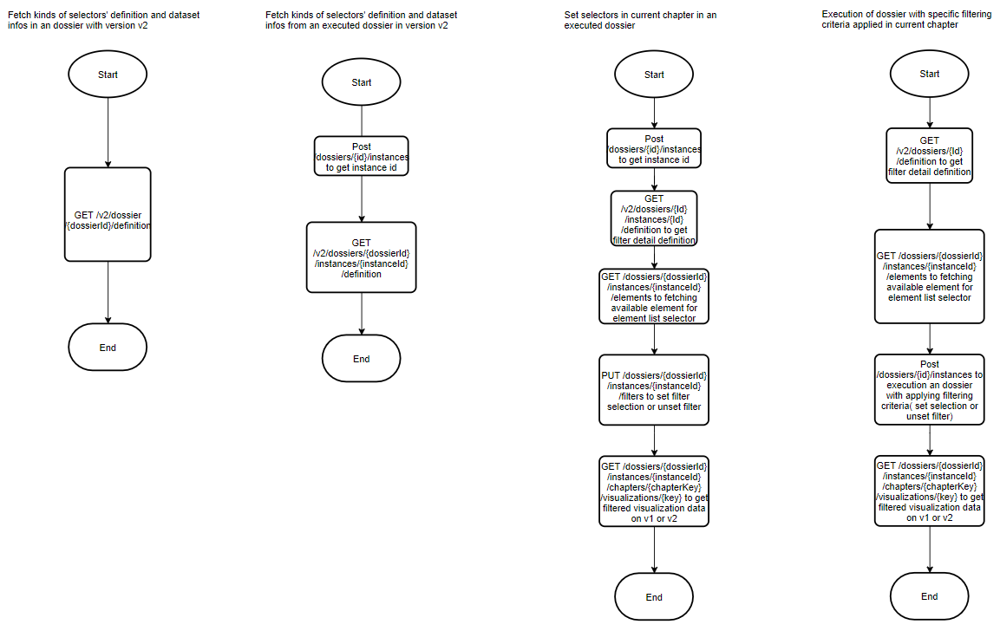

The MicroStrategy RESTful server supports different types of selectors, similar to the function in MicroStrategy Library Web.

The following five selector types are supported:

- Attribute qualification selector
- Attribute element list selector
- Metric qualification selector
- Object replacement selector
- Visualization as filter

You can use the following APIs to set the different types of selectors and view selector definitions:

| API                                                                                                                                                                                                  | Functionality                                                                                                                                     |
| ---------------------------------------------------------------------------------------------------------------------------------------------------------------------------------------------------- | ------------------------------------------------------------------------------------------------------------------------------------------------- |
| [PUT /api/dossiers/{dossierId}/instances/{instanceId}/filters](https://demo.microstrategy.com/MicroStrategyLibrary/api-docs/index.html#/Dossiers%20and%20Documents/setFilters)                       | Set selectors in the current chapter based on an existing dossier instance                                                                        |
| [POST /api/dossiers/instances](https://demo.microstrategy.com/MicroStrategyLibrary/api-docs/index.html?visibility=all#/Dossiers%20and%20Documents/createDossierInstance_1)                           | Set selectors in the current chapter based on a new dossier instance                                                                              |
| [GET /api/v2/dossiers/{dossierId}/instances/{instanceId}/definition](https://demo.microstrategy.com/MicroStrategyLibrary/api-docs/index.html#/Dossiers%20and%20Documents/getVisualizationList_2)     | Return selector definition (status, selected answer, key, name), dataset information, and the current chapter key in an existing dossier instance |
| [GET /api/v2/dossiers/{dossierId}/definition](https://demo.microstrategy.com/MicroStrategyLibrary/api-docs/index.html#/Dossiers%20and%20Documents/getVisualizationList_1)                            | Return selectors definition (status, selected answer, key, name), dataset information, and the current chapter key in a dossier                   |
| [GET /api/dossiers/{dossierId}/instances/{instanceId}/elements](https://demo.microstrategy.com/MicroStrategyLibrary/api-docs/index.html#/Dossiers%20and%20Documents/getDossierDatasetFilterElements) | Fetch suggested answers or elements for attribute elements selector (include search box functionality)                                            |

## Compatibility

The enhancement for the setting dossier filter API does not break compatibility since the existing selection setting API is enhanced to support two filter selection json formats: the old format and new format.

The existing setting dossier filter API is shown below. However, it is suggested that you use the new format of the filter setting body input. This new format is consistent with the filter definition in the output for the GET dossier definition APIs.

- [PUT /api/dossiers/{dossierId}/instances/{instanceId}/filters](https://demo.microstrategy.com/MicroStrategyLibrary/api-docs/index.html#/Dossiers%20and%20Documents/setFilters)
- [POST /api/dossiers/{dossierId}/instances](https://demo.microstrategy.com/MicroStrategyLibrary/api-docs/index.html?visibility=all#/Dossiers%20and%20Documents/createDossierInstance_2)

The following section outlines a summary of the compatibility.

### Compatibility prior to MicroStrategy 2021 Update 1

For library versions prior to MicroStrategy 2021 Update 1:

- The behavior remains the same for all Intelligence Server versions.
- The expected behavior for the GET Filter API is that the fetched filter definition json returns the chapter-level selector key, name, and summary.
- The expected behavior for the Setting Filter API is that it supports old filter setting format for setting the following two selector types:
  - Attribute element list filter
  - Metric qualification selector

### Compatibility on and after MicroStrategy 2021 Update 1

For library versions on and after MicroStrategy 2021 Update 1, the behavior changes based on the Intelligence Server version.

- For Intelligence Server versions prior to MicroStrategy 2021 Update 1
  - The expected behavior for the GET filter API is that the fetched filter definition json is missing information for visualization as filter and dataset name for dataset. Returns the definition of the following selector types:
    - Attribute element list selector
    - Attribute qualification selector
    - Metric qualification selector
    - Object replacement selector(Attribute/metric selector)
  - The expected behavior for the Setting Filter API is that it supports old and new filter setting formats for setting the following five selector types:
    - Attribute element list selector
    - Attribute qualification selector
    - Metric qualification selector
    - Object replacement selector(Attribute/metric selector)
    - Visualization as filter
- For Intelligence Server versions on and after MicroStrategy 2021 Update 1
  - The expected behavior for the GET filter API is that the fetched filter definition json is complete and returns the definition of the following selector types:
    - Attribute element list selector
    - Attribute qualification selector
    - Metric qualification selector
    - Object replacement selector(Attribute/metric selector)
    - Visualization as filter
  - The expected behavior for the Setting Filter API is that it supports old and new filter setting formats for setting the following five selector types:
    - Attribute element list selector
    - Attribute qualification selector
    - Metric qualification selector
    - Object replacement selector(Attribute/metric selector)
    - Visualization as filter

## How to Use Selector Consumption APIs

The diagrams below outlines common workflows for using APIs for dossier selector functionalities.

