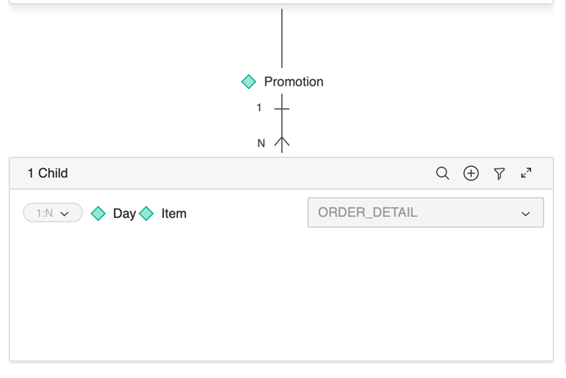

<Available since="2021 Update 1" />

:::tip

You can try out this workflow at [REST API Playground](https://www.postman.com/microstrategysdk/workspace/microstrategy-rest-api/folder/16131298-a1ebd204-40ea-42e0-9ccc-21f391c797fb?ctx=documentation).

Learn more about MicroStrategy REST API Playground [here](/docs/getting-started/playground.md).

:::

This workflow sample demonstrates how to update an attribute's relationship through the Modeling service.

1. Create a changeset.
1. [Update the attribute's relationship.](#update-the-attributes-relationship)
1. Commit the changeset.
1. Delete the changeset.

You want to update the relationship for the `“Subcategory“` attribute object with ID `E8C034036E4EE6404513A6B12FAE9481` in the MicroStrategy Tutorial project. The project ID is `B7CA92F04B9FAE8D941C3E9B7E0CD754`.

:::info

Obtain the authorization token needed to execute the request using [POST /api/auth/login](https://demo.microstrategy.com/MicroStrategyLibrary/api-docs/index.html#/Authentication/postLogin).

Obtain the project ID from [GET /api/projects](https://demo.microstrategy.com/MicroStrategyLibrary/api-docs/index.html#/Projects/getProjects_1).

:::

:::tip

Changesets are used in this workflow. For information on how to create and use changesets see [Changesets](/docs/common-workflows/modeling/changesets.md).

:::

## Update the attribute's relationship

Use [PUT /api/model/systemHierarchy/attributes/{attributeId}/relationships](https://demo.microstrategy.com/MicroStrategyLibrary/api-docs/index.html?#/System%20Hierarchy/ms-putAttributeRelationships).

You want to update the relationship of the "Subcategory" attribute object by adding relationships between "Category" and "Subcategory", and "Subcategory" and "Item". The object ID of the "Subcategory" attribute is `E8C034036E4EE6404513A6B12FAE9481` in the MicroStrategy Tutorial project. The project ID is `B7CA92F04B9FAE8D941C3E9B7E0CD754`.

The following screenshot shows how these relationships are shown in the editor.


Sample Request Header:

```http
"accept": "application/json"
"X-MSTR-AuthToken": "o0ak9privdo27nfo798j40m8aa"
"X-MSTR-MS-Changeset": "F768352DC66E40F2BCD9A3F050ECDE9B"
```

Sample Request Body:

```json
{
  "relationships": [
    {
      "parent": {
        "objectId": "E8C034036E4EE6404513A6B12FAE9481",
        "subType": "attribute",
        "name": "Subcategory"
      },
      "child": {
        "objectId": "8D679D4211D3E4981000E787EC6DE8A4",
        "subType": "attribute",
        "name": "Item"
      },
      "relationshipTable": {
        "objectId": "8D67937411D3E4981000E787EC6DE8A4",
        "subType": "logical_table",
        "name": "LU_ITEM"
      },
      "relationshipType": "one_to_many"
    },
    {
      "parent": {
        "objectId": "8D679D3711D3E4981000E787EC6DE8A4",
        "subType": "attribute",
        "name": "Category"
      },
      "child": {
        "objectId": "E8C034036E4EE6404513A6B12FAE9481",
        "subType": "attribute",
        "name": "Subcategory"
      },
      "relationshipTable": {
        "objectId": "8D6793B611D3E4981000E787EC6DE8A4",
        "subType": "logical_table",
        "name": "LU_SUBCATEG"
      },
      "relationshipType": "one_to_many"
    }
  ]
}
```

Sample Curl:

```bash
curl -X PUT "https://demo.microstrategy.com/MicroStrategyLibrary/api/model/systemHierarchy/attributes/E8C034036E4EE6404513A6B12FAE9481/relationships" -H "accept: application/json" -H "X-MSTR-AuthToken: o0ak9privdo27nfo798j40m8aa" -H "X-MSTR-MS-Changeset: F768352DC66E40F2BCD9A3F050ECDE9B" -H "Content-Type: application/json" -d "{\\"relationships\\":[{\\"parent\\":{\\"objectId\\":\\"E8C034036E4EE6404513A6B12FAE9481\\",\\"subType\\":\\"attribute\\",\\"name\\":\\"Subcategory\\"},\\"child\\":{\\"objectId\\":\\"8D679D4211D3E4981000E787EC6DE8A4\\",\\"subType\\":\\"attribute\\",\\"name\\":\\"Item\\"},\\"relationshipTable\\":{\\"objectId\\":\\"8D67937411D3E4981000E787EC6DE8A4\\",\\"subType\\":\\"logical_table\\",\\"name\\":\\"LU_ITEM\\"},\\"relationshipType\\":\\"one_to_many\\"},{\\"parent\\":{\\"objectId\\":\\"8D679D3711D3E4981000E787EC6DE8A4\\",\\"subType\\":\\"attribute\\",\\"name\\":\\"Category\\"},\\"child\\":{\\"objectId\\":\\"E8C034036E4EE6404513A6B12FAE9481\\",\\"subType\\":\\"attribute\\",\\"name\\":\\"Subcategory\\"},\\"relationshipTable\\":{\\"objectId\\":\\"8D6793B611D3E4981000E787EC6DE8A4\\",\\"subType\\":\\"logical_table\\",\\"name\\":\\"LU_SUBCATEG\\"},\\"relationshipType\\":\\"one_to_many\\"}]}"
```

Sample Response Body:

You can view the new attribute relationships in the body of the response.

```json
{
  "relationships": [
    {
      "parent": {
        "objectId": "E8C034036E4EE6404513A6B12FAE9481",
        "subType": "attribute",
        "name": "Subcategory"
      },
      "child": {
        "objectId": "8D679D4211D3E4981000E787EC6DE8A4",
        "subType": "attribute",
        "name": "Item"
      },
      "relationshipTable": {
        "objectId": "8D67937411D3E4981000E787EC6DE8A4",
        "subType": "logical_table",
        "name": "LU_ITEM"
      },
      "relationshipType": "one_to_many"
    },
    {
      "parent": {
        "objectId": "8D679D3711D3E4981000E787EC6DE8A4",
        "subType": "attribute",
        "name": "Category"
      },
      "child": {
        "objectId": "E8C034036E4EE6404513A6B12FAE9481",
        "subType": "attribute",
        "name": "Subcategory"
      },
      "relationshipTable": {
        "objectId": "8D6793B611D3E4981000E787EC6DE8A4",
        "subType": "logical_table",
        "name": "LU_SUBCATEG"
      },
      "relationshipType": "one_to_many"
    }
  ]
}
```

Response Code: 200 (The attribute's relationships are updated successfully in the changeset.)

## Example

You want to update the relationship for the "Promotion" attribute object with ID "6E6E867115400A10F71D979E00325F4A" by adding a joint relationship with "Day" and "Item" as the join-child of "Promotion".

The following screenshot shows how this relationship is shown in the editor.



Sample Request Body:

```json
{
  "relationships": [
    {
      "parent": {
        "objectId": "6E6E867115400A10F71D979E00325F4A",
        "subType": "attribute",
        "name": "Promotion"
      },
      "jointChild": [
        {
          "objectId": "96ED3EC811D5B117C000E78A4CC5F24F",
          "subType": "attribute",
          "name": "Day"
        },
        {
          "objectId": "8D679D4211D3E4981000E787EC6DE8A4",
          "subType": "attribute",
          "name": "Item"
        }
      ],
      "relationshipTable": {
        "objectId": "8D6793CE11D3E4981000E787EC6DE8A4",
        "subType": "logical_table",
        "name": "ORDER_DETAIL"
      },
      "relationshipType": "one_to_many"
    }
  ]
}
```
