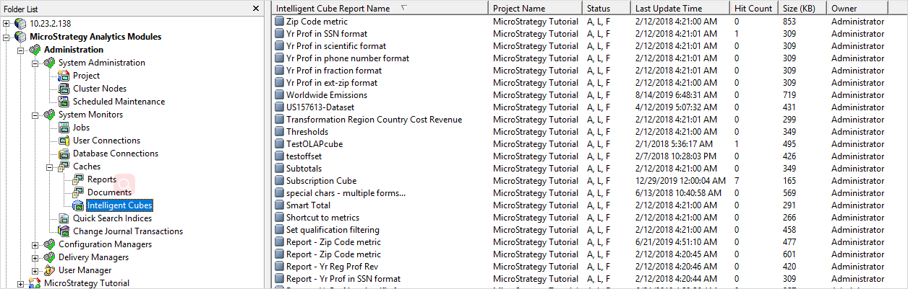
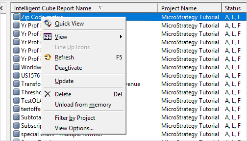
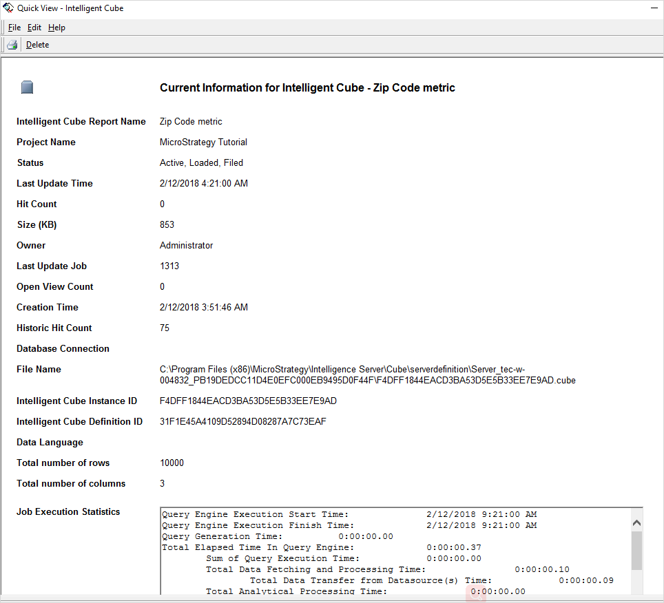

:::tip

You can try out this workflow at [REST API Playground](https://www.postman.com/microstrategysdk/workspace/microstrategy-rest-api/folder/16131298-736d23cb-1247-49fc-99dc-83365a1502e6?ctx=documentation).

Learn more about MicroStrategy REST API Playground [here](/docs/getting-started/playground.md).

:::

The status of a cube tells you how the cube is currently being used and whether reports/dossiers can access the cube. For example, if a cube is deactivated, reports that access that cube fail to execute. Cube status is accessed through the System Monitors in Developer. All published cubes have an entry in the cube monitor. Deleting an entry from the cube monitor unpublishes the cube.

## Instructions to access the Cube Cache Monitor in Developer

1. Open MicroStrategy Developer.
1. In the left pane, navigate to **Administration** > **System Monitors** > **Caches** > **Intelligent Cubes** to access the cube cache list.

   

1. Right-click a cube to access the cube cache actions.

   

1. Choose **Quick View** to access cube cache details.

   

Cube cache monitoring is exposed through the following REST APIs:

| API                                                        | Function                                                                 |
| ---------------------------------------------------------- | ------------------------------------------------------------------------ |
| `GET /api/monitors/caches/cubes`                           | Fetch cube caches on an specific intelligence server node.               |
| `GET /api/monitors/caches/cubes/{cacheId}`                 | Get cache information for a single cube.                                 |
| `GET /api/monitors/caches/cubes/aggregatedUsages`          | Get aggregated cube cache capacity usage information by user or project. |
| `PATCH /api/monitors/caches/cubes/{cacheId}`               | Alter cache status for a specific cube.                                  |
| `GET /api/monitors/caches/cubes/manipulations/{id}/status` | Get cache manipulation status.                                           |
| `DELETE /api/monitors/caches/cubes/{cacheId}`              | Delete a single cube cache.                                              |

The workflow sample below demonstrates how to:

1. [Fetch the cube cache list.](#fetch-the-cube-cache-list)
1. [Get cache info for a single cube.](#get-cache-information-for-a-single-cube)
1. [Fetch aggregated cube cache capacity usage information by project or user.](#fetch-aggregated-cube-cache-capacity-usage-information)
1. [Alter cube cache status for a specific cube.](#alter-cube-cache-status-for-a-specific-cube)
1. [Get cube cache manipulation status information.](#get-cube-cache-manipulation-status-information)
1. [Delete a cube cache.](#delete-a-cube-cache)

## Fetch the cube cache list

Endpoint: `GET /api/monitors/caches/cubes`

This endpoint fetches the cube cache list on a specific Intelligence server node.

### API Parameter Details

| Parameter         | Description                                                                                                                                | Parameter Type | Data Type | Is Required |
| ----------------- | ------------------------------------------------------------------------------------------------------------------------------------------ | -------------- | --------- | ----------- |
| X-MSTR-AuthToken  | Authorization token                                                                                                                        | header         | string    | true        |
| clusterNode       | Cluster node name                                                                                                                          | query          | string    | true        |
| projectIds        | The project ID collection that is used for filtering data. For example:'B19DEDCC11D4E0EFC000EB9495D0F6E2,A232EDCC11D4E0EFC000EB9495D0F6E2' | query          | string    | false       |
| state.loadedState | Filters all loaded cube caches. Valid input is "loaded".                                                                                   | query          | string    | false       |
| sortBy            | Specifies sorting criteria. For example, "-size" sorts in descending order by size.                                                        | query          | string    | false       |
| offset            | Starting point within the collection of returned results. Used to control paging behavior. Default value is 0.                             | query          | int       | false       |
| limit             | Maximum number of items returned for a single request. Used to control paging behavior. Default value is 1000.                             |                |           |             |

The `sortBy` query parameter allows input such as `"+size"`, `"-size"`, and `"size"`. If you do not specify sort fields, it returns the default sorting data from Intelligence server and the supported sorting fields in the order shown below:

- Name
- Size
- Hit count
- Last update time
- Status
- Project
- Owner

### Output Design

Fill in the sample below to design your own output.

```json
{
  "offset": 0,
  "limit": 0,
  "total": 0,
  "loaded": 0,
  "unloaded": 0,
  "cubeCaches": [
    {
      "id": "string",
      "projectId": "string",
      "source": {
        "id": "string",
        "type": "cube",
        "name": "string"
      },
      "state": {
        "active": false,
        "dirty": false,
        "infoDirty": false,
        "persisted": false,
        "processing": false,
        "loadedState": "loadPending" //"loadedState" can be 'loaded','unloaded','loadPending', 'unloadPending'
      },
      "errorMessage": "",
      "lastUpdateTime": "yyyy-MM-dd HH:mm:ss",
      "hitCount": 0,
      "size": 0,
      "creatorId": "string",
      "creatorName": "string",
      "lastUpdateJob": 0,
      "openViewCount": 0,
      "creationTime": "yyyy-MM-dd HH:mm:ss",
      "historicHitCount": 0,
      "databaseConnection": ["string"],
      "fileName": "string",
      "dataLanguage": "string",
      "rowCount": 0,
      "columnCount": 0
    }
  ]
}
```

### Output Example

```json
{
  "offset": 0,
  "limit": 1,
  "total": 100,
  "loaded": 20,
  "unloaded": 70,
  "cubeCaches": [
    {
      "id": "363249D447A5EF245AD51AB916CA4904:B19DEDCC11D4E0EFC000EB9495D0F44F:MTAuMjMuNS44NQ==",
      "projectId": "B19DEDCC11D4E0EFC000EB9495D0F44F",
      "source": {
        "name": "C02_callctr_image",
        "id": "6226ADDD47920CB034078BABA1673960",
        "type": "cube"
      },
      "state": {
        "active": false,
        "dirty": false,
        "infoDirty": false,
        "persisted": true,
        "processing": false,
        "loadedState": "unloaded"
      },
      "lastUpdateTime": "2018-02-12 07:15:17",
      "hitCount": 0,
      "size": 101376,
      "creatorName": "Administrator",
      "creatorId": "54F3D26011D2896560009A8E67019608",
      "lastUpdateJob": 632,
      "openViewCount": 0,
      "creationTime": "2018-02-12 07:15:17",
      "historicHitCount": 121,
      "fileName": "C:\\Program Files (x86)\\MicroStrategy\\Intelligence Server\\Cube\\serverdefinition\\Server_tec-w-004832_PB19DEDCC11D4E0EFC000EB9495D0F44F\\363249D447A5EF245AD51AB916CA4904.cube",
      "rowCount": 39,
      "columnCount": 8
    }
  ]
}
```

### Error Handling

| Invalid Input              | Error Message                                                                                                                                                     | HTTP Response Code |
| -------------------------- | ----------------------------------------------------------------------------------------------------------------------------------------------------------------- | ------------------ |
| Cluster node doesn't exist | The cluster node ''{0}'' is not connected or canonical name, you should use the cluster node name from the `GET /api/monitors/iServer/nodes`                      | 503                |
| offset is invalid          | The offset value {offset} is not valid, it must be greater than or equal to 0                                                                                     | 400                |
| limit is invalid           | The limit value {limit} is not valid, it must be greater than or equal to 1, and less than or equal to 1000                                                       | 400                |
| projectIds is invalid      | At least one of GUID provided in the list is not valid                                                                                                            | 400                |
| status is invalid          | Invalid filter field state.loadedState input ''{0}'', it should like: 'loaded'                                                                                    | 400                |
| sortBy is invalid          | Invalid sortBy input '{sortBy input}', it should like: ^[+ -]{0,1}(cubeName size &#124; hitCount &#124; lastUpdateTime &#124; status &#124; project &#124; owner) | 400                |

## Get Cache Information for a Single Cube

Endpoint: `GET /api/monitors/caches/cubes/{cacheId}`

This endpoint gets cache information for a single cube.

### API Parameter Details

| Parameter        | Description         | Parameter Type | Data Type | Is Required |
| ---------------- | ------------------- | -------------- | --------- | ----------- |
| X-MSTR-AuthToken | Authorization token | header         | string    | true        |
| id               | Cache ID            | path           | string    | true        |

### Output Design

Fill in the sample below to design your own output.

```json
{
  "id": "string",
  "projectId": "string",
  "source": {
    "id": "string",
    "type": "cube",
    "name": "string"
  },
  "state": {
    "active": false,
    "dirty": false,
    "infoDirty": false,
    "persisted": false,
    "processing": false,
    "loadedState": "loadPending" //"loadedState" can be 'loaded','unloaded','loadPending', 'unloadPending'
  },
  "errorMessage": "",
  "lastUpdateTime": "yyyy-MM-dd HH:mm:ss",
  "hitCount": 0,
  "size": 0,
  "creatorId": "string",
  "creatorName": "string",
  "lastUpdateJob": 0,
  "openViewCount": 0,
  "creationTime": "yyyy-MM-dd HH:mm:ss",
  "historicHitCount": 0,
  "databaseConnection": ["string"],
  "fileName": "string",
  "dataLanguage": "string",
  "rowTotalCount": 0,
  "columnTotalCount": 0,
  "jobExecutionStatistics": {
    "startTime": "yyyy-MM-dd HH:mm:ss",
    "finishTime": "yyyy-MM-dd HH:mm:ss",
    "sqlDuration": 0,
    "analyticalEngineDuration": 0,
    "otherDuration": 0,
    "rowCount": 0,
    "columnCount": 0,
    "tempTablesCount": 0,
    "totalPassedCount": 0,
    "sqlPassesCount": 0,
    "analyticalEnginePassesNumber": 0,
    "errorMessage": "string",
    "accessedTables": [
      {
        "name": "string"
      }
    ],
    "queryPasseInfos": [
      {
        "rowCount": 0,
        "columnCount": 0,
        "startTime": "yyyy-MM-dd HH:mm:ss",
        "finishTime": "yyyy-MM-dd HH:mm:ss",
        "duration": 0,
        "sqlStatement": "string"
      }
    ]
  }
}
```

### Output Example

```json
{
  "id": "363249D447A5EF245AD51AB916CA4904:B19DEDCC11D4E0EFC000EB9495D0F44F:MTAuMjMuNS44NQ==",
  "projectId": "B19DEDCC11D4E0EFC000EB9495D0F44F",
  "source": {
    "name": "C02_callctr_image",
    "id": "6226ADDD47920CB034078BABA1673960",
    "type": "cube"
  },
  "state": {
    "active": false,
    "dirty": false,
    "infoDirty": false,
    "persisted": true,
    "processing": false,
    "loadedState": "unloaded"
  },
  "lastUpdateTime": "2018-02-12 07:15:17",
  "hitCount": 0,
  "size": 101376,
  "creatorName": "Administrator",
  "creatorId": "54F3D26011D2896560009A8E67019608",
  "lastUpdateJob": 632,
  "openViewCount": 0,
  "creationTime": "2018-02-12 07:15:17",
  "historicHitCount": 121,
  "fileName": "C:\\Program Files (x86)\\MicroStrategy\\Intelligence Server\\Cube\\serverdefinition\\Server_tec-w-004832_PB19DEDCC11D4E0EFC000EB9495D0F44F\\363249D447A5EF245AD51AB916CA4904.cube",
  "rowCount": 39,
  "columnCount": 8,
  "jobExecutionStatistics": {
    "startTime": "2018-02-12 07:15:16",
    "finishTime": "2018-02-12 07:15:17",
    "sqlDuration": 619,
    "analyticalEngineDuration": 0,
    "otherDuration": 620,
    "rowCount": 39,
    "columnCount": 8,
    "tempTablesCount": 0,
    "totalPassedCount": 2,
    "sqlPassesCount": 2,
    "analyticalEnginePassesCount": 0,
    "errorMessage": "",
    "accessedTables": [
      {
        "name": "LU_CALL_CTR"
      },
      {
        "name": "LU_EMPLOYEE"
      },
      {
        "name": "LU_REGION"
      }
    ],
    "queryPasseInfos": [
      {
        "rowCount": 39,
        "columnCount": 8,
        "startTime": "2018-02-12 07:15:16",
        "finishTime": "2018-02-12 07:15:17",
        "duration": 615,
        "sqlStatement": "select\tdistinct a11.CALL_CTR_ID  CALL_CTR_ID,\n\ta12.CENTER_NAME  CENTER_NAME,\n\t'images\\1.jpg'  CustCol_13,\n\ta11.EMP_ID  EMP_ID,\n\ta11.EMP_LAST_NAME  EMP_LAST_NAME,\n\ta11.EMP_FIRST_NAME  EMP_FIRST_NAME,\n\ta12.REGION_ID  REGION_ID,\n\ta13.REGION_NAME  REGION_NAME\nfrom\tLU_EMPLOYEE\ta11\n\tjoin\tLU_CALL_CTR\ta12\n\t  on \t(a11.CALL_CTR_ID = a12.CALL_CTR_ID)\n\tjoin\tLU_REGION\ta13\n\t on \t(a11.COUNTRY_ID = a13.COUNTRY_ID and \n\ta12.REGION_ID = a13.REGION_ID)"
      },
      {
        "rowCount": 0,
        "columnCount": 0,
        "startTime": "2018-02-12 07:15:17",
        "finishTime": "2018-02-12 07:15:17",
        "duration": 4,
        "sqlStatement": "[Populate Report Data]"
      }
    ]
  }
}
```

### Error Handling

| Invalid Input                                                            | Error Message                                                                                                                                | HTTP Response Code |
| ------------------------------------------------------------------------ | -------------------------------------------------------------------------------------------------------------------------------------------- | ------------------ |
| cacheId is invalid                                                       | Invalid cube cache Id '{cacheId}'                                                                                                            | 404                |
| cacheId does not exist in Intelligence server                            | The cube cache '{cacheId}' is not found in Intelligence server                                                                               | 404                |
| cacheId is invalid with an invalid cluster node (based on code 64) in it | The cluster node ''{0}'' is not connected or canonical name, you should use the cluster node name from the `GET /api/monitors/iServer/nodes` | 503                |

## Fetch Aggregated Cube Cache Capacity Usage Information

Endpoint: `GET /api/monitors/caches/cubes/aggregatedUsages`

This endpoint fetches aggregated cube cache capacity usage information by project or user.

### API Parameter Details

| Parameter        | Description                                                                                                                           | Parameter Type | Data Type   | Is Required |
| ---------------- | ------------------------------------------------------------------------------------------------------------------------------------- | -------------- | ----------- | ----------- |
| X-MSTR-AuthToken | Authorization token                                                                                                                   | header         | string      | true        |
| clusterNode      | Cluster node name                                                                                                                     | query          | string      | true        |
| aggregateBy      | An enum to control aggregated cache size by object. Aggregation is currently supported by project and user. Default value is project. | query          | enum string | true        |

### Output Design

Fill in the sample below to design your own output. We recommend you specify all sizes in bytes across your REST APIs.

```json
{
  "aggregatedCacheUsages": [
    {
      "id": "string",
      "name": "string",
      "currentUsage": 0,
      "capacity": 0 // Capacity just for project level, not for user level
    }
  ]
}
```

### Output Example for Grouping by Project

```json
{
  "aggregatedCacheUsages": [
    {
      "id": "B19DEDCC11D4E0EFC000EB9495D0F44F",
      "name": "MicroStrategy Tutorial",
      "currentUsage": 178000,
      "capacity": 280000 // Capacity just for project level, not for user level
    },
    {
      "id": "132D3C9F414694BC371BAE94EF08D339",
      "name": "New Project for Quota",
      "currentUsage": 0,
      "capacity": 290000 // Capacity just for project level, not for user level
    },
    {
      "id": "4D5AD5814107623836895EB96B70B0E1",
      "name": "VLDBInherit",
      "currentUsage": 0,
      "capacity": 260000 // Capacity just for project level, not for user level
    }
  ]
}
```

### Output Example for Grouping by User

```json
{
  "aggregatedCacheUsages": [
    {
      "id": "54F3D26011D2896560009A8E67019608",
      "name": "Administrator",
      "currentUsage": 238000
    },
    {
      "id": "C1E141A811D603A2100086B3A5E8F8A4",
      "name": "Developer",
      "currentUsage": 106500
    }
  ]
}
```

### Error Handling

| Invalid Input              | Error Message                                                                                   | HTTP Response Code |
| -------------------------- | ----------------------------------------------------------------------------------------------- | ------------------ |
| Cluster node doesn't exist | Invalid cluster node name {clusterNode}                                                         | 400                |
| groupByObject is invalid   | The group by object {groupByObject} is invalid, currently just support group by user or project | 400                |

## Alter Cube Cache Status for a Specific Cube

Endpoint: `PATCH /api/monitors/caches/cubes/{cacheId}`

This endpoint alters cube cache status for a specific cube, on a specific node.

### API Parameter Details

| Parameter        | Description                                                                     | Parameter Type | Data Type | Is Required |
| ---------------- | ------------------------------------------------------------------------------- | -------------- | --------- | ----------- |
| X-MSTR-AuthToken | Authorization token                                                             | header         | string    | true        |
| id               | Cache ID                                                                        | path           | string    | true        |
| Prefer           | Allows client to set preferences. Execute asynchronous mode with respond-async. | header         | string    | true        |

### Body Input

```json
The following change status actions are supported: active, deactive, load, and unload.

{
  "state": {"active":true}
}
or
{
  "state": {"loadedState":"loaded"}
}
or
{
  "state": {"loadedState":"unLoaded"}
}
```

### Body Input Example

```json
{
  "state": { "active": false }
}
```

### Output Design

Fill in the sample below to design your own output. This sample is for a successful response code of 202 (Accepted). The response location header includes a URI where this same status can be retrieved, so that the client stays up-to-date.

```json
{
  "manipulationId": "XXXXXXXXX",
  "status": "executing"
}
```

### Output Example

```json
{
  "manipulationId": "3D9062444858D2D5A25BF891E575A297:MTAuMjMuNi4yMDY=",
  "status": "executing"
}
```

### Prerequisite Condition Details

Check the cube prerequisite status for action in the REST-API side.

| Action     | Required status to perform action |
| ---------- | --------------------------------- |
| Activate   | Filed                             |
| Deactivate | Always available                  |
| Load       | Active                            |
| Unload     | Always available                  |
| Delete     | Always available                  |

An invalid action input, which is the code validation logic on the REST-API side, produces the following errors:

| Current State                | Action | Error                                                                                      |
| ---------------------------- | ------ | ------------------------------------------------------------------------------------------ |
| Not persisted and not active | Active | The cube cache ''{0}'' is not persisted. The cube cache must be persisted before active it |
| Not active and not loaded    | Load   | The cube cache ''{0}'' is not active. The cube cache must be active before loading it      |

### Error Handling

| Invalid Input                                | Error Message                                                                                      | HTTP Response Code |
| -------------------------------------------- | -------------------------------------------------------------------------------------------------- | ------------------ |
| Invalid cacheId                              | Invalid cube cache Id '{cacheId}'                                                                  | 400                |
| cacheId doesn't exist in Intelligence server | The cube cache '{cacheId}' is not found in Intelligence server                                     | 404                |
| Unsupported status input                     | unsupported statue input, currently just support formats: {"active":boolean} or {"loaded":boolean} | 400                |

## Get Cube Cache Manipulation Status Information

Endpoint: `GET /api/monitors/caches/cubes/manipulations/{id}/status`

This endpoint get cube cache manipulation status information.

### API Parameter Details

| Parameter        | Description           | Parameter Type | Data Type | Is Required |
| ---------------- | --------------------- | -------------- | --------- | ----------- |
| X-MSTR-AuthToken | Authorization token   | header         | string    | true        |
| id               | Cache manipulation ID | path           | string    | true        |

### Output Design

Fill in the sample below to design your own output. This sample is for a response status code of 200.

```json
{
  "status": "string", // status is an enum string
  "statusDetail": "String"
}
```

For each enum state:

- When the manipulation is “ready“ it means the manipulation was processed successfully,
- When the manipulation is “executing“ it means the manipulation is still processing,
- When the manipulation is “error“ it means the manipulation finished with an error.
- When the manipulation is “requestHandlingFailed“ it means the manipulation request failed. This request is handled by Intelligence server.

### Output Example

This example is for a response status code of 200.

```json
{
  "status": "ready"
}
```

### Error Handling

| Invalid Input      | Error Message               | HTTP Response Code |
| ------------------ | --------------------------- | ------------------ |
| cacheId is invalid | Invalid manipulation id {0} | 400                |

## Delete a Cube Cache

Endpoint: `DELETE /api/monitors/caches/cubes/{cacheId}`

This endpoint deletes a cube cache.

### API Parameter Details

| Parameter        | Description         | Parameter Type | Data Type | Is Required |
| ---------------- | ------------------- | -------------- | --------- | ----------- |
| X-MSTR-AuthToken | Authorization token | header         | string    | true        |
| id               | Cache ID            | path           | string    | true        |

### Output Design

Successful response code 204 (no content).

### Error Handling

| Invalid Input                                | Error Message                                                  | HTTP Response Code |
| -------------------------------------------- | -------------------------------------------------------------- | ------------------ |
| Invalid cacheId                              | Invalid cube cache Id '{cacheId}'                              | 400                |
| cacheId doesn't exist in Intelligence server | The cube cache '{cacheId}' is not found in Intelligence server | 404                |
