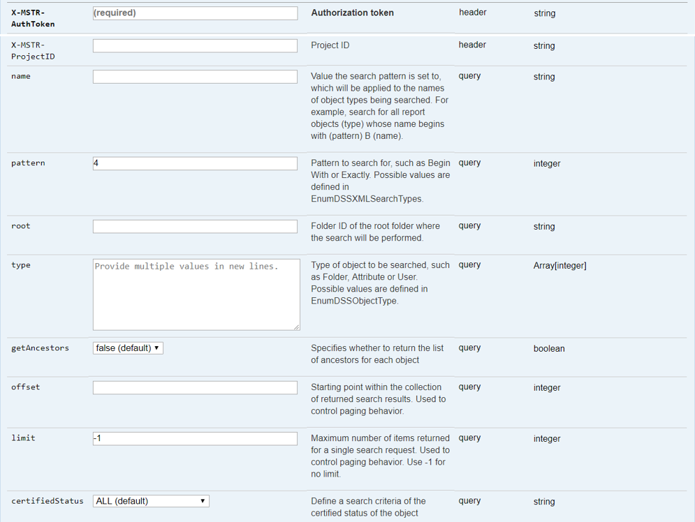

:::tip

You can try out this workflow at [REST API Playground](https://www.postman.com/microstrategysdk/workspace/microstrategy-rest-api/folder/16131298-52d5eba3-f23a-4853-aa5b-6cc0c38f698d?ctx=documentation).

Learn more about MicroStrategy REST API Playground [here](/docs/getting-started/playground.md).

:::

The workflow for performing a quick search for specific objects includes the following sequence of REST API requests.

1. [Log in](#log-in) User authenticates into the environment with `POST /api/auth/login` and standard authentication
1. [Get project list](#get-project-list) User obtains the project list from `GET /api/projects`
1. [Perform a quick search](#perform-a-quick-search) User obtains all reports with "Customer" in the title from `GET /api/searches`
1. [Log out](#log-out) User calls `POST /api/logout` to close the session

To make it easy for you to test this workflow in your environment, [download the zipped Postman script](https://www2.microstrategy.com/producthelp/2021/downloads/RESTSDK/PostmanScripts/QuickSearch_postman_collection.zip) provided for you, extract the JSON file, and configure it to point to your Web server.

A detailed explanation of each step is provided below:

## Log in

End Point: `POST /api/auth/login`

This endpoint allows the caller to authenticate with the MicroStrategy REST Server. You provide the information used to create the session in the body of the request. In this example, you use standard authentication so you need to provide username, password, and loginMode (which specifies the authentication mode to use). If you omit an optional field, the REST Server uses the default value. If the call is successful, the resulting HTTP response returns an HTTP status code 204 and a response header containing `X-MSTR-AuthToken`, the authorization token that will be used in subsequent requests.


REST API Explorer: [https://demo.microstrategy.com/MicroStrategyLibrary/api-docs/#!/Authentication/postLogin](https://demo.microstrategy.com/MicroStrategyLibrary/api-docs/#!/Authentication/postLogin)

Sample Request

- Request Headers

  ```http
  'Content-Type: application/json'
  'Accept: application/json'
  ```

- Request Body

```json
{
  "loginMode": 1,
  "username": "administrator",
  "password": ""
}
```

- Curl

```bash
curl -X POST -i -c ~/cookie-jar.txt --header 'Content-Type: application/json' --header 'Accept: application/json' -d '{ \\
"loginMode":1, \\
"username": "administrator", \\
"password": "" \\
}' https://demo.microstrategy.com/MicroStrategyLibrary/api/auth/login'
```

Sample Response

- Response Headers

```json
{
  "pragma": "no-cache",
  "x-mstr-authtoken": "nllmm5lpmkjdsj4d4etgdikc6c",
  "cache-control": "no-cache, no-store, max-age=0, must-revalidate",
  "date": "Wed, 16 Aug 2017 01:42:31 GMT",
  "expires": "0",
  "content-type": null
}
```

The authorization token "`x-mstr-authtoken`" is returned in the response header. It is used in other endpoints to authenticate the user.

- Response Body: Empty

- Response Code: 204 (Success: No Content)

## Get project list

End Point: `GET /api/projects`

This endpoint allows the caller to get the list of projects with the MicroStrategy REST Server. In this example, you get the list of projects in the MicroStrategy Tutorial metadata. You use the authorization token returned during login as the value for `X-MSTR-AuthToken`. If the call is successful, the resulting HTTP response returns an HTTP status code 200 and a response body containing a list of the active projects that the user session has access to.


REST API Explorer: [https://demo.microstrategy.com/MicroStrategyLibrary/api-docs/index.html#!/Projects/getProjects](https://demo.microstrategy.com/MicroStrategyLibrary/api-docs/index.html#!/Projects/getProjects)

Sample Request

- Request Headers

  ```http
  'Accept: application/json'
  'X-MSTR-AuthToken: nllmm5lpmkjdsj4d4etgdikc6c'
  ```

- Request Body: Empty

- Curl

```bash
curl -X GET -b ~/cookie-jar.txt --header 'Accept: application/json' --header 'X-MSTR-AuthToken: nllmm5lpmkjdsj4d4etgdikc6c'  https://demo.microstrategy.com/MicroStrategyLibrary/api/projects'
```

Sample Response

- Response Body

```hs
       [
         {
           "id": "nllmm5lpmkjdsj4d4etgdikc6c",
           "name": "MicroStrategy Tutorial",
           "alias": "",
           "description": "MicroStrategy Tutorial project and application set designed to illustrate the platform's rich functionality. The theme is an Electronics, Books, Movies and Music store. Employees, Inventory, Finance, Product Sales and Suppliers are analyzed.",
           "status": 0
         },
         {
           "id": "AF09B3E3458F78B4FBE4DEB68528BF7B",
           "name": "Human Resources Analysis Module",
           "alias": "",
           "description": "The Human Resources Analysis Module analyses workforce headcount, trends and profiles, employee attrition and recruitment, compensation and benefit costs and employee qualifications, performance and satisfaction.",
           "status": 0
         }
       ]
```

The response body contains information for each project that is returned, including the project ID that you use in later endpoints.

- Response Code: 204 (Success: OK)

## Perform a quick search

End Point: `GET /api/searches/results`

This endpoint allows the caller to perform a quick search for specific objects. In this example, you search in the "MicroStrategy Tutorial" project for reports that include "Customer" in the title and then return all results without pagination. You use two different types of parameters—header and query.

- You identify the project by passing the project ID in the request header.
- You set the following values using query parameters in the request:
  - You specify that you are searching for reports by setting the type query parameter to "3". You find the value for the object type in the [EnumDSSXMLObjectTypes](https://www2.microstrategy.com/producthelp/2021/WebAPIReference/com/microstrategy/webapi/EnumDSSXMLObjectTypes.html) enumeration.
  - You specify that you do not want to paginate the search results (that is, include all reports) by setting the limit query parameter to "-1", which means no limit.
  - You specify that you are searching for reports that have "Customer" in the title using the name and pattern query parameters; you set name to "Customer" and pattern to "4", which means "contains". You find the value for pattern in the [EnumDSSXMLSearchTypes](https://www2.microstrategy.com/producthelp/2021/WebAPIReference/com/microstrategy/webapi/EnumDSSXMLSearchTypes.html) enumeration.

To use this API, you need to look for values in several enumerations. To find the values, you go to the [Web API References](https://www2.microstrategy.com/producthelp/2021/WebAPIReference/index.html) and search for the enumeration specified in the swagger description of the field.

If you do not provide values for optional query parameter fields, their default values are used. In this example, you do not specify a value for the root parameter, so the root folder of the project is used, and you do not specify a value for the offset parameter, so you get the results starting at the index 0.


REST API Explorer: [https://demo.microstrategy.com/MicroStrategyLibrary/api-docs/#!/Browsing/doQuickSearch](https://demo.microstrategy.com/MicroStrategyLibrary/api-docs/#!/Browsing/doQuickSearch)

Sample Request

- Request Parameters

  

- Request Headers

```http
'Accept: application/json'
'X-MSTR-AuthToken: nllmm5lpmkjdsj4d4etgdikc6c'
'X-MSTR-ProjectID: B19DEDCC11D4E0EFC000EB9495D0F44F'
```

- Curl

```bash
curl -X GET -b ~/cookie-jar.txt --header 'Accept: application/json' --header 'X-MSTR-AuthToken: nllmm5lpmkjdsj4d4etgdikc6c' --header 'X-MSTR-ProjectID: B19DEDCC11D4E0EFC000EB9495D0F44F' 'https://demo.microstrategy.com/MicroStrategyLibrary/api/searches/results?name=Customer&amp;pattern=4&amp;type=3&amp;getAncestors=false&amp;limit=-1&amp;certifiedStatus=ALL'
```

Sample Response

- Response Body

  The model structure of the API response is detailed in the Model tab of the Response Class on the REST API Explorer page, with a detailed definition for each parameter in the Response body for this endpoint. Note that the default or null fields are omitted in the response and that the search name is not case sensitive.

  

  The REST server returns all the object information under "Shared Reports". The search returned 2 items (totalItems:2) and the object information of these items in the results array.

  ```json
  {
    "totalItems": 2,
    "result": [
      {
        "name": "Customer Analysis",
        "id": "F294156C11D60AD910008BB3D1CEE6A4",
        "type": 3,
        "description": "This template allows users to build new Customer reports. Only calculations relevant to this topic are available through this template.",
        "subtype": 768,
        "dateCreated": "2006-05-22T11:42:06.000-0400",
        "dateModified": "2010-04-08T07:13:16.000-0400",
        "version": "D07DA02D455910C463F928ACBDE6AC9D",
        "acg": 255,
        "owner": {
          "name": "Administrator",
          "id": "54F3D26011D2896560009A8E67019608"
        }
      },
      {
        "name": "Customers Summary",
        "id": "10CC59004E98E5F3032E5A8D916401F0",
        "type": 3,
        "description": "This report provides a collection of key customer metrics analyzing average revenue, customer count, comparison vs. forecast, and variance vs. previous month.",
        "subtype": 768,
        "extType": 1,
        "dateCreated": "2006-08-11T08:13:26.000-0400",
        "dateModified": "2009-11-18T15:54:05.000-0500",
        "version": "CFDC52604BFBB2F1A78C9885E095EAAB",
        "acg": 255,
        "viewMedia": 134217728,
        "owner": {
          "name": "Administrator",
          "id": "54F3D26011D2896560009A8E67019608"
        },
        "certifiedInfo": {
          "certified": false
        }
      }
    ]
  }
  ```

- Response Headers

  There is a specific response header returned from this API, "x-mstr-total-count", that exposes the number of items returned from the search.

  ```json
  {
    "pragma": "no-cache",
    "date": "Wed, 16 Aug 2017 15:33:44 GMT",
    "x-mstr-total-count": "2",
    "x-frame-options": "SAMEORIGIN",
    "access-control-allow-methods": "GET, POST, DELETE, PUT, PATCH",
    "content-type": "application/json",
    "x-xss-protection": "1; mode=block",
    "cache-control": "no-store",
    "access=control-allow-headers": "Content-TYPE",
    "content-length": "957",
    "x-content-type-options": "nosniff",
    "x-application-context": "org.springframework.boot.context.embedded.AnnotationConfigEmbeddedWebApplicationContext@49c7fffc",
    "expires": "0"
  }
  ```

- Response Code: 200 (Success: OK)

## Log out

End Point: `POST /api/auth/logout`

This endpoint allows the caller to log out for the authenticated user with the MicroStrategy REST server. In this example, you close the active user session by providing the authorization token, X-MSTR-AuthToken, generated during login. If the call is successful, the resulting HTTP response returns an HTTP status code 204.


REST API Explorer: [https://demo.microstrategy.com/MicroStrategyLibrary/api-docs/#!/Authentication/postLogout](https://demo.microstrategy.com/MicroStrategyLibrary/api-docs/#!/Authentication/postLogout)

Sample Request

```http
'Accept: application/json'
'X-MSTR-AuthToken: nllmm5lpmkjdsj4d4etgdikc6c'
```

- Request Headers

```http
'Accept: application/json'
'X-MSTR-AuthToken: nllmm5lpmkjdsj4d4etgdikc6c'
```

- Request Body: Empty
- Curl

```bash
curl -X POST -i -c ~/cookie-jar.txt --header 'Content-Type: application/json' --header 'Accept: application/json' --header 'X-MSTR-AuthToken: nllmm5lpmkjdsj4d4etgdikc6c'  https://demo.microstrategy.com/MicroStrategyLibrary/api/auth/logout'
```

Sample Response

- Response code: 204 (Success: No Content)
