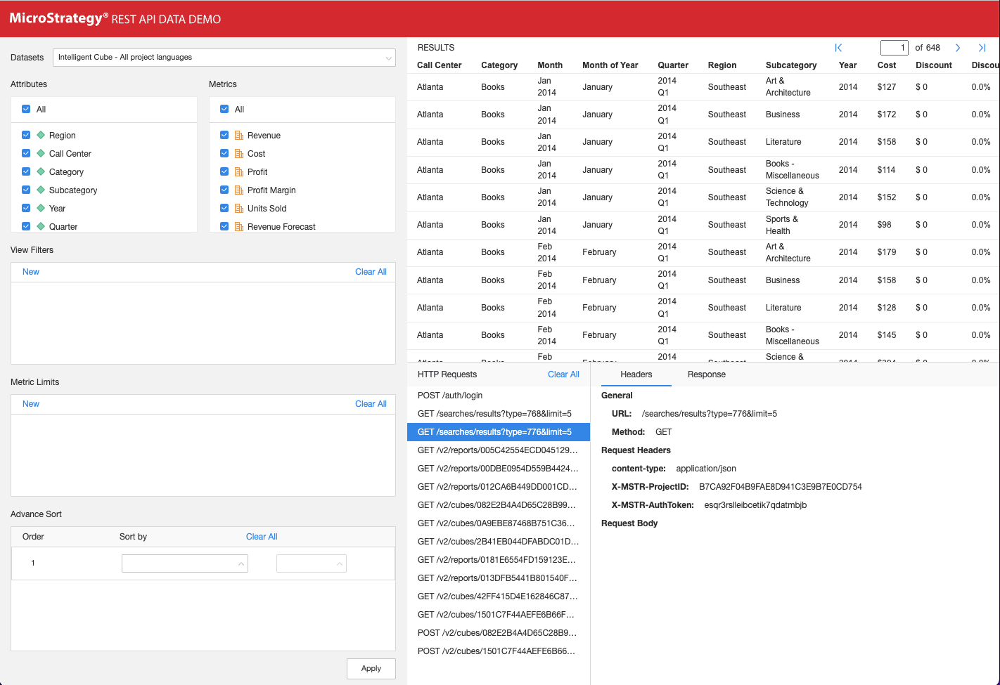

This interactive REST API sample highlights the ability to create reports on the fly, with ad-hoc object fetching and incremental fetch.

This sample gets data from an Intelligent cube or a report. It uses the attributes and metrics from the report definition to populate two list boxes. When a user selects attributes and metrics from the list boxes, an ad-hoc report is run on the cube and the results are displayed. A specified number of rows are returned, with additional rows displayed each time the user clicks the forward and backward arrows. Two types of view filters allow the user to narrow the results that are displayed. An auto-load button lets a user decide whether to automatically apply changes as they are made.

You can [view a live demo](https://microstrategy.github.io/data-api-demo/site/) of the sample. You can also [download the code](https://github.com/microstrategy/data-api-demo/) for this sample to help you understand and use MicroStrategy REST APIs in your application.

## Understand the REST API Workflow in the Sample

This sample uses REST APIs to authenticate the user, get a list of reports and cubes, get definitions for the reports and cubes, and then run the reports and cubes with selected attributes and metrics, using defined view filters.

**1.** `POST /api/auth/login`

This REST API authenticates a user. It creates a MicroStrategy session using credentials for the user and a specified authentication mode. It returns an authorization token, which is used by subsequent REST API calls. In this sample, the API is used to create a configuration session.

**2.** `GET /api/searches/results`

This REST API uses quick search functionality to search objects using specified search criteria. In this sample, the API is used to search cubes or reports in a specified project.

**3.** `GET /api/reports/{reportId}`

This REST API returns the definition for a specified report in a specified project, including available attributes and metrics.

**4.** `GET /api/cubes/{cubeId}`

This REST API returns the definition for a specified cube in a specified project, including available attributes and metrics.

**5.** `POST /api/reports/{reportId}/instances`

This REST API creates an instance of a specified report in a specified project. It replaces the objects in the view template with the requested attributes or metrics, applies the view filters to the report, executes the report, and returns the final data.

**6.** `POST /api/cubes/{cubeId}/instances`

This REST API creates a report instance based on a specified cube in a specified project. It adds the requested attributes or metrics to the view template, applies the view filters to the report, executes the report, and returns the final data,.

**7.** `GET /api/reports/{reportId}/instances/{instanceId}`

This REST API returns the results of a specific report instance in a specified project. It supports fetching the results of the report instance incrementally,

**8.** `GET /api/cubes/{cubeId}/instances/{instanceId}`

This REST API returns the results of a specific report instance based on a specified cube in a specified project. It supports fetching the results of the report instance incrementally,

## Set Up the Sample

If you want to setup the sample, you can [download the source code from GitHub](https://github.com/microstrategy/data-api-demo/). Follow the instruct to build and deploy the project. It is a React App.

## Configure the Sample

The config.js file is used to configure the sample for your environment. Set values for the following variables to configure the Intelligence Server, project, folder, user credentials, and number of documents to display on the page.

| Variable name | Variable description                                                                                                                               |
| :------------ | :------------------------------------------------------------------------------------------------------------------------------------------------- |
| restServerURL | Base URL of the REST API. For example, `http://localhost:8080/MicroStrategyLibrary/api`. The REST API endpoints will be appended to this base URL. |
| projectId     | ID of the MicroStrategy project that will be used by the REST API endpoints. For example, "B19DEDCC11D4E0EFC000EB9495D0F44F".                      |
| username      | Username that will be authenticated. The default value is "administrator".                                                                         |
| password      | Password for username that will be authenticated.                                                                                                  |
| cubes         | Array of cube IDs. These cubes are listed in the Datasets panel on the left of the sample, under Cubes. Be sure to use valid cube IDs.             |
| reports       | Array of report IDs. These reports are listed in the Datasets panel on the left of the sample, under Reports. Be sure to use valid report IDs.     |
| datasets      | Array of reports or cubes to be shown by default.                                                                                                  |

## Use the Sample

Initially, the demo displays a list of cubes and reports in the panel on the left, including the name of the cube or report and the number of attributes and metrics; users can also see the JSON representation of the cube or report definition from the log view at the bottom.

Users select a cube or report from the list. Once users have made a selection, the attributes and metrics for the selected cube or report are displayed in the panel on the left, with a data table on the right. By default, all the attributes and metrics are shown initially, but users can select specific attributes or metrics then apply the change to the data table.

Below the attributes, users are given the option to apply view filters. This demo supports two kinds of view filters: element filter and attribute form filter. Users define a filter, click **Add**, and then click Apply. The data displayed is filtered by the view filter.

Users can also see the detailed information of all the requests made in the log view below the data table.

:::tip

If the grid does not populate, use the browser’s developer tools to investigate potential causes. It is possible that incorrect connectivity information caused the demo to fail.

:::
